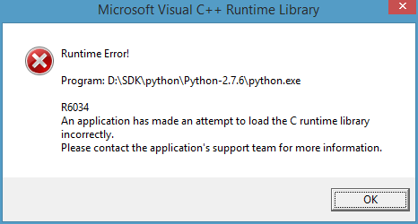

.. _pygplates_getting_started:

Getting started
===============

This document covers installation of pyGPlates and a tutorial to get you started using pyGPlates.

.. contents::
   :local:
   :depth: 3

.. _pygplates_getting_started_installation:

Installation
------------

This section covers how and when to install pyGPlates.
It also covers installing Python and telling Python how to find pyGPlates.

.. contents::
   :local:
   :depth: 2

When to install pyGPlates
^^^^^^^^^^^^^^^^^^^^^^^^^

As covered in the :ref:`introduction <pygplates_introduction>` there are two ways to use pyGPlates:

* with an :ref:`external <pygplates_introduction_using_pygplates_external>` Python interpreter, and
* with the GPlates :ref:`embedded <pygplates_introduction_using_pygplates_embedded>` Python interpreter.

.. note:: The *embedded* option is **not** yet available.

No installation is required for the *embedded* case since both pyGPlates and a Python interpreter are
already embedded inside the GPlates desktop application. All that is required is the
`installation of GPlates <http://www.gplates.org>`_.

However installation of pyGPlates is required for the *external* case since, in this situation,
pyGPlates is provided as a separate Python library/module (that is not part of the
GPlates desktop application).

The following sections cover the installation of pyGPlates in the *external* case.

.. _pygplates_getting_started_installation_external:

Installing pyGPlates
^^^^^^^^^^^^^^^^^^^^

Each release includes the following files:
::

  pygplates_rev@PYGPLATES_REVISION@_docs.zip
  pygplates_rev@PYGPLATES_REVISION@_python27_MacOS64.zip
  pygplates_rev@PYGPLATES_REVISION@_python27_win32.zip
  pygplates_rev@PYGPLATES_REVISION@_src.zip

.. note:: If this is an internal (non-public) release then the above files come in a single zip file
  (``pygplates_rev@PYGPLATES_REVISION@.zip``).

.. note:: For public releases there are also Ubuntu packages (``.deb`` files).

| The pyGPlates documentation is in ``pygplates_rev@PYGPLATES_REVISION@_docs.zip``.
| If you extract this zip file to your hard drive and then open ``pygplates_rev@PYGPLATES_REVISION@_docs/index.html``
  in a web browser you will see the :ref:`front page <pygplates_index>` of this documentation.

The remaining zip files contain a pre-built pyGPlates library for MacOS X and Windows, and source
code for Linux (and Ubuntu packages for public pyGPlates releases):
  
* ``pygplates_rev@PYGPLATES_REVISION@_python27_MacOS64.zip`` - pyGPlates for MacOS X (compiled for 64-bit Python 2.7).

  Extracting this zip file creates a directory ``pygplates_rev@PYGPLATES_REVISION@_python27_MacOS64`` containing the
  ``pygplates.so`` pyGPlates library and its dependency libraries.
  
  .. note:: This pre-built pyGPlates library will only work with a Python interpreter that is
     version 2.7.x and is 64-bit. The operating system can be Snow Leopard or above.
  
* ``pygplates_rev@PYGPLATES_REVISION@_python27_win32.zip`` - pyGPlates for Windows (compiled for 32-bit Python 2.7).

  Extracting this zip file creates a directory ``pygplates_rev@PYGPLATES_REVISION@_python27_win32`` containing the
  ``pygplates.pyd`` pyGPlates library and its dependency libraries.
  
  .. note:: This pre-built pyGPlates library will only work with a Python interpreter that is
     version 2.7.x and is 32-bit. It will work on a 32-bit or 64-bit operating system (Windows 7 or above),
     **but the installed Python must be 32-bit**. A 64-bit Python installation will not work.
  
* ``pygplates_rev@PYGPLATES_REVISION@_src.zip`` - pyGPlates source code (typically used to compile pyGPlates on Linux).

  Extracting this zip file creates a directory ``pygplates_rev@PYGPLATES_REVISION@_src``
  containing the pyGPlates source code.
  
  Unlike the pre-built pyGPlates libraries for MacOS X and Windows, here we have source code that
  needs to be compiled into a pyGPlates library. This is typically used to compile pyGPlates on
  Linux systems because they have binary package managers that make installing dependency
  libraries (of pyGPlates and GPlates) a lot easier than with MacOS X and Windows.
  
  To compile pyGPlates follow the instructions for building GPlates in the files ``BUILD.Linux`` and
  ``DEPS.Linux`` in the root directory ``pygplates_rev@PYGPLATES_REVISION@_src`` of the source code.
  Once the dependency libraries have been installed this process essentially boils down to executing
  the following commands in a *Terminal* in the root source code directory:
  ::
  
    cmake .
    make pygplates

  ...which, on successful completion, should result in a ``pygplates.so`` library in the ``bin``
  sub-directory of the root source code directory ``pygplates_rev@PYGPLATES_REVISION@_src``.
  
  Also if you have a dual-core or quad-core system then you can speed up compilation
  using ``make -j 2 pygplates`` or ``make -j 4 pygplates``.
  
  .. note:: The pyGPlates source code is actually the same as the GPlates source code except we build
     pyGPlates with ``make pygplates`` (whereas GPlates is built with just ``make``). However the
     pyGPlates source code is currently a separate development branch (of the GPlates source code repository)
     that has not yet made its way into the development mainline (hence you won't find it in regular
     GPlates source code releases yet).
  
* ``pygplates-ubuntu_...`` - pyGPlates Ubuntu ``.deb`` packages (compiled for Python 2.7).

  To install pyGPlates on Ubuntu, double-click on the ``.deb`` file appropriate for your system.
  
  If you do not know which version of Ubuntu is installed, open a terminal and enter the following:
  ::
  
    cat /etc/lsb-release
  
  ...and note the codename displayed.
  
  PyGPlates will then be installed to ``/usr/lib/pygplates/revision@PYGPLATES_REVISION@/``.
  
  .. note:: Ubuntu ``.deb`` packages are not available for internal (non-public) releases.
  
In the next section we will tell Python how to find our pre-built (or compiled) pyGPlates installation.

.. _pygplates_getting_started_installation_telling_python_how_to_find_pygplates:

Telling Python how to find pyGPlates
^^^^^^^^^^^^^^^^^^^^^^^^^^^^^^^^^^^^

The easiest, but least flexible, way to tell Python how to find pyGPlates is to directly modify
your python scripts before they ``import pygplates``. The following example demonstrates this:
::

  import sys
  sys.path.insert(1, '/path/to/pygplates')
  import pygplates

However a better solution is to set the *PYTHONPATH* environment variable so that you don't have
to modify all your Python scripts.

.. note:: If pyGPlates is found in the same directory as the python script you are running, it will
   be imported and any pyGPlates in *PYTHONPATH* will be ignored. This is because ``sys.path`` is
   initialised with the directory containing the python script and then *PYTHONPATH*.

Setting the *PYTHONPATH* environment variable:

* *MacOS X*:

  Type the following in a *Terminal* window (or you can add it to your shell startup file):
  ::
  
    export PYTHONPATH=$PYTHONPATH:/path/to/pygplates

  ...replacing ``/path/to/pygplates`` with the actual path to your extracted
  ``pygplates_rev@PYGPLATES_REVISION@_python27_MacOS64`` directory, for example.

* *Linux*:

  Type the following in a *Terminal* window (or you can add it to your shell startup file):
  ::
  
    export PYTHONPATH=$PYTHONPATH:/path/to/pygplates/bin

  ...replacing ``/path/to/pygplates`` with the actual path to your extracted
  ``pygplates_rev@PYGPLATES_REVISION@_src`` source code directory, for example.
  
  .. note:: The extra ``/bin`` suffix is because ``pygplates.so`` is in the local ``bin`` directory
     (once it has been compiled from source code).

* *Ubuntu* ``.deb`` package:

  Type the following in a *Terminal* window (or you can add it to your shell startup file):
  ::
  
    export PYTHONPATH=$PYTHONPATH:/usr/lib/pygplates/revision@PYGPLATES_REVISION@
  
  .. note:: Ubuntu ``.deb`` packages are not available for internal (non-public) releases.

* *Windows*:

  Type the following in a *command* window (click the *Start* icon in lower-left corner of screen
  and type ``cmd``):
  ::
  
    set pythonpath=%pythonpath%;"c:\path\to\pygplates"
    set path=%path%;"c:\path\to\pygplates"

  ...replacing ``c:\path\to\pygplates`` with the actual path to your extracted
  ``pygplates_rev@PYGPLATES_REVISION@_python27_win32`` directory, for example.

  Or you can change *PYTHONPATH* and *PATH* in the system environment variables:
  
  #. Open the *Control Panel* (eg, click the *Start* icon in lower-left corner of the screen and
     select *Control Panel*),
  #. Select *System and Security* and then *System*,
  #. Select *Advanced System Settings* and *Environment Variables*,
  #. Create a new *PYTHONPATH* variable (if not already present):
  
     * can be a user or system variable,
  #. Add the extracted pyGPlates folder path both to *PYTHONPATH* and *PATH*
     (they both contain a ``;`` separated list of paths).
  
.. note:: *PYTHONPATH* might already refer to a previous pyGPlates installation. In this case
   you will first need to remove the path to the previous pyGPlates installation (from *PYTHONPATH*)
   before adding the path to the newly installed/extracted pyGPlates (otherwise Python will load the
   previous pyGPlates).

Installing Python
^^^^^^^^^^^^^^^^^

In order to execute Python source code in an :ref:`external <pygplates_introduction_using_pygplates_external>` Python
interpreter you will need a Python installation. MacOS X typically comes with a Python installation.
However for Windows you will need to install Python.

Python is available as a standalone package by following the download link at `<http://www.python.org>`_.

Alternatively it is available in Python distributions such as `Anaconda <http://continuum.io/downloads>`_
that also include common Python packages.

And as noted in :ref:`pygplates_using_the_correct_python_version` you will need to install the
correct version of Python if you are using pre-built versions of pyGPlates.

.. _pygplates_using_the_correct_python_version:

Using the correct Python version
^^^^^^^^^^^^^^^^^^^^^^^^^^^^^^^^

As noted in :ref:`pygplates_getting_started_installation_external` the pre-built MacOS X and Windows pyGPlates
libraries have been compiled for a specific version of Python (such as 64-bit Python 2.7.x on MacOS X).
So if you attempt to import pyGPlates into a Python interpreter with a different version then you
will get an error.

For example, on Windows if you attempt to import a pre-built pyGPlates library compiled for
32-bit Python **2.7.x** into a 32-bit Python **2.6.x** interpreter then you will get an error similar to:
::

  ImportError: Module use of python27.dll conflicts with this version of Python.

And on MacOS X the error message (in a similar situation) is more cryptic:
::

  Fatal Python error: PyThreadState_Get: no current thread

...but means the same thing (a Python version mismatch between pyGPlates and the Python interpreter).

It is also important to use matching architectures (32-bit versus 64-bit).

For example, on Windows if you attempt to import the pre-built pyGPlates library (compiled for
**32-bit** Python 2.7.x) into a **64-bit** Python 2.7.x interpreter then you will get the following
error:
::

  ImportError: DLL load failed: %1 is not a valid Win32 application.

And for MacOS X there are two Python 2.7 installers ("64-bit/32-bit" and "32-bit i386/PPC"),
so if you attempt to import the pre-built pyGPlates library (compiled for **64-bit** Python 2.7.x)
into a **32-bit** Python 2.7.x interpreter (eg, installed from "i386/PPC") then you will get the following
error:
::

  ... no suitable image found.  Did find: .../pygplates.so: mach-o, but wrong architecture

To find out which Python interpreter version you are currently using you can type the following
in the *Terminal* or *Command* window:
::

  python --version

However, on Windows, this will only tell you the python version that will be used to run your
script if you run your script like this:
::

  python my_script.py

But if you run it without prefixing ``python`` as in:
::

  my_script.py

...then it might use the Windows registry and find a different version of python (different than
the version returned by ``python --version``). This can happen if you have, for example, an ArcGIS
installation. If this happens then you might get an error message similar to the following:
::

  'import site' failed; use -v for traceback

...or a more verbose version...
::

  'import site' failed; use -v for traceback
  Traceback (most recent call last):
    File "D:\Users\john\Development\gplates\my_script.py", line 20, in <module>
      import argparse
    File "C:\SDK\python\Python-2.7.6\lib\argparse.py", line 86, in <module>
      import copy as _copy
    File "C:\SDK\python\Python-2.7.6\lib\copy.py", line 52, in <module>
      import weakref
    File "C:\SDK\python\Python-2.7.6\lib\weakref.py", line 12, in <module>
      import UserDict
    File "C:\SDK\python\Python-2.7.6\lib\UserDict.py", line 84, in <module>
      _abcoll.MutableMapping.register(IterableUserDict)
    File "C:\SDK\python\Python-2.7.6\lib\abc.py", line 109, in register
      if issubclass(subclass, cls):
    File "C:\SDK\python\Python-2.7.6\lib\abc.py", line 184, in __subclasscheck__
      cls._abc_negative_cache.add(subclass)
    File "C:\SDK\python\Python-2.7.6\lib\_weakrefset.py", line 84, in add
      self.data.add(ref(item, self._remove))
  TypeError: cannot create weak reference to 'classobj' object

...where, in the above example, a Python **2.6.x** interpreter was used (found in "C:\\Python26\\ArcGIS10.0"
presumably via the Windows registry) but it loaded the Python **2.7.6** standard libraries
(the ``PYTHONHOME`` environment variable was set to "C:\\SDK\\python\\Python-2.7.6").

.. note:: The above error had nothing to do with pyGPlates (it could happen with any python script
   regardless of whether it imported pyGPlates or not).

So, on Windows, it is usually best to run your python script as:
::

  python my_script.py

.. _pygplates_miscellaneous_issues:

Miscellaneous issues
^^^^^^^^^^^^^^^^^^^^

Windows runtime library error
"""""""""""""""""""""""""""""

On Windows operating systems it is possible to get the following error when importing pyGPlates or
other Python C extension modules (that use native libraries):

This can happen because a regular Python 2.7 installation contains these files in the main directory (the directory
where the Python interpreter executable ``python.exe`` is located):

* ``msvcr90.dll``
* ``Microsoft.VC90.CRT.manifest``

If this is the case then a potential solution is to:

#. Create a sub-directory called ``Microsoft.VC90.CRT``, and
#. Move the above files into that sub-directory.

.. _pygplates_getting_started_tutorial:

Tutorial
--------

This tutorial first provides a fundamental overview of functions and classes.
And then covers the steps to set up and run a simple pyGPlates script.

.. contents::
   :local:
   :depth: 2

What are functions and classes ?
^^^^^^^^^^^^^^^^^^^^^^^^^^^^^^^^

Functions
"""""""""

Essentially a function accepts arguments, does some work and then optionally returns a value.
The function arguments allow data to be passed to and from the function. Input arguments pass data
to the function and output arguments pass data from the function back to the caller. The function
return value is also another way to pass data back to the caller. A function argument can be both
input and output if the function first reads from it (input) and then writes to it (output).

An example pyGPlates function call is reconstructing coastlines to 10Ma:
::

  pygplates.reconstruct('coastlines.gpml', 'rotations.rot', 'reconstructed_coastlines_10Ma.shp', 10)

.. note:: The ``pygplates.`` in front of ``reconstruct()`` means the ``reconstruct()`` function belongs to the ``pygplates`` module.
          Also this particular function doesn't need to a return value.

All four parameters are input parameters since they only pass data *to* the function
(even though ``'reconstructed_coastlines_10Ma.shp'`` specifies the filename to *write* the output to).

A similar use of the ``pygplates.reconstruct()`` function appends the reconstructed output to a
Python list (instead of writing to a file):
::

  reconstructed_feature_geometries = []
  pygplates.reconstruct('coastlines.gpml', 'rotations.rot', reconstructed_feature_geometries, 10)
  
  # Do something with the reconstructed output.
  for reconstructed_feature_geometry in reconstructed_feature_geometries:
    ...

The parameter ``reconstructed_feature_geometries`` is now an *output* parameter because it is used
to pass data from the function back to the caller so that the caller can do something with it.

Classes
"""""""

Primarily a class is a way to group some data together as a single entity.

An object can be created (instantiated) from a class by providing a specific initial state.
For example, a point object can be created (instantiated) from the :class:`pygplates.PointOnSphere` class
by giving it a specific latitude and longitude:
::

  point = pygplates.PointOnSphere(latitude, longitude)

.. note:: This looks like a regular ``pygplates`` function call (such as ``pygplates.reconstruct()``)
   but this is just how you create (instantiate) an object from a class with a specific initial state.
   Python uses the special method name ``__init__()`` for this and you will see these special methods
   documented in the classes listed in the :ref:`reference section<pygplates_reference>`.

You can then call functions (methods) on the *point* object such as querying its latitude and longitude
(this particular method returns a Python tuple):
::

  latitude, longitude = point.to_lat_lon()

The ``point.`` before the ``to_lat_lon()`` means the ``to_lat_lon()`` function (method) applies to the ``point`` object.
And :meth:`to_lat_lon()<pygplates.PointOnSphere.to_lat_lon>` will be one of several functions (methods)
documented in the :class:`pygplates.PointOnSphere` class.

These class *methods* behave similarly to top-level functions (such as ``pygplates.reconstruct()``) except
they operate on an instance of class. Hence a class *method* has an implicit first function
argument that is the object itself (for example, ``point`` is the implicit argument in ``point.to_lat_lon()``).

.. note:: A complete list of pyGPlates functions and classes can be found in the :ref:`reference section<pygplates_reference>`.

.. _pygplates_getting_started_tutorial_first_script:

Introductory pyGPlates script
^^^^^^^^^^^^^^^^^^^^^^^^^^^^^

.. note:: Before starting this section please make sure you have :ref:`installed<pygplates_getting_started_installation>` pyGPlates.

Source code
"""""""""""

Our introductory pyGPlates Python script will contain the following lines of source code:
::

  import pygplates
  
  pygplates.reconstruct('coastlines.gpmlz', 'rotations.rot', 'reconstructed_coastlines_10Ma.shp', 10)

The first statement...
::

  import pygplates

| ...tells Python to load pyGPlates.
| This needs to be done before pyGPlates can be used in subsequent statements.

.. note:: There are other ways to import pyGPlates but this is the simplest and most common way.

The second statement...
::
  
  pygplates.reconstruct('coastlines.gpmlz', 'rotations.rot', 'reconstructed_coastlines_10Ma.shp', 10)

...will reconstruct coastlines (loaded from the ``coastlines.gpmlz`` file) to their location
10 million years ago (Ma) using the plate rotations in the ``rotations.rot`` file, and then save those
reconstructed locations to the Shapefile ``reconstructed_coastlines_10Ma.shp``.

Setting up the script
"""""""""""""""""""""

| First of all we need to create the Python script. This is essentially just a text file with the ``.py`` filename extension.
| To do this copy the above lines of source code into a new file called ``tutorial.py`` (eg, using a text editor).

.. note:: You may want to create a sub-directory in your home directory (such as ``pygplates_tutorial``) to place
   the Python script and data files in.

| Next we need the data files containing the coastlines and rotations.
| This data is available in the `GPlates sample data <http://www.gplates.org/download.html#download_data>`_.
| For example, in the GPlates 1.5 sample data, the coastlines file is called ``Seton_etal_ESR2012_Coastlines_2012.1_Polygon.gpmlz``
  and the rotations file is called ``Seton_etal_ESR2012_2012.1.rot``.
| Copy those files to the ``pygplates_tutorial`` directory and rename them as ``coastlines.gpmlz`` and ``rotations.rot``.
  Alternatively the filenames (and paths) could be changed in the ``tutorials.py`` script to match the sample data.

Next open up a terminal or command window (on MacOS and Ubuntu this is a *Terminal* window, and on Windows this is a *Command* window).

| We may need to let Python know where to find pyGPlates by setting an environment variable
  as covered in :ref:`pygplates_getting_started_installation_telling_python_how_to_find_pygplates`.
| For example on MacOS this can be done by typing:

::

  export PYTHONPATH=$PYTHONPATH:/path/to/pygplates

...where ``/path/to/pygplates`` is replaced with the directory where you extracted pyGPlates.

| Next change the current working directory to the directory containing the ``tutorial.py`` file.
| For example, on MacOS or Linux:

::

  cd ~/pygplates_tutorial

Running the script
""""""""""""""""""

Next run the Python script by typing:
::

  python tutorial.py

If any errors were generated they might be due to a version incompatibility between the Python you are using and the
pyGPlates you have installed - please see :ref:`pygplates_using_the_correct_python_version` for more details.

.. note:: We are running our Python script through an *external* Python interpreter - see
   :ref:`pygplates_introduction_external_vs_embedded`.

Output of the script
""""""""""""""""""""

| There should now be a ``reconstructed_coastlines_10Ma.shp`` file containing the reconstructed coastline
  locations at ten million years ago (10Ma).
| This Shapefile can be loaded into the `GPlates desktop application <http://www.gplates.org>`_
  to see these locations on the globe.
