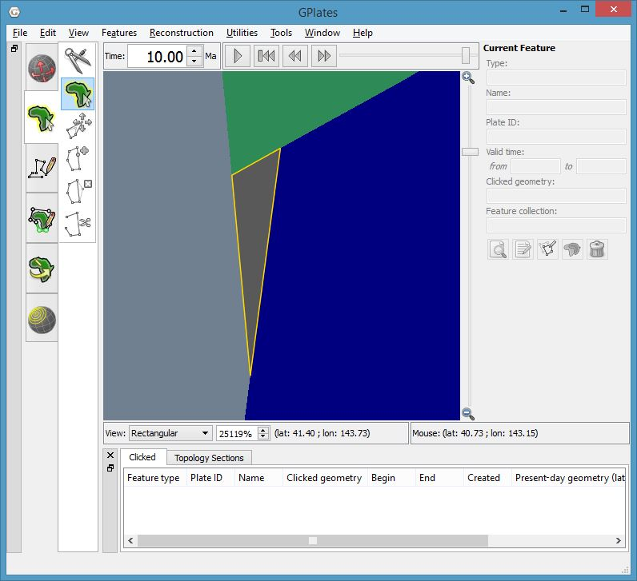
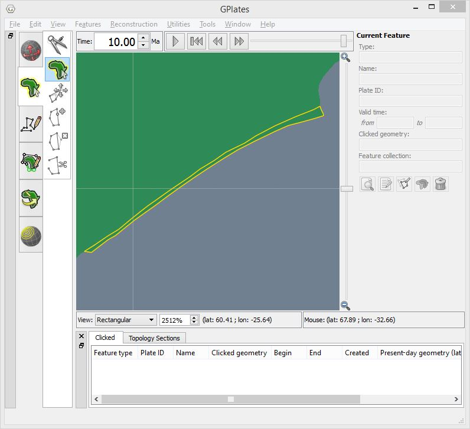

.. _pygplates_detect_topology_gaps_and_overlaps:

Find gaps and overlaps in global topological boundaries
^^^^^^^^^^^^^^^^^^^^^^^^^^^^^^^^^^^^^^^^^^^^^^^^^^^^^^^

| This example resolves topological plate polygons (and deforming networks) and detects any gaps and
  overlaps in their global coverage.
| Anomalous sub-segments, locating the gaps/overlaps, are written to a file that can be loaded into
  `GPlates <http://www.gplates.org>`_ to visualise alongside the dynamic plate polygons.

Gaps and overlaps are caused when:

- there is an area of the globe not covered by a topological boundary or network, or
- two (or more) topological boundary polygons overlap in some area of the globe.

This can also happen if two topological line sections are *identical* when ideally there should
only be one of them (and it should be shared by two neighbouring topological boundaries).

.. contents::
   :local:
   :depth: 2

Sample code
"""""""""""

::

    import pygplates

    # Create a topological model from the topological plate polygon features (can also include deforming networks)
    # and rotation file(s).
    topological_model = pygplates.TopologicalModel('topologies.gpml', 'rotations.rot')

    # Our geological times will be from 0Ma to 'num_time_steps' Ma (inclusive) in 1 My intervals.
    num_time_steps = 140

    # 'time' = 0, 1, 2, ... , 140
    for time in range(num_time_steps + 1):
        
        # Get a snapshot of our resolved topologies at the current 'time'.
        topological_snapshot = topological_model.topological_snapshot(time)

        # Extract the boundary sections between our resolved topological plate polygons (and deforming networks) from the current snapshot.
        shared_boundary_sections = topological_snapshot.get_resolved_topological_sections()
        
        # We'll create a feature for any anomalous sub-segment we find.
        anomalous_features = []
        
        # Iterate over the shared boundary sections.
        for shared_boundary_section in shared_boundary_sections:
            
            # Iterate over the sub-segments that actually contribute to a topology boundary.
            for shared_sub_segment in shared_boundary_section.get_shared_sub_segments():
                
                # If the resolved topologies have global coverage with no gaps/overlaps then
                # each sub-segment should be shared by exactly two resolved boundaries.
                if len(shared_sub_segment.get_sharing_resolved_topologies()) != 2:
                    
                    # We keep track of any anomalous sub-segment features.
                    anomalous_features.append(shared_sub_segment.get_resolved_feature())
        
        # If there are any anomalous features for the current 'time' then write them to a file
        # so we can load them into GPlates and see where the errors are located.
        if anomalous_features:
            
            # Put the anomalous features in a feature collection so we can write them to a file.
            anomalous_feature_collection = pygplates.FeatureCollection(anomalous_features)
            
            # Create a filename (for anomalous features) with the current 'time' in it.
            anomalous_features_filename = 'anomalous_sub_segments_at_{0}Ma.gpml'.format(time)
            
            # Write the anomalous sub-segments to a new file.
            anomalous_feature_collection.write(anomalous_features_filename)

Details
"""""""

| First create a :class:`topological model<pygplates.TopologicalModel>` from topological features and rotation files.
| The topological features can be plate polygons and/or deforming networks.
| More than one file containing topological features can be specified here, however we're only specifying one file.
| Also note that more than one rotation file (or even a single :class:`pygplates.RotationModel`) can be specified here,
  however we're only specifying a single rotation file.

::

    topological_model = pygplates.TopologicalModel('topologies.gpml', 'rotations.rot')

.. note:: We create our :class:`pygplates.TopologicalModel` **outside** the time loop since that does not require ``time``.

| Get a snapshot of our resolved topologies.
| Here the topological features are resolved to the current ``time``
  using :func:`pygplates.TopologicalModel.topological_snapshot`.

::

    topological_snapshot = topological_model.topological_snapshot(time)

| Extract the boundary sections between our resolved topological plate polygons (and deforming networks) from the current snapshot.
| By default both :class:`pygplates.ResolvedTopologicalBoundary` (used for dynamic plate polygons) and
  :class:`pygplates.ResolvedTopologicalNetwork` (used for deforming regions) are listed in the boundary sections.

::

    shared_boundary_sections = topological_snapshot.get_resolved_topological_sections()

These :class:`boundary sections<pygplates.ResolvedTopologicalSection>` are actually what
we're interested in because their sub-segments have a list of topologies on them.

| Not all parts of a topological section feature's geometry contribute to the boundaries of topologies.
| Little bits at the ends get clipped off.
| The parts that do contribute can be found using :meth:`pygplates.ResolvedTopologicalSection.get_shared_sub_segments`.

::

    for shared_sub_segment in shared_boundary_section.get_shared_sub_segments():

| The list of topologies that share a :class:`sub-segment<pygplates.ResolvedTopologicalSharedSubSegment>`
  is obtained using :class:`pygplates.ResolvedTopologicalSharedSubSegment.get_sharing_resolved_topologies`.
| If the resolved topologies have global coverage with no gaps/overlaps then each sub-segment should be
  shared by exactly two resolved boundaries.

::

    if len(shared_sub_segment.get_sharing_resolved_topologies()) != 2:

If a sub-segment is not shared by exactly two resolved boundaries then we record its feature.
::

    anomalous_sub_segment_features.append(shared_sub_segment.get_resolved_feature())

Finally we write the anomalous features to a file.
::

    anomalous_features_filename = 'anomalous_sub_segments_at_{0}Ma.gpml'.format(time)
    anomalous_feature_collection.write(anomalous_features_filename)

Visualising gaps and overlaps in GPlates
""""""""""""""""""""""""""""""""""""""""

The resulting output files such as ``anomalous_sub_segments_at_10Ma.gpml`` can be loaded into
`GPlates <http://www.gplates.org>`_ to see where the topological errors are located on the globe.

.. figure:: ../images/anomalous_sub_segments.png

   GPlates screenshot showing anomalous sub-segments (yellow) and dynamic plate polygons (blue) at 10Ma.

The following two screenshots show a zoomed-in view of a gap and an overlap.

   GPlates screenshot showing zoomed-in view of a **gap** in dynamic polygon coverage (outlined in yellow) at 10Ma.

   GPlates screenshot showing zoomed-in view of an **overlap** in dynamic polygon coverage (outlined in yellow) at 10Ma.
