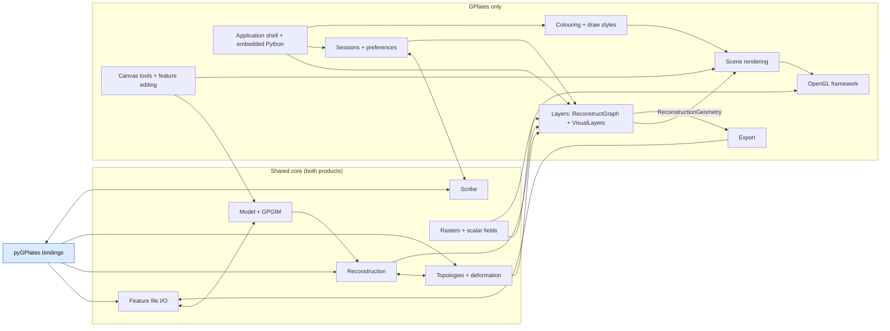

# `src/` architecture: two products, one tree

GPlates (the Qt desktop application) and pyGPlates (the Boost.Python extension module) are
built from this one source tree, selected by the CMake option `GPLATES_BUILD_GPLATES`
(see `AGENTS.md` at the repository root for the build mechanics). This document is the overview
of `src/`: its areas, its intended layering, and the boundary between what the two products
compile.

There is one architecture doc for all of `src/` — GPlates is the superset, and the pyGPlates
boundary is marked within it rather than described separately.

## What is here

- This README: the overview of the areas and how data flows between them, the layer groups, which
  directory a new file belongs in, and how the pyGPlates boundary is enforced.
- [dependency-matrix.md](dependency-matrix.md), generated from the `#include` lines: the layer
  diagrams (the code measured against the layer groups below), the include matrix, and the files
  the pyGPlates module compiles.
- One directory per area, listed under [Areas](#areas): what the area is for, its component
  diagram and, where it has them, sequence diagrams of its key operations, how it works, its
  traps and known weaknesses, and where to start reading.

Before changing an area, read its page. A pull request that changes an area's structure updates
its page in the same pull request.

A page describes the code as it is: known weaknesses are stated as facts about the current
design, never as proposals, plans or progress. It links only to material a public reader can
open (other pages, source files, public issues).

## Overview

An arrow means that one area's results feed the other; a double-headed arrow means each feeds the
other, as when one area both writes and reads through another. The shared core is compiled into
both products, and so are the pyGPlates bindings (blue): GPlates' embedded interpreter imports the
same module.

The nodes are the areas of the table below, except that *Model + GPGIM* is `model` and `gpgim`,
*Canvas tools + feature editing* is `canvas-tools` and `feature-editing`, the embedded
interpreter of `python-bindings` is drawn with the shell, and `auxiliary-tools` and `foundation`
have no node.

Files come in through feature file I/O into the model. The model feeds reconstruction, and
reconstruction and topologies feed each other: resolving a topology needs the reconstructed
geometries of its sections, and a reconstruction by plate ID can go through a
`TopologyReconstruct` to move geometries through resolved plates and deforming networks.

The two products drive that core through different doors. pyGPlates calls it directly
(`RotationModel`, `ReconstructModel` and `TopologicalModel` hold core objects and never see a
layer), and pickles through Scribe. GPlates wraps it in *layers*: `ReconstructGraph` holds the
loaded files and a graph of layer tasks, and each layer's proxy pulls from its inputs on demand
and caches. The layer outputs (`ReconstructionGeometry` objects) are turned into rendered
geometries, coloured by the draw-style system, and painted through the OpenGL framework. Rasters
partly bypass the scene: their GL objects are owned by the raster layer proxy and drawn by
`GLVisualLayers`. Canvas tools edit the model and draw into the same scene. Export reads the layer
outputs and writes with file I/O back ends. Sessions save the layer graph with Scribe. The
application shell owns all of it, and the embedded Python interpreter is where the colouring
scripts run. The GPGIM (the feature schema) is consulted by file I/O, the bindings and the
feature-editing dialogs; it is not drawn as edges.

## Areas

An area is a subject, not a directory: several span directories, and `app-logic/`, `gui/`,
`presentation/`, `view-operations/` and `qt-widgets/` are each split across several areas. An
area without a link has no page yet. The short name is the area's page directory, and how other
documents refer to the area.

| area | short name | what it covers | products |
| --- | --- | --- | --- |
| [Reconstruction](reconstruction/README.md) | `reconstruction` | rotation features to reconstruction trees; reconstruct methods; reconstructed feature geometries and velocities | both |
| GPGIM and feature schema | `gpgim` | the `Gpgim` registry of feature classes, properties and structural types; GPML version upgrades | both |
| Feature file I/O | `file-io` | the file-format registry; GPML, PLATES4, rotation and OGR readers and writers; the loaded-file state | both |
| Topologies and deformation | `topologies` | resolved lines, boundaries and networks; triangulation; deformation and strain; plate partitioning | both |
| Layers | `layers` | `ReconstructGraph`, layer tasks and proxies, and the visual layers that mirror them | GPlates |
| Colouring and draw styles | `colouring` | colours and palettes; the Python draw styles and their C++ adapters; symbols | GPlates (colour value types: both) |
| Scene rendering | `scene-rendering` | rendered geometries, the globe and map painters, view parameters, the canvases | GPlates |
| OpenGL framework | `opengl` | `opengl/`: the renderer, contexts, raster pyramids, scalar fields, filled polygons | GPlates |
| Python bindings and embedded Python | `python-bindings` | the `export_*()` bindings; the interpreter embedded in GPlates, and its scripts | both (embedding: GPlates) |
| Feature editing GUI | `feature-editing` | the dialogs that create and edit features property by property | GPlates |
| Application shell | `app-shell` | start-up; `Application`, `ApplicationState`, `ViewState`, `ViewportWindow`; the command line | GPlates |
| Rasters and 3D scalar fields | `rasters` | proxied raster property values, raster readers and caches, raster layers | GPlates (values and readers: both) |
| Export | `export` | the export-animation registry and strategies, and the writers of reconstructed data | GPlates (writers: both) |
| Canvas tools and geometry editing | `canvas-tools` | canvas-tool workflows, the geometry builder and its operations, undo | GPlates |
| Sessions, projects and preferences | `sessions` | saving and restoring the loaded files and layer state; user preferences | GPlates |
| Model | `model` | feature handles, revisions, property values, feature visitors | both |
| [Scribe](scribe-system/README.md) | `scribe-system` | serialisation for sessions, projects and pickling | both |
| Auxiliary analysis tools | `auxiliary-tools` | co-registration, Hellinger fitting, kinematic graphs, age models, velocity domains | GPlates |
| Foundation | `foundation` | `maths/` (geometry on the sphere, rotations), `utils/`, `global/` | both |

## The layer groups

The layering of `src/` is a statement of intent, not a description of the code. Measured as it
is, the code has almost no layers: counting every include, the shared core is one include cycle
and the GPlates-only half is another (the *Include cycles* table in
[dependency-matrix.md](dependency-matrix.md)). The groups below say what each part of the tree
may include. The generated diagrams draw every include that goes *up* them in red, and those red
edges are the distance between the code and the intent.

A group holds directory *parts*. A directory the pyGPlates module compiles only some of has two
parts: the module part (`app-logic`) and the GPlates-only rest (`app-logic+`). Anything in a group
may include anything else in it, or in a group below. Lowest first:

1. **Foundation** (`global`, `utils`): assertions, the exception classes and the version, and
   general utilities (smart pointers, strings, configuration). `utils` holds utilities for many
   directories, so it is *cross-cutting*: its upward includes are drawn
   in amber, and some of them are fine.
2. **Maths and serialisation** (`maths`, `scribe`): geometry on the sphere and rotations, and the
   Scribe serialisation framework. They include each other: the maths value types are
   transcribable, and `Transcription.cc` uses `Real`.
3. **Model and value types** (`model`, `property-values`, `gui`): the feature model and its
   property values. `gui` here is only its module part, the colour and palette value types, and
   the mipmapper, that the raster property values use; it and `property-values` include each
   other.
4. **Shared core** (`file-io`, `app-logic`): feature and raster readers and writers, and the
   reconstruction and topology code both products run. They include each other heavily in both
   directions.
5. **pyGPlates bindings** (`api`): the `export_*()` functions and the wrapper classes.
6. **GPlates engine** (`app-logic+`, `file-io+`, `scribe+`, `maths+`, `property-values+`,
   `global+`, `utils+`, `data-mining`, `cli`): the GPlates-only application logic, above all the
   layers machinery (`ReconstructGraph`, layer tasks and proxies, `ApplicationState`), plus the
   text and XML Scribe archives, co-registration, and the command-line tools. `cli` includes
   nothing from the user interface.
7. **OpenGL rendering** (`opengl`): a group of its own so that the includes into it from the
   engine are drawn. The raster and reconstruct layer proxies own OpenGL objects, and the
   co-registration proxy runs on one, which is why the Vulkan port has to change `app-logic`.
8. **GPlates user interface** (`gui+`, `presentation`, `view-operations`, `canvas-tools`,
   `qt-widgets`, `api+`): the rest of `gui` (painters, canvas-tool workflows, export strategies,
   menus, `PythonManager`), the presentation state and renderers, rendered geometries and geometry
   editing, the canvas tools and widgets, and the embedded-interpreter half of `api`. It is one
   group because its directories include each other heavily: `gui` and `qt-widgets` do so in
   both directions, in large numbers (the matrix has the counts).

Of `qt-resources/`, `gpgim.qrc` (the GPGIM XML) and `python.qrc` (the pure-Python API and
scripts) are compiled into both products; `opengl.qrc` (shaders) and `qt_resources.qrc` (images)
are GPlates-only.

The groups live in `LAYERS` in `cmake/pygplates_source_closure.py`. Change the list and this
section together. The drift check fails if a directory part is in no group, so a new directory
can't go unplaced.

**An upward include** is a lower group reaching into a higher one, so the lower code can't be
built or understood without the higher. Some are misplaced files (a value type living in the
directory of its main user), which a move fixes. Some are real design problems, such as the model
naming the application-logic classes that observe features, or raster property values reading
files. The generated *Upward includes* table lists each one with the files making it.

## What goes in which directory

The layer groups say what may include what, and the module boundary says what the module
compiles. Neither says which directory a new class belongs in, and two rules here were learned by
getting them wrong.

**A directory is a subject, not a shape of code.** `src/feature-visitors/` grouped classes solely
because they inherited `FeatureVisitor` or `ConstFeatureVisitor`. That put a `QTreeWidget`
populator and the model's own `get_property_value()` in one directory. It never held most of
them: of the files declaring a class derived from `FeatureVisitor` or `ConstFeatureVisitor`, 15
were in that directory and 45 were spread across seven others - `app-logic/` (27), `file-io/`
(8), `data-mining/` (3), `api/` (2), `qt-widgets/` (2), `utils/` (2) and `model/` (1) - where
they belonged. Sharing a base class, or a suffix like `*Finder` or `*Utils`, is not a reason to
sit together. The directory was dissolved for that reason and each class went beside the code it
serves.

**`property-values/` holds property values, not code that operates on them.** Everything in it
either *is* a property value (`Gml*`, `Gpml*`, `Xs*`, `Enumeration`,
`UninterpretedPropertyValue`) or is a value type one is built from and owns (`GeoTimeInstant`,
`RawRaster`, `StructuralType`, the raster georeferencing). A visitor or helper that reads or
builds property values goes in `model/`, beside `ModelUtils` and `PropertyValueFinder`. Before
the dissolution `property-values/` contained no feature visitor at all and `model/` already did,
which is the distinction to keep.

Two practical constraints on that choice, both of which the build will tell you about:

- Every file in `model/` is inside the pyGPlates closure (the matrix reports it as 97 / 97), and
  `model/CMakeLists.txt` has no `gplates_only_srcs` list as a result. A GPlates-only class does
  not belong there; `FromQvariantConverter` went to `gui/` beside `FeaturePropertyTableModel`,
  the one consumer its own comment names.
- Moving a class between directories moves its namespace with it. Watch for free functions
  declared in the same header - `GeometryTypeFinder.h` declares four, which a sweep by class name
  misses - and for `using namespace` sites, which stop compiling only if something else in that
  function also relied on them.

## How the boundary is defined and enforced

The module's source list is not curated by hand: it is the **include closure of the pyGPlates
API**, computed by `cmake/pygplates_source_closure.py`. The roots are discovered automatically
from the `export_*()` calls that `BOOST_PYTHON_MODULE` and `export_cpp_python_api()` make
outside the `GPLATES_PYTHON_EMBEDDING` guard (`src/api/PyGPlatesModule.cc`), plus
`src/ScribeExportPyGPlates.cc`; quoted includes are traversed, and reaching `X.h` pulls in
`X.cc`. The per-directory `gplates_only_srcs` exclusion lists (and the `gui/` allowlist) in
`src/*/CMakeLists.txt` are derived from that closure.

Enforcement, in CTest (run `ctest --test-dir <build-pygplates> -C Release`):

- **pygplates-source-closure-test** re-runs the tracer against the source list the configure step
  actually gave the `pygplates` target (`<build>/pygplates_sources.txt`, or
  `pygplates_sources_<config>.txt` in a multi-config tree such as Visual Studio), failing on over-
  *and* under-inclusion, on any reach into a forbidden directory or a Qt Widgets / OpenGL /
  Qwt angle include, and on drift of the committed `dependency-matrix.md`.
- **pygplates-linkage-test** inspects the built module's direct shared-library dependencies
  (`dumpbin` / `readelf` / `otool`), failing if one of GPlates' GUI/rendering libraries
  (Qt Widgets, Qt Gui, Qt Svg, the Qt OpenGL modules, Qwt, GLEW) appears — or the platform's
  own OpenGL (GLVND's `libOpenGL`/`libGLX`/`libGLdispatch`, the legacy `libGL`, the macOS
  framework, `opengl32.dll`). There is no exemption: the module links only `Qt6::Core`, and a
  GL library on its link line means a GUI library has crept back in
  (`Qt6::Gui`'s imported target propagates Qt's own OpenGL dependency onto everything linking
  it, which is how the Linux wheel once needed `libGL.so.1` just to be imported).

## Rules for new files

- **New file in a GPlates-only directory** (`qt-widgets`, `opengl`, `canvas-tools`,
  `view-operations`, `presentation`, `cli`, `data-mining`, `gui`, `unit-test`): nothing to
  do — those directories (and everything not on the `gui/` allowlist) are excluded from the
  module by default.
- **New file in a shared directory**: if the API cannot reach it, add its `.h` *and* `.cc` to
  that directory's `gplates_only_srcs`; if the API can reach it, just list it in `srcs`. The
  closure test tells you which, and fails with the include chain when a listing is wrong.
  Keep `.h`/`.cc` pairs together: AUTOMOC mocs any Q_OBJECT header listed in the module's
  sources, and a moc'ed header whose `.cc` is not compiled fails at link time.
- **A shared TU must not reference a symbol defined only in a GPlates-only TU.** The Release
  linker can hide such a reference (`/OPT:REF` discards unreferenced code); a **Debug**
  pyGPlates link is the reliable check.
- **Python bindings that need the embedded interpreter** go behind `GPLATES_PYTHON_EMBEDDING`
  (a compile definition only `gplates-lib` has) and are registered inside the guarded block of
  `export_cpp_python_api()`.
- **Error reporting in shared code** goes through return values / exceptions /
  `ReadErrorAccumulation` — never a `QMessageBox` or other widget (shared code cannot assume
  a GUI, or even Qt Widgets at link time). When shared code genuinely needs a GUI decision,
  or a Qt Gui/Widgets facility, inject an interface the GPlates side implements and registers
  from `presentation/FileIOInjections.cc` (`register_file_io_injections`, called by both the
  GUI's `Application::initialise()` and the command-line path in `gplates_main.cc` — the CLI
  never constructs an `Application`, so a registration made only there silently regresses
  `gplates convert-file-format` and friends). Three examples: `file-io/PropertyMapper.h`
  (implemented by `qt-widgets/ShapefilePropertyMapper`, set with
  `OgrReader::set_property_mapper`); `RasterReader::set_rgba_reader_factory` (the
  `QImage`-based `file-io/RgbaRasterReader` for BMP/GIF/JPEG/PNG/SVG rasters — without it a
  module reports such a raster as unreadable, which pyGPlates cannot observe); and
  `GeoscimlProfile::set_progress_reporter_factory` (the `QProgressDialog` in
  `qt-widgets/GeoscimlProgressDialog` — without it the `.gsml` reader runs silently).

## Deferred / follow-up work (not in the build-graph-split PR)

- Decouple `GmlFile` from its `ProxiedRasterCache` member (TODO at
  `property-values/GmlFile.h`): today loading a raster GPML opens the raster through GDAL at
  parse time. Worth doing on its own merits, but note that it does **not** shrink the module —
  it removes exactly one translation unit. `RasterReader`/GDAL, `gui/Mipmapper` and
  `gui/RasterColourPalette` are reached independently of `GmlFile`, through the
  `RasterBandReaderHandle` member of `property-values/RawRaster.h`, which
  `app-logic/ExtractRasterFeatureProperties.h` puts on the API's own feature-collection
  classification path.
- Physically move the `app-logic` layers machinery into its own directory, and the ~17
  embedded-interpreter files out of `src/api/` (they serve `gui/PythonManager`, not the API).
  Directory moves multiply merge risk across the `vulkan` branch and the downstream fork, so
  this waits for a dedicated commit at a quiet merge point.
