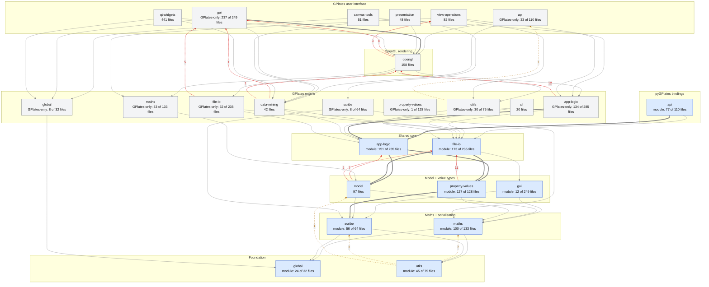
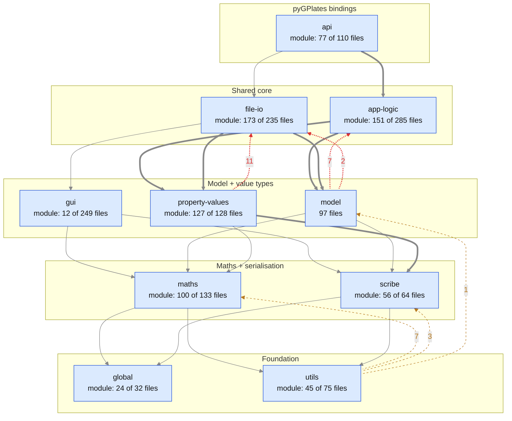

<!-- Generated by cmake/pygplates_source_closure.py - do not edit.
     Regenerate: python cmake/pygplates_source_closure.py --output-doc docs/design/architecture/dependency-matrix.md
     The pygplates-source-closure test fails if this file is stale. -->

# `src/` dependencies

Generated from the `#include` lines in `src/`: the layer diagrams (the intended
layering, and where the code departs from it), the include matrix between
directories, and the files the pyGPlates module compiles.

# Layer diagrams

Each node is a directory *part*: the part of a directory that the pyGPlates module
compiles (blue), or the GPlates-only part (grey). Directories the module never
reaches are wholly grey. The groups are the intended layering, `LAYERS` in
`cmake/pygplates_source_closure.py`, lowest at the bottom; [README.md](README.md)
says what each group is for. An arrow means *includes*. Downward arrows are
transitively reduced (thick: 100 or more includes), and includes between parts in
one group are not drawn. **Red** dotted arrows go *up* the layering, with their
include counts; **amber** ones go up from `utils`, which is cross-cutting. The files
in `src/` itself and `unit-test/` are left out.

## Both products

## The pyGPlates module on its own

## Upward includes

Every include that goes up the layering, and the files making it (`M` marks an edge
inside the pyGPlates module).

| from | to | includes | files (includes) |
| --- | --- | ---: | --- |
| `app-logic+` | `opengl` | 12 | `app-logic/RasterLayerProxy.h` (10), `app-logic/CoRegistrationLayerProxy.cc` (1), `app-logic/ReconstructLayerProxy.h` (1) |
| `property-values` | `file-io` | 11 M | `property-values/ProxiedRasterResolver.h` (6), `property-values/GmlFile.h` (1), `property-values/GpmlMetadata.h` (1), `property-values/ProxiedRasterCache.cc` (1), `property-values/ProxiedRasterCache.h` (1), `property-values/RawRaster.h` (1) |
| `opengl` | `gui+` | 8 | `opengl/GLLight.h` (2), `opengl/GLVisualLayers.h` (2), `opengl/GLMapCubeMeshGenerator.h` (1), `opengl/GLMultiResolutionMapCubeMesh.h` (1), `opengl/GLMultiResolutionStaticPolygonReconstructedRaster.h` (1), `opengl/GLText.cc` (1) |
| `model` | `app-logic` | 7 M | `model/WeakObserverVisitor.cc` (7) |
| `file-io+` | `gui+` | 5 | `file-io/CptReader.cc` (2), `file-io/CptReader.h` (1), `file-io/SymbolFileReader.cc` (1), `file-io/SymbolFileReader.h` (1) |
| `opengl` | `view-operations` | 3 | `opengl/GLVisualLayers.h` (2), `opengl/GLScalarField3D.h` (1) |
| `model` | `file-io` | 2 M | `model/Gpgim.cc` (1), `model/Metadata.h` (1) |
| `data-mining` | `gui+` | 1 | `data-mining/DataTable.cc` (1) |
| `data-mining` | `opengl` | 1 | `data-mining/DataSelector.cc` (1) |
| `utils` | `maths` | 7 M | `utils/GeometryCreationUtils.h` (6), `utils/StringFormattingUtils.h` (1) |
| `utils` | `scribe` | 3 M | `utils/UnicodeString.cc` (2), `utils/UnicodeString.h` (1) |
| `utils` | `model` | 1 M | `utils/XmlNamespaces.cc` (1) |
| `utils+` | `api+` | 1 | `utils/GetPropertyAsPythonObjVisitor.h` (1) |

## Include cycles

The layering the code actually has, before any intent is applied: the groups of
parts that include each other in a cycle (strongly connected components), counting
only the edges that carry at least a given number of includes.

| edges counted | parts in one cycle |
| --- | --- |
| every include | `api+`, `app-logic+`, `canvas-tools`, `data-mining`, `file-io+`, `gui+`, `opengl`, `presentation`, `qt-widgets`, `utils+`, `view-operations`; `app-logic`, `file-io`, `global`, `gui`, `maths`, `model`, `property-values`, `scribe`, `utils` |
| 3 or more includes | `api+`, `app-logic+`, `canvas-tools`, `data-mining`, `file-io+`, `gui+`, `opengl`, `presentation`, `qt-widgets`, `view-operations`; `app-logic`, `file-io`, `gui`, `model`, `property-values`; `global`, `maths`, `scribe`, `utils` |
| 10 or more includes | `api+`, `canvas-tools`, `gui+`, `presentation`, `qt-widgets`, `view-operations`; `app-logic`, `file-io`, `model`, `property-values`; `app-logic+`, `opengl` |

# Dependency matrix

Counts of resolved quoted `#include` lines from files in the *row* directory to files
in the *column* directory, over every `.h`/`.cc` in the built `src/` subdirectories.
`(src root)` is the files directly in `src/`.

| includes -> | (src root) | api | app-logic | canvas-tools | cli | data-mining | file-io | global | gui | maths | model | opengl | presentation | property-values | qt-widgets | scribe | unit-test | utils | view-operations |
| --- | ---: | ---: | ---: | ---: | ---: | ---: | ---: | ---: | ---: | ---: | ---: | ---: | ---: | ---: | ---: | ---: | ---: | ---: | ---: |
| (src root) |  | 2 | 2 |  | 1 | 1 | 1 | 4 | 4 | 3 | 1 | 1 | 2 | 1 | 2 | 6 | 1 | 3 |  |
| api |  | 275 | 125 |  |  | 8 | 36 | 156 | 15 | 86 | 78 | 2 | 3 | 114 | 5 | 29 |  | 44 |  |
| app-logic |  |  | 936 |  |  | 7 | 21 | 161 |  | 279 | 293 | 12 |  | 307 |  | 25 |  | 121 |  |
| canvas-tools |  |  | 12 | 42 |  |  |  | 3 | 36 | 27 | 14 |  | 7 | 2 | 38 |  |  | 8 | 68 |
| cli |  |  | 17 |  | 42 |  | 29 | 6 |  | 5 | 24 |  |  |  |  |  |  |  |  |
| data-mining |  |  | 18 |  |  | 81 | 4 | 6 | 1 | 8 | 9 | 1 |  | 72 |  | 11 |  | 6 |  |
| file-io |  |  | 82 |  |  |  | 537 | 117 | 19 | 112 | 241 |  |  | 415 |  |  |  | 78 |  |
| global |  |  |  |  |  |  |  | 25 |  |  |  |  |  |  |  |  |  | 5 |  |
| gui |  | 18 | 169 | 53 |  | 3 | 53 | 95 | 480 | 117 | 81 | 113 | 79 | 98 | 163 | 14 |  | 89 | 108 |
| maths |  |  |  |  |  |  |  | 75 |  | 410 | 1 |  |  |  |  | 24 |  | 41 |  |
| model |  |  | 7 |  |  |  | 2 | 30 |  | 1 | 218 |  |  | 58 |  | 23 |  | 48 |  |
| opengl |  |  | 16 |  |  |  | 10 | 189 | 32 | 100 |  | 614 |  | 24 |  |  |  | 125 | 3 |
| presentation |  | 1 | 100 |  |  | 1 | 24 | 23 | 76 | 12 | 9 | 3 | 93 | 6 | 26 | 25 |  | 11 | 19 |
| property-values |  |  |  |  |  |  | 11 | 64 | 5 | 26 | 292 |  |  | 176 |  | 103 |  | 35 |  |
| qt-widgets |  | 17 | 276 | 7 |  | 8 | 79 | 133 | 223 | 116 | 268 | 35 | 116 | 212 | 834 |  |  | 55 | 26 |
| scribe |  |  |  |  |  |  |  | 31 |  | 8 |  |  |  |  |  | 172 |  | 23 |  |
| unit-test |  |  | 4 |  |  | 2 | 11 | 2 | 5 | 9 | 11 |  |  | 5 |  | 16 | 2 | 6 |  |
| utils |  | 1 |  |  |  |  | 1 | 34 |  | 13 | 1 |  |  | 54 |  | 3 |  | 50 |  |
| view-operations |  |  | 44 | 6 |  |  | 5 | 27 | 56 | 92 | 27 |  | 6 | 9 | 1 | 3 |  | 13 | 232 |

# The pyGPlates module subset

The pygplates module compiles only the include closure of the API roots below
(reaching `X.h` pulls in `X.cc`). Everything else is GPlates-only and excluded by
`src/*/CMakeLists.txt`; the `pygplates-source-closure` test enforces the boundary.

Roots: the exporter `.cc` of every `export_*()` call registered in
`export_cpp_python_api()` outside the `GPLATES_PYTHON_EMBEDDING` guard, plus
`api/PyGPlatesModule.cc` and `ScribeExportPyGPlates.cc` (45 roots).

| directory | module files / total |
| --- | ---: |
| (src root) | 1 / 7 |
| api | 77 / 110 |
| app-logic | 151 / 285 |
| canvas-tools | 0 / 51 |
| cli | 0 / 20 |
| data-mining | 0 / 42 |
| file-io | 173 / 235 |
| global | 24 / 32 |
| gui | 12 / 249 |
| maths | 100 / 133 |
| model | 97 / 97 |
| opengl | 0 / 158 |
| presentation | 0 / 48 |
| property-values | 127 / 128 |
| qt-widgets | 0 / 441 |
| scribe | 56 / 64 |
| unit-test | 0 / 16 |
| utils | 45 / 75 |
| view-operations | 0 / 82 |

What the module takes from each partially-included directory:

## (src root) (1 of 7)

- `ScribeExportPyGPlates.cc`

## api (77 of 110)

- `api/APIVersion.cc`
- `api/APIVersion.h`
- `api/PyCalculateVelocities.cc`
- `api/PyDateLineWrapper.cc`
- `api/PyEarth.cc`
- `api/PyExceptions.cc`
- `api/PyExceptions.h`
- `api/PyFeature.cc`
- `api/PyFeature.h`
- `api/PyFeatureCollection.cc`
- `api/PyFeatureCollectionFileFormatRegistry.cc`
- `api/PyFeatureCollectionFileFormatRegistry.h`
- `api/PyFeatureCollectionFunctionArgument.cc`
- `api/PyFeatureCollectionFunctionArgument.h`
- `api/PyFilePathFunctionArgument.cc`
- `api/PyFilePathFunctionArgument.h`
- `api/PyFiniteRotation.cc`
- `api/PyGPlatesModule.cc`
- `api/PyGeoTimeInstant.cc`
- `api/PyGeometriesOnSphere.cc`
- `api/PyGeometriesOnSphere.h`
- `api/PyGreatCircleArc.cc`
- `api/PyGreatCircleArc.h`
- `api/PyIds.cc`
- `api/PyInformationModel.cc`
- `api/PyInformationModel.h`
- `api/PyInteger.cc`
- `api/PyInterpolationException.h`
- `api/PyLatLonPoint.cc`
- `api/PyLocalCartesian.cc`
- `api/PyNetRotation.cc`
- `api/PyNetRotation.h`
- `api/PyNetworkTriangulation.cc`
- `api/PyNetworkTriangulation.h`
- `api/PyPlatePartitioner.cc`
- `api/PyPlatePartitioner.h`
- `api/PyProperty.cc`
- `api/PyPropertyValueVisitor.cc`
- `api/PyPropertyValues.cc`
- `api/PyPropertyValues.h`
- `api/PyPurePython.cc`
- `api/PyQualifiedXmlNames.cc`
- `api/PyQualifiedXmlNames.h`
- `api/PyReal.cc`
- `api/PyReconstruct.cc`
- `api/PyReconstructModel.cc`
- `api/PyReconstructModel.h`
- `api/PyReconstructSnapshot.cc`
- `api/PyReconstructSnapshot.h`
- `api/PyReconstructionGeometries.cc`
- `api/PyReconstructionGeometries.h`
- `api/PyReconstructionTree.cc`
- `api/PyReconstructionTree.h`
- `api/PyResolveTopologies.cc`
- `api/PyResolveTopologyParameters.cc`
- `api/PyResolveTopologyParameters.h`
- `api/PyRevisionedVector.cc`
- `api/PyRevisionedVector.h`
- `api/PyRotationModel.cc`
- `api/PyRotationModel.h`
- `api/PyStrain.cc`
- `api/PyStrings.cc`
- `api/PyTopologicalFeatureCollectionFunctionArgument.cc`
- `api/PyTopologicalFeatureCollectionFunctionArgument.h`
- `api/PyTopologicalModel.cc`
- `api/PyTopologicalModel.h`
- `api/PyTopologicalSnapshot.cc`
- `api/PyTopologicalSnapshot.h`
- `api/PyVector3D.cc`
- `api/PythonConverterUtils.h`
- `api/PythonExtractUtils.cc`
- `api/PythonExtractUtils.h`
- `api/PythonHashDefVisitor.h`
- `api/PythonPickle.cc`
- `api/PythonPickle.h`
- `api/PythonVariableFunctionArguments.cc`
- `api/PythonVariableFunctionArguments.h`

## app-logic (151 of 285)

- `app-logic/AppLogicUtils.cc`
- `app-logic/AppLogicUtils.h`
- `app-logic/DeformationStrain.cc`
- `app-logic/DeformationStrain.h`
- `app-logic/DeformationStrainRate.cc`
- `app-logic/DeformationStrainRate.h`
- `app-logic/ExtractRasterFeatureProperties.cc`
- `app-logic/ExtractRasterFeatureProperties.h`
- `app-logic/ExtractScalarField3DFeatureProperties.cc`
- `app-logic/ExtractScalarField3DFeatureProperties.h`
- `app-logic/FlowlineGeometryPopulator.cc`
- `app-logic/FlowlineGeometryPopulator.h`
- `app-logic/FlowlineUtils.cc`
- `app-logic/FlowlineUtils.h`
- `app-logic/GeometryCookieCutter.cc`
- `app-logic/GeometryCookieCutter.h`
- `app-logic/GeometryFinder.cc`
- `app-logic/GeometryFinder.h`
- `app-logic/GeometrySetter.cc`
- `app-logic/GeometrySetter.h`
- `app-logic/GeometryTypeFinder.cc`
- `app-logic/GeometryTypeFinder.h`
- `app-logic/GeometryUtils.cc`
- `app-logic/GeometryUtils.h`
- `app-logic/MotionPathGeometryPopulator.cc`
- `app-logic/MotionPathGeometryPopulator.h`
- `app-logic/MotionPathUtils.cc`
- `app-logic/MotionPathUtils.h`
- `app-logic/MultiPointVectorField.cc`
- `app-logic/MultiPointVectorField.h`
- `app-logic/NetRotationUtils.cc`
- `app-logic/NetRotationUtils.h`
- `app-logic/PlateBoundaryStats.cc`
- `app-logic/PlateBoundaryStats.h`
- `app-logic/PlateVelocityUtils.cc`
- `app-logic/PlateVelocityUtils.h`
- `app-logic/ReconstructContext.cc`
- `app-logic/ReconstructContext.h`
- `app-logic/ReconstructHandle.h`
- `app-logic/ReconstructMethodByPlateId.cc`
- `app-logic/ReconstructMethodByPlateId.h`
- `app-logic/ReconstructMethodFiniteRotation.h`
- `app-logic/ReconstructMethodFlowline.cc`
- `app-logic/ReconstructMethodFlowline.h`
- `app-logic/ReconstructMethodHalfStageRotation.cc`
- `app-logic/ReconstructMethodHalfStageRotation.h`
- `app-logic/ReconstructMethodInterface.cc`
- `app-logic/ReconstructMethodInterface.h`
- `app-logic/ReconstructMethodMotionPath.cc`
- `app-logic/ReconstructMethodMotionPath.h`
- `app-logic/ReconstructMethodRegistry.cc`
- `app-logic/ReconstructMethodRegistry.h`
- `app-logic/ReconstructMethodSmallCircle.cc`
- `app-logic/ReconstructMethodSmallCircle.h`
- `app-logic/ReconstructMethodType.h`
- `app-logic/ReconstructMethodVirtualGeomagneticPole.cc`
- `app-logic/ReconstructMethodVirtualGeomagneticPole.h`
- `app-logic/ReconstructParams.cc`
- `app-logic/ReconstructParams.h`
- `app-logic/ReconstructUtils.cc`
- `app-logic/ReconstructUtils.h`
- `app-logic/ReconstructedFeatureGeometry.cc`
- `app-logic/ReconstructedFeatureGeometry.h`
- `app-logic/ReconstructedFeatureGeometryFinder.cc`
- `app-logic/ReconstructedFeatureGeometryFinder.h`
- `app-logic/ReconstructedFlowline.cc`
- `app-logic/ReconstructedFlowline.h`
- `app-logic/ReconstructedMotionPath.cc`
- `app-logic/ReconstructedMotionPath.h`
- `app-logic/ReconstructedScalarCoverage.cc`
- `app-logic/ReconstructedScalarCoverage.h`
- `app-logic/ReconstructedSmallCircle.cc`
- `app-logic/ReconstructedSmallCircle.h`
- `app-logic/ReconstructedVirtualGeomagneticPole.cc`
- `app-logic/ReconstructedVirtualGeomagneticPole.h`
- `app-logic/ReconstructionFeatureProperties.cc`
- `app-logic/ReconstructionFeatureProperties.h`
- `app-logic/ReconstructionGeometry.h`
- `app-logic/ReconstructionGeometryFinder.cc`
- `app-logic/ReconstructionGeometryFinder.h`
- `app-logic/ReconstructionGeometryUtils.cc`
- `app-logic/ReconstructionGeometryUtils.h`
- `app-logic/ReconstructionGeometryVisitor.cc`
- `app-logic/ReconstructionGeometryVisitor.h`
- `app-logic/ReconstructionGraph.h`
- `app-logic/ReconstructionGraphBuilder.cc`
- `app-logic/ReconstructionGraphBuilder.h`
- `app-logic/ReconstructionGraphPopulator.cc`
- `app-logic/ReconstructionGraphPopulator.h`
- `app-logic/ReconstructionTree.cc`
- `app-logic/ReconstructionTree.h`
- `app-logic/ReconstructionTreeCreator.cc`
- `app-logic/ReconstructionTreeCreator.h`
- `app-logic/ResolvedSubSegmentRangeInSection.cc`
- `app-logic/ResolvedSubSegmentRangeInSection.h`
- `app-logic/ResolvedTopologicalBoundary.cc`
- `app-logic/ResolvedTopologicalBoundary.h`
- `app-logic/ResolvedTopologicalGeometry.h`
- `app-logic/ResolvedTopologicalGeometrySubSegment.cc`
- `app-logic/ResolvedTopologicalGeometrySubSegment.h`
- `app-logic/ResolvedTopologicalLine.cc`
- `app-logic/ResolvedTopologicalLine.h`
- `app-logic/ResolvedTopologicalNetwork.cc`
- `app-logic/ResolvedTopologicalNetwork.h`
- `app-logic/ResolvedTopologicalSection.h`
- `app-logic/ResolvedTopologicalSharedSubSegment.cc`
- `app-logic/ResolvedTopologicalSharedSubSegment.h`
- `app-logic/ResolvedTopologicalSubSegmentImpl.cc`
- `app-logic/ResolvedTopologicalSubSegmentImpl.h`
- `app-logic/ResolvedTriangulationDelaunay2.cc`
- `app-logic/ResolvedTriangulationDelaunay2.h`
- `app-logic/ResolvedTriangulationNetwork.cc`
- `app-logic/ResolvedTriangulationNetwork.h`
- `app-logic/ResolvedTriangulationUtils.h`
- `app-logic/ResolvedVertexSourceInfo.cc`
- `app-logic/ResolvedVertexSourceInfo.h`
- `app-logic/RotationUtils.cc`
- `app-logic/RotationUtils.h`
- `app-logic/ScalarCoverageEvolution.cc`
- `app-logic/ScalarCoverageEvolution.h`
- `app-logic/ScalarCoverageFeatureProperties.cc`
- `app-logic/ScalarCoverageFeatureProperties.h`
- `app-logic/ScalarCoverageTimeSpan.cc`
- `app-logic/ScalarCoverageTimeSpan.h`
- `app-logic/SmallCircleGeometryPopulator.cc`
- `app-logic/SmallCircleGeometryPopulator.h`
- `app-logic/TimeSpanUtils.cc`
- `app-logic/TimeSpanUtils.h`
- `app-logic/TopologyGeometryResolver.cc`
- `app-logic/TopologyGeometryResolver.h`
- `app-logic/TopologyGeometryType.h`
- `app-logic/TopologyInternalUtils.cc`
- `app-logic/TopologyInternalUtils.h`
- `app-logic/TopologyIntersections.cc`
- `app-logic/TopologyIntersections.h`
- `app-logic/TopologyNetworkParams.cc`
- `app-logic/TopologyNetworkParams.h`
- `app-logic/TopologyNetworkResolver.cc`
- `app-logic/TopologyNetworkResolver.h`
- `app-logic/TopologyPointLocation.h`
- `app-logic/TopologyReconstruct.cc`
- `app-logic/TopologyReconstruct.h`
- `app-logic/TopologyReconstructedFeatureGeometry.cc`
- `app-logic/TopologyReconstructedFeatureGeometry.h`
- `app-logic/TopologyUtils.cc`
- `app-logic/TopologyUtils.h`
- `app-logic/TotalReconstructionSequencePlateIdFinder.cc`
- `app-logic/TotalReconstructionSequencePlateIdFinder.h`
- `app-logic/VelocityDeltaTime.cc`
- `app-logic/VelocityDeltaTime.h`
- `app-logic/VelocityUnits.h`

## file-io (173 of 235)

- `file-io/ArbitraryNodeProcessor.h`
- `file-io/ArbitraryXmlProfile.h`
- `file-io/ArbitraryXmlReader.cc`
- `file-io/ArbitraryXmlReader.h`
- `file-io/CitcomsResolvedTopologicalBoundaryExportImpl.cc`
- `file-io/CitcomsResolvedTopologicalBoundaryExportImpl.h`
- `file-io/ErrorOpeningFileForReadingException.cc`
- `file-io/ErrorOpeningFileForReadingException.h`
- `file-io/ErrorOpeningFileForWritingException.cc`
- `file-io/ErrorOpeningFileForWritingException.h`
- `file-io/ErrorOpeningPipeFromGzipException.cc`
- `file-io/ErrorOpeningPipeFromGzipException.h`
- `file-io/ErrorOpeningPipeToGzipException.cc`
- `file-io/ErrorOpeningPipeToGzipException.h`
- `file-io/ErrorWritingFeatureCollectionToFileFormatException.h`
- `file-io/FeatureCollectionFileFormat.h`
- `file-io/FeatureCollectionFileFormatClassify.cc`
- `file-io/FeatureCollectionFileFormatClassify.h`
- `file-io/FeatureCollectionFileFormatConfiguration.h`
- `file-io/FeatureCollectionFileFormatConfigurations.cc`
- `file-io/FeatureCollectionFileFormatConfigurations.h`
- `file-io/FeatureCollectionFileFormatRegistry.cc`
- `file-io/FeatureCollectionFileFormatRegistry.h`
- `file-io/File.cc`
- `file-io/File.h`
- `file-io/FileFormatNotSupportedException.h`
- `file-io/FileInfo.cc`
- `file-io/FileInfo.h`
- `file-io/FileLoadAbortedException.h`
- `file-io/GMTFormatFlowlineExport.cc`
- `file-io/GMTFormatFlowlineExport.h`
- `file-io/GMTFormatGeometryExporter.cc`
- `file-io/GMTFormatGeometryExporter.h`
- `file-io/GMTFormatHeader.cc`
- `file-io/GMTFormatHeader.h`
- `file-io/GMTFormatMotionPathExport.cc`
- `file-io/GMTFormatMotionPathExport.h`
- `file-io/GMTFormatReconstructedFeatureGeometryExport.cc`
- `file-io/GMTFormatReconstructedFeatureGeometryExport.h`
- `file-io/GMTFormatResolvedTopologicalGeometryExport.cc`
- `file-io/GMTFormatResolvedTopologicalGeometryExport.h`
- `file-io/GMTFormatWriter.cc`
- `file-io/GMTFormatWriter.h`
- `file-io/Gdal.h`
- `file-io/GdalRasterReader.cc`
- `file-io/GdalRasterReader.h`
- `file-io/GdalUtils.cc`
- `file-io/GdalUtils.h`
- `file-io/GeometryExporter.h`
- `file-io/GeoscimlProfile.cc`
- `file-io/GeoscimlProfile.h`
- `file-io/GmapReader.cc`
- `file-io/GmapReader.h`
- `file-io/GpmlFeatureReaderFactory.cc`
- `file-io/GpmlFeatureReaderFactory.h`
- `file-io/GpmlFeatureReaderImpl.cc`
- `file-io/GpmlFeatureReaderImpl.h`
- `file-io/GpmlFeatureReaderInterface.cc`
- `file-io/GpmlFeatureReaderInterface.h`
- `file-io/GpmlOutputVisitor.cc`
- `file-io/GpmlOutputVisitor.h`
- `file-io/GpmlPropertyReader.cc`
- `file-io/GpmlPropertyReader.h`
- `file-io/GpmlPropertyStructuralTypeReader.cc`
- `file-io/GpmlPropertyStructuralTypeReader.h`
- `file-io/GpmlPropertyStructuralTypeReaderUtils.cc`
- `file-io/GpmlPropertyStructuralTypeReaderUtils.h`
- `file-io/GpmlReader.cc`
- `file-io/GpmlReader.h`
- `file-io/GpmlReaderException.h`
- `file-io/GpmlReaderUtils.cc`
- `file-io/GpmlReaderUtils.h`
- `file-io/GpmlStructuralTypeReaderUtils.cc`
- `file-io/GpmlStructuralTypeReaderUtils.h`
- `file-io/GpmlUpgradeReaderUtils.cc`
- `file-io/GpmlUpgradeReaderUtils.h`
- `file-io/GsmlConst.h`
- `file-io/GsmlFeatureHandlers.cc`
- `file-io/GsmlFeatureHandlers.h`
- `file-io/GsmlFeaturesDef.h`
- `file-io/GsmlNodeProcessor.cc`
- `file-io/GsmlNodeProcessor.h`
- `file-io/GsmlNodeProcessorFactory.cc`
- `file-io/GsmlNodeProcessorFactory.h`
- `file-io/GsmlPropertyDef.h`
- `file-io/GsmlPropertyHandlers.cc`
- `file-io/GsmlPropertyHandlers.h`
- `file-io/GsmlXmlQuery.cc`
- `file-io/GsmlXmlQuery.h`
- `file-io/GzipFile.cc`
- `file-io/GzipFile.h`
- `file-io/LineReader.cc`
- `file-io/LineReader.h`
- `file-io/MipmappedRasterFormatReader.h`
- `file-io/MipmappedRasterFormatWriter.cc`
- `file-io/MipmappedRasterFormatWriter.h`
- `file-io/Ogr.h`
- `file-io/OgrException.h`
- `file-io/OgrFeatureCollectionWriter.cc`
- `file-io/OgrFeatureCollectionWriter.h`
- `file-io/OgrFormatFlowlineExport.cc`
- `file-io/OgrFormatFlowlineExport.h`
- `file-io/OgrFormatMotionPathExport.cc`
- `file-io/OgrFormatMotionPathExport.h`
- `file-io/OgrFormatReconstructedFeatureGeometryExport.cc`
- `file-io/OgrFormatReconstructedFeatureGeometryExport.h`
- `file-io/OgrFormatResolvedTopologicalGeometryExport.cc`
- `file-io/OgrFormatResolvedTopologicalGeometryExport.h`
- `file-io/OgrGeometryExporter.cc`
- `file-io/OgrGeometryExporter.h`
- `file-io/OgrReader.cc`
- `file-io/OgrReader.h`
- `file-io/OgrUtils.cc`
- `file-io/OgrUtils.h`
- `file-io/OgrWriter.cc`
- `file-io/OgrWriter.h`
- `file-io/PlatesFormatUtils.cc`
- `file-io/PlatesFormatUtils.h`
- `file-io/PlatesLineFormatGeometryExporter.cc`
- `file-io/PlatesLineFormatGeometryExporter.h`
- `file-io/PlatesLineFormatHeaderVisitor.cc`
- `file-io/PlatesLineFormatHeaderVisitor.h`
- `file-io/PlatesLineFormatReader.cc`
- `file-io/PlatesLineFormatReader.h`
- `file-io/PlatesLineFormatWriter.cc`
- `file-io/PlatesLineFormatWriter.h`
- `file-io/PlatesRotationFileProxy.cc`
- `file-io/PlatesRotationFileProxy.h`
- `file-io/PlatesRotationFormatReader.cc`
- `file-io/PlatesRotationFormatReader.h`
- `file-io/PlatesRotationFormatWriter.cc`
- `file-io/PlatesRotationFormatWriter.h`
- `file-io/Proj.h`
- `file-io/PropertyMapper.h`
- `file-io/RasterBandReader.cc`
- `file-io/RasterBandReader.h`
- `file-io/RasterBandReaderHandle.cc`
- `file-io/RasterBandReaderHandle.h`
- `file-io/RasterFileCache.h`
- `file-io/RasterFileCacheFormat.cc`
- `file-io/RasterFileCacheFormat.h`
- `file-io/RasterFileCacheFormatReader.h`
- `file-io/RasterReader.cc`
- `file-io/RasterReader.h`
- `file-io/ReadErrorAccumulation.h`
- `file-io/ReadErrorOccurrence.cc`
- `file-io/ReadErrorOccurrence.h`
- `file-io/ReadErrors.h`
- `file-io/ReconstructedFeatureGeometryExport.cc`
- `file-io/ReconstructedFeatureGeometryExport.h`
- `file-io/ReconstructedFlowlineExport.cc`
- `file-io/ReconstructedFlowlineExport.h`
- `file-io/ReconstructedMotionPathExport.cc`
- `file-io/ReconstructedMotionPathExport.h`
- `file-io/ReconstructionGeometryExportImpl.cc`
- `file-io/ReconstructionGeometryExportImpl.h`
- `file-io/ResolvedTopologicalGeometryExport.cc`
- `file-io/ResolvedTopologicalGeometryExport.h`
- `file-io/RotationAttributesRegistry.cc`
- `file-io/RotationAttributesRegistry.h`
- `file-io/ShapefileAttributeFinder.cc`
- `file-io/ShapefileAttributeFinder.h`
- `file-io/ShapefileXmlReader.cc`
- `file-io/ShapefileXmlReader.h`
- `file-io/ShapefileXmlWriter.cc`
- `file-io/ShapefileXmlWriter.h`
- `file-io/SourceRasterFileCacheFormatReader.h`
- `file-io/StandaloneBundle.cc`
- `file-io/StandaloneBundle.h`
- `file-io/TemporaryFileRegistry.cc`
- `file-io/TemporaryFileRegistry.h`
- `file-io/XmlWriter.cc`
- `file-io/XmlWriter.h`

## global (24 of 32)

- `global/AbortException.cc`
- `global/AbortException.h`
- `global/AssertionFailureException.cc`
- `global/AssertionFailureException.h`
- `global/CompilerWarnings.h`
- `global/ExternalResourceFailureException.h`
- `global/GPlatesAssert.cc`
- `global/GPlatesAssert.h`
- `global/GPlatesException.cc`
- `global/GPlatesException.h`
- `global/GdalVersion.h`
- `global/InternalObjectInconsistencyException.h`
- `global/IntrusivePointerZeroRefCountException.h`
- `global/InvalidFeatureCollectionException.h`
- `global/InvalidParametersException.h`
- `global/LogException.h`
- `global/NotYetImplementedException.h`
- `global/PointerTraits.h`
- `global/PreconditionViolationError.h`
- `global/RetrievalFromEmptyContainerException.h`
- `global/UninitialisedIteratorException.h`
- `global/Version.h`
- `global/python.h`
- `global/unicode.h`

## gui (12 of 249)

- `gui/Colour.cc`
- `gui/Colour.h`
- `gui/ColourPalette.h`
- `gui/ColourPaletteAdapter.h`
- `gui/ColourPaletteVisitor.h`
- `gui/ColourRawRaster.h`
- `gui/ColourSpectrum.cc`
- `gui/ColourSpectrum.h`
- `gui/Mipmapper.cc`
- `gui/Mipmapper.h`
- `gui/RasterColourPalette.cc`
- `gui/RasterColourPalette.h`

## maths (100 of 133)

- `maths/AngularDistance.cc`
- `maths/AngularDistance.h`
- `maths/AngularExtent.cc`
- `maths/AngularExtent.h`
- `maths/AzimuthalEqualAreaProjection.cc`
- `maths/AzimuthalEqualAreaProjection.h`
- `maths/CalculateVelocity.cc`
- `maths/CalculateVelocity.h`
- `maths/CartesianConvMatrix3D.cc`
- `maths/CartesianConvMatrix3D.h`
- `maths/Centroid.cc`
- `maths/Centroid.h`
- `maths/ConstGeometryOnSphereVisitor.h`
- `maths/DateLineWrapper.cc`
- `maths/DateLineWrapper.h`
- `maths/FiniteRotation.cc`
- `maths/FiniteRotation.h`
- `maths/FunctionDomainException.h`
- `maths/GenericVectorOps3D.h`
- `maths/GeometryDistance.cc`
- `maths/GeometryDistance.h`
- `maths/GeometryInterpolation.cc`
- `maths/GeometryInterpolation.h`
- `maths/GeometryIntersect.cc`
- `maths/GeometryIntersect.h`
- `maths/GeometryOnSphere.h`
- `maths/GeometryType.h`
- `maths/GnomonicProjection.cc`
- `maths/GnomonicProjection.h`
- `maths/GreatCircle.cc`
- `maths/GreatCircle.h`
- `maths/GreatCircleArc.cc`
- `maths/GreatCircleArc.h`
- `maths/HighPrecision.h`
- `maths/IndeterminateArcRotationAxisException.h`
- `maths/IndeterminateResultException.h`
- `maths/InvalidLatLonCoordinateException.cc`
- `maths/InvalidLatLonCoordinateException.h`
- `maths/InvalidLatLonException.cc`
- `maths/InvalidLatLonException.h`
- `maths/InvalidOperationException.h`
- `maths/InvalidPolylineContainsOnlyOnePointException.h`
- `maths/InvalidPolylineContainsZeroPointsException.h`
- `maths/LatLonPoint.cc`
- `maths/LatLonPoint.h`
- `maths/MathematicalException.h`
- `maths/MathsUtils.cc`
- `maths/MathsUtils.h`
- `maths/MultiPointOnSphere.cc`
- `maths/MultiPointOnSphere.h`
- `maths/MultiPointProximityHitDetail.h`
- `maths/PointInPolygon.cc`
- `maths/PointInPolygon.h`
- `maths/PointLiesOnGreatCircleArc.cc`
- `maths/PointLiesOnGreatCircleArc.h`
- `maths/PointOnSphere.cc`
- `maths/PointOnSphere.h`
- `maths/PointProximityHitDetail.h`
- `maths/PolyGreatCircleArcBoundingTree.h`
- `maths/PolygonOnSphere.cc`
- `maths/PolygonOnSphere.h`
- `maths/PolygonOrientation.cc`
- `maths/PolygonOrientation.h`
- `maths/PolygonPartitioner.cc`
- `maths/PolygonPartitioner.h`
- `maths/PolygonProximityHitDetail.h`
- `maths/PolylineIntersections.cc`
- `maths/PolylineIntersections.h`
- `maths/PolylineOnSphere.cc`
- `maths/PolylineOnSphere.h`
- `maths/PolylineProximityHitDetail.h`
- `maths/ProximityCriteria.cc`
- `maths/ProximityCriteria.h`
- `maths/ProximityHitDetail.cc`
- `maths/ProximityHitDetail.h`
- `maths/ProximityHitDetailVisitor.cc`
- `maths/ProximityHitDetailVisitor.h`
- `maths/Real.cc`
- `maths/Real.h`
- `maths/Rotation.cc`
- `maths/Rotation.h`
- `maths/ScribeExportMaths.h`
- `maths/SmallCircle.cc`
- `maths/SmallCircle.h`
- `maths/SmallCircleBounds.cc`
- `maths/SmallCircleBounds.h`
- `maths/SphericalArea.cc`
- `maths/SphericalArea.h`
- `maths/TrailingLatLonCoordinateException.cc`
- `maths/TrailingLatLonCoordinateException.h`
- `maths/UnableToNormaliseZeroVectorException.h`
- `maths/UnitQuaternion3D.cc`
- `maths/UnitQuaternion3D.h`
- `maths/UnitVector3D.cc`
- `maths/UnitVector3D.h`
- `maths/Vector3D.cc`
- `maths/Vector3D.h`
- `maths/ViolatedClassInvariantException.h`
- `maths/ViolatedUnitVectorInvariantException.h`
- `maths/types.h`

## property-values (127 of 128)

- `property-values/CoordinateTransformation.cc`
- `property-values/CoordinateTransformation.h`
- `property-values/Enumeration.cc`
- `property-values/Enumeration.h`
- `property-values/EnumerationContent.h`
- `property-values/EnumerationType.h`
- `property-values/GeoTimeInstant.cc`
- `property-values/GeoTimeInstant.h`
- `property-values/Georeferencing.cc`
- `property-values/Georeferencing.h`
- `property-values/GmlDataBlock.cc`
- `property-values/GmlDataBlock.h`
- `property-values/GmlDataBlockCoordinateList.cc`
- `property-values/GmlDataBlockCoordinateList.h`
- `property-values/GmlFile.cc`
- `property-values/GmlFile.h`
- `property-values/GmlGridEnvelope.cc`
- `property-values/GmlGridEnvelope.h`
- `property-values/GmlLineString.cc`
- `property-values/GmlLineString.h`
- `property-values/GmlMultiPoint.cc`
- `property-values/GmlMultiPoint.h`
- `property-values/GmlOrientableCurve.cc`
- `property-values/GmlOrientableCurve.h`
- `property-values/GmlPoint.cc`
- `property-values/GmlPoint.h`
- `property-values/GmlPolygon.cc`
- `property-values/GmlPolygon.h`
- `property-values/GmlRectifiedGrid.cc`
- `property-values/GmlRectifiedGrid.h`
- `property-values/GmlTimeInstant.cc`
- `property-values/GmlTimeInstant.h`
- `property-values/GmlTimePeriod.cc`
- `property-values/GmlTimePeriod.h`
- `property-values/GpmlAge.cc`
- `property-values/GpmlAge.h`
- `property-values/GpmlArray.cc`
- `property-values/GpmlArray.h`
- `property-values/GpmlConstantValue.cc`
- `property-values/GpmlConstantValue.h`
- `property-values/GpmlFeatureReference.cc`
- `property-values/GpmlFeatureReference.h`
- `property-values/GpmlFeatureSnapshotReference.cc`
- `property-values/GpmlFeatureSnapshotReference.h`
- `property-values/GpmlFiniteRotation.cc`
- `property-values/GpmlFiniteRotation.h`
- `property-values/GpmlFiniteRotationSlerp.cc`
- `property-values/GpmlFiniteRotationSlerp.h`
- `property-values/GpmlHotSpotTrailMark.cc`
- `property-values/GpmlHotSpotTrailMark.h`
- `property-values/GpmlInterpolationFunction.cc`
- `property-values/GpmlInterpolationFunction.h`
- `property-values/GpmlIrregularSampling.cc`
- `property-values/GpmlIrregularSampling.h`
- `property-values/GpmlKeyValueDictionary.cc`
- `property-values/GpmlKeyValueDictionary.h`
- `property-values/GpmlKeyValueDictionaryElement.cc`
- `property-values/GpmlKeyValueDictionaryElement.h`
- `property-values/GpmlMeasure.cc`
- `property-values/GpmlMeasure.h`
- `property-values/GpmlMetadata.cc`
- `property-values/GpmlMetadata.h`
- `property-values/GpmlOldPlatesHeader.cc`
- `property-values/GpmlOldPlatesHeader.h`
- `property-values/GpmlPiecewiseAggregation.cc`
- `property-values/GpmlPiecewiseAggregation.h`
- `property-values/GpmlPlateId.cc`
- `property-values/GpmlPlateId.h`
- `property-values/GpmlPolarityChronId.cc`
- `property-values/GpmlPolarityChronId.h`
- `property-values/GpmlPropertyDelegate.cc`
- `property-values/GpmlPropertyDelegate.h`
- `property-values/GpmlRasterBandNames.cc`
- `property-values/GpmlRasterBandNames.h`
- `property-values/GpmlRevisionId.cc`
- `property-values/GpmlRevisionId.h`
- `property-values/GpmlScalarField3DFile.cc`
- `property-values/GpmlScalarField3DFile.h`
- `property-values/GpmlStringList.cc`
- `property-values/GpmlStringList.h`
- `property-values/GpmlTimeSample.cc`
- `property-values/GpmlTimeSample.h`
- `property-values/GpmlTimeWindow.cc`
- `property-values/GpmlTimeWindow.h`
- `property-values/GpmlTopologicalLine.cc`
- `property-values/GpmlTopologicalLine.h`
- `property-values/GpmlTopologicalLineSection.cc`
- `property-values/GpmlTopologicalLineSection.h`
- `property-values/GpmlTopologicalNetwork.cc`
- `property-values/GpmlTopologicalNetwork.h`
- `property-values/GpmlTopologicalPoint.cc`
- `property-values/GpmlTopologicalPoint.h`
- `property-values/GpmlTopologicalPolygon.cc`
- `property-values/GpmlTopologicalPolygon.h`
- `property-values/GpmlTopologicalSection.cc`
- `property-values/GpmlTopologicalSection.h`
- `property-values/OldVersionPropertyValue.cc`
- `property-values/OldVersionPropertyValue.h`
- `property-values/ProxiedRasterCache.cc`
- `property-values/ProxiedRasterCache.h`
- `property-values/ProxiedRasterResolver.cc`
- `property-values/ProxiedRasterResolver.h`
- `property-values/RasterStatistics.h`
- `property-values/RasterType.cc`
- `property-values/RasterType.h`
- `property-values/RawRaster.cc`
- `property-values/RawRaster.h`
- `property-values/RawRasterUtils.cc`
- `property-values/RawRasterUtils.h`
- `property-values/ScribeExportPropertyValues.h`
- `property-values/SpatialReferenceSystem.cc`
- `property-values/SpatialReferenceSystem.h`
- `property-values/StructuralType.h`
- `property-values/TextContent.h`
- `property-values/TimescaleBand.h`
- `property-values/TimescaleName.h`
- `property-values/UninterpretedPropertyValue.cc`
- `property-values/UninterpretedPropertyValue.h`
- `property-values/ValueObjectType.h`
- `property-values/XsBoolean.cc`
- `property-values/XsBoolean.h`
- `property-values/XsDouble.cc`
- `property-values/XsDouble.h`
- `property-values/XsInteger.cc`
- `property-values/XsInteger.h`
- `property-values/XsString.cc`
- `property-values/XsString.h`

## scribe (56 of 64)

- `scribe/Scribe.cc`
- `scribe/Scribe.h`
- `scribe/ScribeAccess.cc`
- `scribe/ScribeAccess.h`
- `scribe/ScribeArchiveCommon.cc`
- `scribe/ScribeArchiveCommon.h`
- `scribe/ScribeArchiveReader.h`
- `scribe/ScribeArchiveWriter.h`
- `scribe/ScribeBinaryArchiveReader.cc`
- `scribe/ScribeBinaryArchiveReader.h`
- `scribe/ScribeBinaryArchiveWriter.cc`
- `scribe/ScribeBinaryArchiveWriter.h`
- `scribe/ScribeBool.cc`
- `scribe/ScribeBool.h`
- `scribe/ScribeConstructObject.h`
- `scribe/ScribeExceptions.cc`
- `scribe/ScribeExceptions.h`
- `scribe/ScribeExportExternal.h`
- `scribe/ScribeExportRegistration.h`
- `scribe/ScribeExportRegistry.cc`
- `scribe/ScribeExportRegistry.h`
- `scribe/ScribeInternalAccess.h`
- `scribe/ScribeInternalUtils.h`
- `scribe/ScribeInternalUtilsImpl.h`
- `scribe/ScribeLoadRef.h`
- `scribe/ScribeLoadRefImpl.h`
- `scribe/ScribeObjectTag.cc`
- `scribe/ScribeObjectTag.h`
- `scribe/ScribeOptions.h`
- `scribe/ScribeSaveLoadConstructObject.h`
- `scribe/ScribeVoidCastRegistry.cc`
- `scribe/ScribeVoidCastRegistry.h`
- `scribe/Transcribe.h`
- `scribe/TranscribeArray.h`
- `scribe/TranscribeBoost.cc`
- `scribe/TranscribeBoost.h`
- `scribe/TranscribeContext.h`
- `scribe/TranscribeDelegateProtocol.h`
- `scribe/TranscribeEnumProtocol.cc`
- `scribe/TranscribeEnumProtocol.h`
- `scribe/TranscribeExternal.h`
- `scribe/TranscribeImpl.h`
- `scribe/TranscribeMappingProtocol.h`
- `scribe/TranscribeNonNullIntrusivePtr.h`
- `scribe/TranscribeQt.cc`
- `scribe/TranscribeQt.h`
- `scribe/TranscribeResult.h`
- `scribe/TranscribeSequenceProtocol.h`
- `scribe/TranscribeSmartPointerProtocol.h`
- `scribe/TranscribeStd.h`
- `scribe/TranscribeUtils.cc`
- `scribe/TranscribeUtils.h`
- `scribe/Transcription.cc`
- `scribe/Transcription.h`
- `scribe/TranscriptionScribeContext.cc`
- `scribe/TranscriptionScribeContext.h`

## utils (45 of 75)

- `utils/Base2Utils.cc`
- `utils/Base2Utils.h`
- `utils/CallStackTracker.cc`
- `utils/CallStackTracker.h`
- `utils/CopyConst.h`
- `utils/Counter64.h`
- `utils/Earth.cc`
- `utils/Earth.h`
- `utils/Endian.h`
- `utils/GeometryCreationUtils.h`
- `utils/HasFunction.h`
- `utils/IdStringSet.cc`
- `utils/IdStringSet.h`
- `utils/IntrusiveSinglyLinkedList.h`
- `utils/KeyValueCache.h`
- `utils/NullIntrusivePointerHandler.cc`
- `utils/NullIntrusivePointerHandler.h`
- `utils/NullNonNullIntrusivePointerException.h`
- `utils/ObjectPool.h`
- `utils/OverloadResolution.h`
- `utils/Parse.h`
- `utils/Profile.cc`
- `utils/Profile.h`
- `utils/QtStreamable.h`
- `utils/ReferenceCount.h`
- `utils/SafeBool.h`
- `utils/Select.h`
- `utils/SetConst.h`
- `utils/Singleton.h`
- `utils/SmartNodeLinkedList.h`
- `utils/StringFormattingUtils.cc`
- `utils/StringFormattingUtils.h`
- `utils/StringSet.cc`
- `utils/StringSet.h`
- `utils/StringUtils.cc`
- `utils/StringUtils.h`
- `utils/TypeTraits.h`
- `utils/UnicodeString.cc`
- `utils/UnicodeString.h`
- `utils/UnicodeStringUtils.h`
- `utils/UniqueId.cc`
- `utils/UniqueId.h`
- `utils/XmlNamespaces.cc`
- `utils/XmlNamespaces.h`
- `utils/non_null_intrusive_ptr.h`

