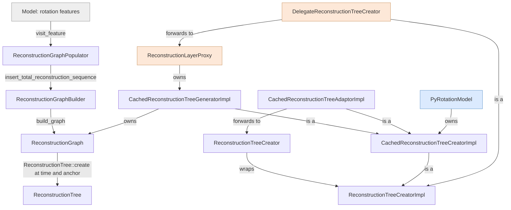
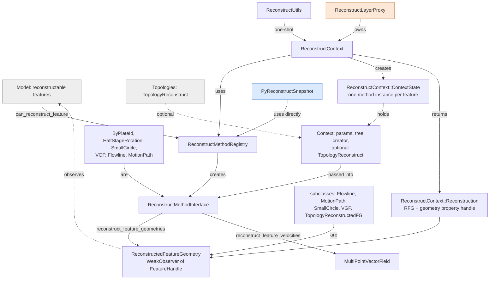
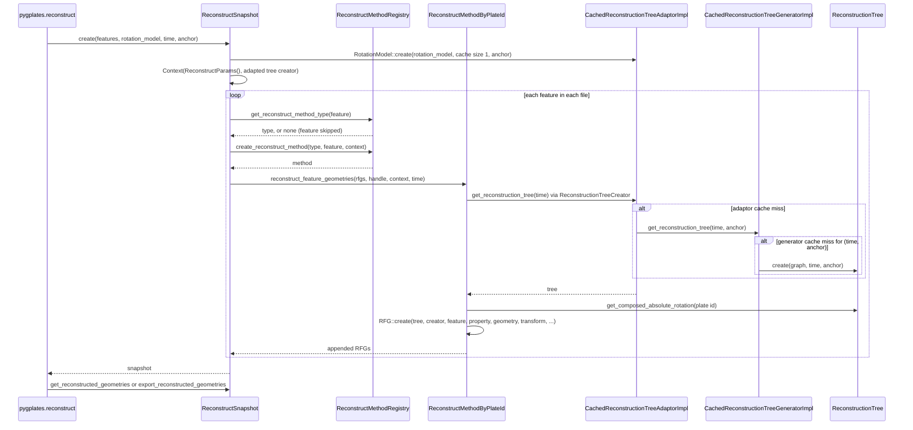
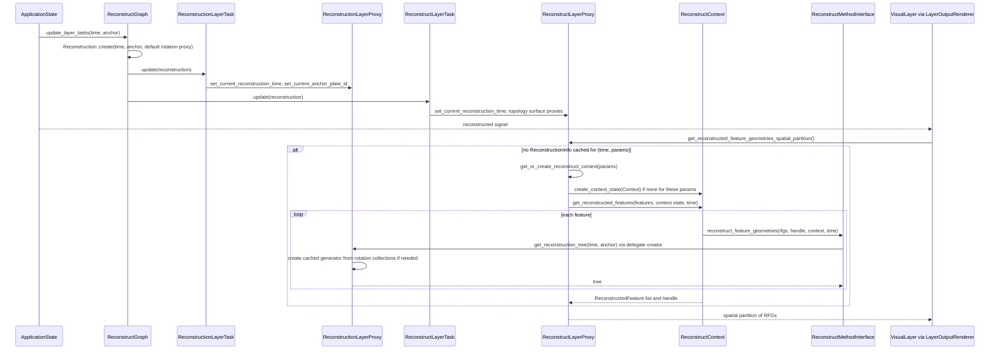

# Reconstruction

Rotation features become a plate-circuit graph and, from it, reconstruction trees at a time and
anchor plate. Regular (non-topological) features become reconstructed geometries at a time, and
velocities at their points. Both products use it: pyGPlates through `RotationModel`,
`ReconstructSnapshot` and friends, GPlates through two layer proxies.

The overview is [`../README.md`](../README.md), and the generated layer diagrams are in
[`../dependency-matrix.md`](../dependency-matrix.md).

## What it is for, and its boundary

Everything is in `src/app-logic/` and compiled into both products, except where marked
*GPlates-only* (the `gplates_only_srcs` list in `src/app-logic/CMakeLists.txt`).

**Rotations.** `ReconstructionGraph` (plates as nodes, one edge per total reconstruction
sequence), built by `ReconstructionGraphBuilder` from sequences that `ReconstructionGraphPopulator`
reads out of rotation features. `ReconstructionTree` is the acyclic tree cut from the graph at one
time and one anchor plate. `ReconstructionTreeCreator` is a value handle over a
`ReconstructionTreeCreatorImpl`, which hands out trees: the cached generator and adaptor
implementations are in `ReconstructionTreeCreator.h`, an uncached one and an identity one are
file-local, and GPlates adds one that delegates to a layer. `RotationUtils` holds half-stage and
stage-pole arithmetic, `TotalReconstructionSequencePlateIdFinder` reads the plate-ID pair of a
sequence. *GPlates-only:* the editing helpers used by the rotation dialogs,
`TotalReconstructionSequenceRotationInserter`, `...RotationInterpolater`,
`...TimePeriodFinder`, `TRSUtils` and `PalaeomagUtils`.

**Reconstruct methods.** `ReconstructMethodInterface` is the per-feature strategy;
`ReconstructMethodRegistry` picks one of six (`ReconstructMethodType.h`):
`ReconstructMethodByPlateId`, `...HalfStageRotation`, `...SmallCircle`,
`...VirtualGeomagneticPole`, `...Flowline`, `...MotionPath`. The flowline, motion-path and
small-circle methods delegate to `FlowlineGeometryPopulator`, `MotionPathGeometryPopulator` and
`SmallCircleGeometryPopulator` (feature visitors), with `FlowlineUtils` and `MotionPathUtils`.
`ReconstructionFeatureProperties` reads the properties a method needs (plate IDs, valid time,
reconstruction method, geometry import time), and `ReconstructParams` is the caller's settings.
`ReconstructMethodFiniteRotation` is the transform an RFG may carry instead of a geometry.

**Driving a set of features.** `ReconstructContext` maps features to method types and runs them
under one or more *context states*. `ReconstructUtils` is the one-call convenience layer over it,
plus `reconstruct_geometry` for reverse-reconstructing an edited geometry. `ReconstructHandle` is
the global counter that labels one pass. `TimeSpanUtils` is the time-range/time-slot type used
for reconstructing over a range.

**Outputs.** `ReconstructionGeometry` (abstract: time and optional handle) with its visitor,
finder and `ReconstructionGeometryUtils`; `ReconstructedFeatureGeometry` (RFG) and its finder;
the RFG subclasses `ReconstructedFlowline`, `ReconstructedMotionPath`, `ReconstructedSmallCircle`,
`ReconstructedVirtualGeomagneticPole`; `MultiPointVectorField` for velocities, with
`VelocityDeltaTime` and `VelocityUnits`.

**Neighbours, shown as seams below.** The model supplies features (in) and RFGs weakly observe
them (back). Topologies enter through `ReconstructMethodInterface::Context::topology_reconstruct`
(a `TopologyReconstruct`), and `TopologyReconstructedFeatureGeometry` is an RFG subclass owned
there. `PlateVelocityUtils` holds both the stage-rotation velocity functions this area uses and
the topological-surface solver that belongs to topologies. GPlates layers (all GPlates-only)
drive the area through `ReconstructionLayerProxy` (a rotation layer's output, wrapping a cached
creator) and `ReconstructLayerProxy` (owns a `ReconstructContext`). The value types it computes
with, `GPlatesMaths::FiniteRotation`, `interpolate` (SLERP) and `calculate_stage_rotation`, live
in `src/maths/`.

## Components

Two diagrams: rotations to trees, then features to reconstructed geometries. Grey nodes are
neighbouring areas, orange ones are GPlates-only, and blue ones are pyGPlates bindings.

Arrows labelled *is a* or *are* point from a subclass to its base. Files:
`src/app-logic/ReconstructionGraph.h`, `ReconstructionGraphBuilder.h`,
`ReconstructionGraphPopulator.h`, `ReconstructionTree.h`, `ReconstructionTreeCreator.h`,
`ReconstructionLayerProxy.h`, `src/api/PyRotationModel.h`.

"Context" is `ReconstructMethodInterface::Context`, VGP is `VirtualGeomagneticPole`, and
`TopologyReconstructedFG` is `TopologyReconstructedFeatureGeometry` (owned by the topologies
area). Files: `src/app-logic/ReconstructMethodInterface.h`, `ReconstructMethodRegistry.h`,
`ReconstructContext.h`, `ReconstructedFeatureGeometry.h`, `MultiPointVectorField.h`,
`ReconstructUtils.h`, `ReconstructLayerProxy.h`, `src/api/PyReconstructSnapshot.cc`.

## Key operations

### `pygplates.reconstruct()`

`ReconstructSnapshot` reconstructs one time. `ReconstructModel` caches snapshots by time in a
`KeyValueCache`. `pygplates.reverse_reconstruct()` and `Feature.set_geometry(...,
reverse_reconstruct=...)` go through `ReconstructUtils::reconstruct_geometry` instead (not
shown).

Note what is absent: `ReconstructContext`. The Python snapshot talks to the registry itself, one
method instance per feature, and sorts motion paths and flowlines into their own lists by method
type. The snapshot always wraps the caller's `RotationModel` in a one-entry adaptor whose default
anchor is the requested one, so the caller's model keeps its own anchor and its 150-tree cache.
`ReconstructUtils::reconstruct` (which does use `ReconstructContext`) is the door used by
`cli/CliReconstructCommand`, `GeometryCookieCutter`, `CoRegistrationLayerProxy` and
`api/CoReg.cc`.

### A GPlates reconstruction pass

`ApplicationState::reconstruct` updates the layers; drawing then *pulls* from the proxies. Only
the calls that reach this area are shown; the layers area owns the rest.

The rotation layer proxy hands out a *delegate* creator, not its internal cached one, so a
client that keeps a `ReconstructionTreeCreator` sees later changes to the anchor, the rotation
files and the cache size (`ReconstructionLayerProxy.cc`, `get_reconstruction_tree_creator`).

## How it works

### Rotation features become a graph

`ReconstructionGraphPopulator` is a `ConstFeatureVisitor`. For each feature it collects the
`gpml:fixedReferenceFrame` and `gpml:movingReferenceFrame` plate IDs and, from a
`GpmlIrregularSampling`, one `(GeoTimeInstant, FiniteRotation)` per *enabled* time sample. A
feature missing either plate ID or having fewer than two enabled samples is dropped; otherwise
`insert_total_reconstruction_sequence` is called (`ReconstructionGraphPopulator.cc`). The builder
creates `Plate` nodes on demand and one `Edge` per sequence, so a plate pair that is split across
two files gets two edges (`ReconstructionGraphBuilder.cc`). Pole samples are copied into the
graph's object pools: the graph does not reference the model afterwards, and later edits to the
rotation features do not reach trees made from it. `build_graph` returns the graph and starts an
empty one.

Edges are pushed to the *front* of a plate's incoming and outgoing lists, so within a plate the
most recently inserted sequence is visited first. The populator visits collections and features
in order, so at a crossover time, or where two edges of one plate pair overlap, the sequence
that appears *last* in the last rotation file wins. The tree code's comment describes this as
"whichever graph edge happens to come first".

With `extend_total_reconstruction_poles_to_distant_past`, `build_graph` adds, for each moving
plate whose oldest incoming edge does not already reach the distant past, an extra edge from that
edge's fixed plate with the oldest pole held constant back to the distant past
(`GeoTimeInstant::create_distant_past()`). This is what stops geometries snapping to present day
beyond the oldest rotation.

### A tree is cut from the graph

`ReconstructionTree::create(graph, time, anchor)` starts at the anchor plate; if the graph has no
such plate the tree is empty and every rotation is the identity. From each plate it follows
outgoing edges (fixed to moving) whose `[begin, end]` contains the time. It follows an incoming
edge in reverse only when it is at the anchor or already travelling in reverse, and it takes at
most *one* incoming edge per plate (`create_sub_trees_from_graph_plate`). An edge whose moving
plate is the anchor, or is already in the tree's `edge_map_type`, is skipped; that is what breaks
crossover cycles and gives one tree edge per moving plate. A long comment above
`create_sub_trees_from_graph_plate` in `ReconstructionTree.cc` shows worked examples, including why
only one reverse edge per plate is allowed (otherwise a non-zero anchor can route plate 8 through
plate 9 and back, a longer circuit than the rotation file implies).

A tree `Edge` keeps a reference to its graph edge and computes its rotation lazily: the exact
sample if the time coincides with one, otherwise `GPlatesMaths::interpolate` (quaternion SLERP)
between the bracketing samples, with a distant-past or distant-future neighbour treated as
"use the other sample". A reversed edge negates the result. The absolute rotation is the parent's
absolute rotation composed with the edge's relative rotation, cached in `mutable` members. The
tree holds a shared pointer to the graph, so the graph outlives any tree.

`get_composed_absolute_rotation(plate)` returns the identity for the anchor plate *and* for a
plate the tree does not contain; `get_composed_absolute_rotation_or_none` is the one that tells
you the plate is missing. `created_from_same_graph_with_same_parameters` compares graph pointer,
time and anchor, because cache eviction can produce two equivalent trees at different addresses.

### Tree creators and caching

`ReconstructionTreeCreator` copies cheaply (a `non_null_intrusive_ptr` to the impl) and orders by
impl pointer, so it can key a `std::map`. `CachedReconstructionTreeCreatorImpl` holds a
`GPlatesUtils::KeyValueCache` (least-recently-used) keyed by `(real_t time, anchor plate)`; the
generator fills a miss with `ReconstructionTree::create` from its graph, the adaptor by asking
another creator. `real_t` compares with `GPlatesMaths::EPSILON`, so two times closer than that
share a cache entry. Cache sizes in use: `create_cached_reconstruction_tree_creator` defaults to 1;
`RotationModel::DEFAULT_RECONSTRUCTION_TREE_CACHE_SIZE` is 150, and a `RotationModel` made from
another one is an adaptor over it; `ReconstructionLayerProxy` uses 512, and its header explains
why (flowlines request a tree per time sample); `ReconstructLayerProxy` asks for the number of
time slots plus one when reconstructing with topologies.

The rotation layer proxy builds its `CachedReconstructionTreeGeneratorImpl` lazily on the first
tree request, with the current anchor as the default anchor, and throws it away (`invalidate`)
when a rotation collection is added, removed or modified, or the anchor or
`ReconstructionParams` change. A change of reconstruction time never invalidates it.

### A method is chosen per feature

`ReconstructMethodRegistry` maps `ReconstructMethod::Type` to a `can_reconstruct_feature`
function and a `create` function. Queries walk the map in *reverse* enum order, so the order in
`ReconstructMethodType.h` is the priority, most specialised last: `MOTION_PATH` (feature type
`gpml:MotionPath`), `FLOWLINE` (`gpml:Flowline`), `VIRTUAL_GEOMAGNETIC_POLE`
(`gpml:VirtualGeomagneticPole`), `SMALL_CIRCLE` (`gpml:SmallCircle`), `HALF_STAGE_ROTATION`
(`gpml:reconstructionMethod` of `HalfStageRotation`, `...Version2` or `...Version3`, plus left
and right plate IDs and a geometry), and finally `BY_PLATE_ID`, which accepts any feature with
a non-topological geometry, plate ID or not (a missing plate ID means plate 0). Registration
order does not matter. Topological features match nothing, which is how `ReconstructContext`
excludes them. GPlates owns one registry in `ApplicationState`; pyGPlates and the utilities build a
temporary one per call.

A method instance is bound to one feature and constructed with a
`ReconstructMethodInterface::Context` (`ReconstructParams`, a `ReconstructionTreeCreator`, and an
optional `TopologyReconstruct`). The header says a new instance is needed if that context
changes, and the code relies on it: `ReconstructMethodByPlateId` caches its present-day
geometries, its `ReconstructionInfo` (plate ID, valid time, geometry import time) and, when
topologies are present, one `TopologyReconstruct::GeometryTimeSpan` per geometry property, all
derived on first use.

### `ReconstructContext` runs a set of features

`set_features` records, for every feature some method accepts, the feature and its method
*type*, and drops the rest. `create_context_state(Context)` then instantiates one method per
recorded feature for that context; the caller owns the returned `shared_ptr<ContextState>` and
the context keeps only a weak reference, reusing expired slots. Calling `set_features` again
rebuilds the methods inside every live state, so their caches start over.

Every `get_*` call takes the next `ReconstructHandle`, stores it in each RFG or vector field it
creates, and returns it. The outputs differ in shape: a flat RFG list; `Reconstruction` objects,
each an RFG paired with a *geometry property handle*; `ReconstructedFeature` objects grouped by
feature (a feature inactive at the time is still present, with no reconstructions); the same two
over a `TimeSpanUtils::TimeRange`; the subset of features named in a set of feature IDs
(`get_reconstructed_topological_sections`, used by topology resolvers); and velocities.

The geometry property handle is an index, assigned once per `set_features` across all features'
reconstructable geometry properties in `assign_geometry_property_handles` (which needs some
context state to ask each method for its present-day geometries, and makes a temporary one with an
identity tree creator if none exists). `get_present_day_feature_geometries` returns the geometries
in handle order. The point is a stable mapping from any RFG back to its unreconstructed geometry,
which the OpenGL static-polygon meshes and raster co-registration use to keep per-geometry
objects alive across times.

### RFGs and how they relate to features

`ReconstructedFeatureGeometry` derives from `ReconstructionGeometry` (reconstruction time,
optional handle) and from `WeakObserver<FeatureHandle>`: constructing one subscribes it to the
feature's observer list, and destroying the feature leaves `is_valid()` false rather than a
dangling pointer. `ReconstructedFeatureGeometryFinder` and `ReconstructionGeometryFinder` are
`WeakObserverVisitor`s that walk that list, optionally filtered by reconstruction tree, reconstruct
handles or property name; this is how a topology resolver finds the section RFGs of *its* pass
among all the RFGs a feature currently has.

An RFG holds the tree it was made with, a tree creator for the same rotation setup, the geometry
property iterator, the method type, the plate ID and the time of formation (the last two are
cached for colouring). It is created either with a reconstructed geometry, or with the
*resolved* (unreconstructed) geometry plus a `ReconstructMethodFiniteRotation`; in the second form
`reconstructed_geometry()` applies the transform on first call and caches it.
`ReconstructMethodByPlateId` uses the second form. `ReconstructMethodFiniteRotation` orders by
method type and then by the derived class's parameters (plate ID for by-plate-ID), not by the
rotation, so geometries that share a transform can be grouped. Subclasses:
`ReconstructedFlowline`, `ReconstructedMotionPath`, `ReconstructedSmallCircle`,
`ReconstructedVirtualGeomagneticPole`, and
`TopologyReconstructedFeatureGeometry`, which overrides `reconstructed_geometry()`.

### Velocities

`ReconstructMethodInterface::reconstruct_feature_velocities` defaults to
`reconstruct_feature_velocities_by_plate_id` (`ReconstructMethodInterface.cc`): it re-reads the
feature's `ReconstructionFeatureProperties`, rotates each present-day geometry as a multi-point,
and computes one stage rotation for the plate with `PlateVelocityUtils::calculate_stage_rotation`,
then `calculate_velocity_vector` per point into a `MultiPointVectorField` (a multi-point domain
and, per point, a vector, a reason, a plate ID and a reconstruction geometry). It also creates an
RFG for the geometry, purely so that colouring code has a reconstruction geometry to look up.

`calculate_stage_rotation` turns `VelocityDeltaTime::Type` (`T_PLUS_DELTA_T_TO_T`,
`T_TO_T_MINUS_DELTA_T`, `T_PLUS_MINUS_HALF_DELTA_T`) and the delta into an old and a young time,
asks the creator for a tree at each and uses `get_composed_absolute_rotation_or_none`. If the plate
is missing at one end it retries: a negative young time with the old time present shifts to
`[dt, 0]`; a missing old time shifts to `[t, t - dt]`. If still missing it returns the identity,
so the velocity is zero rather than an error. `ReconstructMethodByPlateId` overrides the default
only when topologies are present, taking the velocities from each `GeometryTimeSpan` and tagging
points by whether they fell in a network's deforming region, a rigid block, or none.
`ReconstructedFeatureGeometry::reconstructed_geometry_point_velocities` computes velocities from
the RFG alone, through `ResolvedVertexSourceInfo`, which picks by-plate-ID or half-stage from the
RFG's method type and uses the RFG's own tree creator.

### Half-stage rotations, flowlines, motion paths

`RotationUtils::get_half_stage_rotation` divides the interval from the spreading start time to
the reconstruction time into 10 My steps (`DEFAULT_TIME_INTERVAL_HALF_STAGE_ROTATION`) and applies
spreading asymmetry; the version enumeration in the feature selects the older behaviours
(version 1 symmetric from present day, version 2 with intervals and asymmetry, version 3 with a
spreading start time equal to the geometry import time). `FlowlineGeometryPopulator` walks the
flowline's time list from the reconstruction time back, fetching a tree per time and halving each
left-right stage pole (`RotationUtils::get_stage_pole`), which is why it needs a large tree cache.

### The topology seam

When `Context::topology_reconstruct` is set, `ReconstructMethodByPlateId` asks it for a
`GeometryTimeSpan` per geometry property (`create_geometry_time_span`, with the lifetime-detection,
tessellation and interpolation settings taken from `ReconstructParams`) and emits
`TopologyReconstructedFeatureGeometry` objects for time slots where the geometry still exists.
`ReconstructUtils::reconstruct_geometry` deliberately clears `topology_reconstruct` from the
context it is given, so reverse-reconstructing an edited geometry is always rigid.
`TopologyReconstruct::create` is called only from `ReconstructLayerProxy` (combining the
boundary and network time spans of every topology layer) and `api/PyTopologicalModel.cc`.

### The GPlates driver

`ReconstructLayerProxy` owns one `ReconstructContext` and a `KeyValueCache` of
`ReconstructionInfo` keyed by `(time, ReconstructParams)`, at most 4 entries, reduced to 1 while
reconstructing with topologies because each entry pins a time span of resolved topologies. Each
entry holds a strong reference to its context state; the proxy also keeps a map from
`ReconstructParams` to a *weak* context state so that a new time with unchanged params reuses the
state (and its deformation tables) instead of creating one. `set_features` is called when the
layer's input files change, and the whole cache is reset when the rotation layer input changes or
`reconstruct_using_topologies` flips; `create_reconstruction_info` asserts `NotYetImplemented` if a
caller passes params whose `reconstruct_using_topologies` differs from the layer's current value.

## Constraints and traps

- **Two `Reconstruction`s.** `src/app-logic/Reconstruction.h` (GPlates-only) is the *aggregate of
  active layer proxies* that `ReconstructGraph::update_layer_tasks` returns and `ApplicationState`
  stores. `ReconstructContext::Reconstruction` is one RFG paired with its geometry property
  handle. They share nothing but the name.
- **`ReconstructionGraph` versus `ReconstructGraph`.** The first is the rotation hierarchy in this
  area. The second (GPlates-only, `ReconstructGraph.h`) is the layer graph of the layers area.
  `ReconstructionGraphPopulator.h` still carries the include guard
  `GPLATES_APP_LOGIC_RECONSTRUCTIONTREEPOPULATOR_H` from its previous name.
- **Trees are a snapshot.** The graph copies pole values out of the model when built. In GPlates
  the rotation layer proxy rebuilds on a model change; in pyGPlates a `RotationModel` never sees
  edits to its features made after construction, and the deprecated
  `ReconstructionTree(rotation_features, time)` path in `PyReconstructionTree.cc` builds a whole
  graph per call.
- **Silent identities.** A missing anchor plate gives an empty tree; a plate absent from the tree
  gives the identity from `get_composed_absolute_rotation`; a feature with no plate ID is
  reconstructed by plate 0. None of these raise. Use the `_or_none` accessor when absence matters.
- **File order decides ties.** At a crossover time, or where two sequences of the same plate
  pair overlap, the last-inserted sequence wins, because the builder pushes edges to the front.
- **Epsilon cache keys.** Tree caches key on `real_t`, so requests for times within
  `GPlatesMaths::EPSILON` return the same tree.
- **`ReconstructHandle` is a process-wide static counter** and its header says it is not
  thread-protected. There is deliberately no "current handle" accessor, so a client cannot label
  its geometries as belonging to another client's pass.
- **RFGs do not keep features alive**, and `ReconstructContext` silently skips features whose weak
  reference has become invalid. Consumers holding RFGs across model edits must check `is_valid()`.
- **Method instances are context-bound.** They cache per-feature state derived from their
  `Context`; reuse one with a different tree creator or params and it will not notice.
- **`BY_PLATE_ID` is lenient by design**, so anything with a regular geometry is "reconstructed",
  standing still if it has no plate ID. Features that must not go through this framework
  (topological ones) are excluded only because no method accepts them.
- **pyGPlates has its own loop.** `ReconstructSnapshot` calls the registry directly, so it does not
  get `Reconstruction`/geometry-property-handle pairing, and a change to `ReconstructContext`
  does not reach `pygplates.reconstruct()`.

## Known weaknesses and deferred work

- Two code paths produce RFGs from a set of features: `ReconstructContext` (GPlates layers,
  `ReconstructUtils`, topology resolvers, co-registration) and the registry-direct loop in
  `api/PyReconstructSnapshot.cc`. `PyReconstructSnapshot.cc` includes `ReconstructContext.h`
  without using it.
- `ReconstructMethodInterface::get_present_day_feature_geometries` must return a geometry for
  every reconstructable property whether or not it is active at present day (the header marks
  this "May need to revisit"), and the resolved-at-time variant is disabled with `#if 0` in both
  the interface and `ReconstructContext`.
- The default velocity path re-visits the feature's properties on every call, where
  `ReconstructMethodByPlateId` caches them; and it creates a throwaway RFG per geometry so that
  velocity arrows can be coloured.
- Every RFG carries a `ReconstructionTree` pointer and a `ReconstructionTreeCreator`; equivalence
  of trees has to be tested with `created_from_same_graph_with_same_parameters` because caches
  evict.
- Which sequence wins at a crossover is a property of list order, not an explicit rule. The
  builder comment records that ordering incoming edges by time was considered and not done.
- `ReconstructUtils::reconstruct_geometry` strips topology reconstruction from its context with
  a comment calling the approach hacky.
- `ReconstructLayerProxy` cannot serve a request whose `reconstruct_using_topologies` differs
  from its current params (it asserts `NotYetImplementedException`).
- The model's `WeakObserverVisitor` names this area's RFG types, one of the upward includes in
  [`../dependency-matrix.md`](../dependency-matrix.md).
- Comments in `api/PyReconstructionTree.cc` refer to `ReconstructUtils::get_stage_pole()`, which
  lives in `RotationUtils`.

## Entry points

- `src/app-logic/ReconstructContext.h`: the output shapes (RFG list, `Reconstruction`,
  `ReconstructedFeature`, time spans) and context states, all in one header.
- `src/app-logic/ReconstructMethodInterface.h`: the per-feature strategy and the `Context` it
  runs under; `ReconstructMethodByPlateId.cc` is the method to read first.
- `src/app-logic/ReconstructMethodRegistry.cc`: which method a feature gets, and why the enum
  order matters.
- `src/app-logic/ReconstructionTree.cc`: the tree-cutting rules, with the worked crossover
  examples in the comment.
- `src/app-logic/ReconstructionTreeCreator.h`: the creator wrapper and its cached
  implementations, and where every default cache size comes from.
- `src/app-logic/ReconstructLayerProxy.cc`: how GPlates caches reconstructions, reuses context
  states and builds the `TopologyReconstruct` seam.

Last checked against: `553ec966e` (the `gplates` branch).
