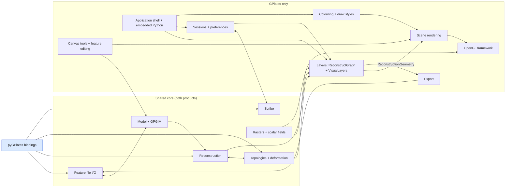

# Architecture survey (stage 1)

A proposal, not documentation: which areas of `src/` get an architecture page, where each
boundary lies, which matter most, and how the generated layer diagram's groups should change.
Checked against the tree at commit `5b90110af` on `feature/architecture-diagrams` (whose `src/`
is the `gplates` branch at the `#87` merge). Every claim has a file reference in section 7.

Sizes below count `.h`/`.cc` files as the dependency matrix does (`qt-widgets` also has 173
`.ui` files). "Module" means the pyGPlates module's include closure.

## 1. Proposed areas

Seventeen areas. The first twelve are the ones the upcoming work touches; the last five are
smaller, and the developer may merge or defer them. Three are **cross-cutting**: GPGIM (consumed
by file I/O, the API and eleven editing dialogs), colouring (consumed by the scene renderer and
sessions) and the application shell (owns everything else). Directory-to-area mixtures:

| directory | split across areas |
| --- | --- |
| `app-logic/` | reconstruction, topologies, layers, rasters, file I/O (state), shell, aux |
| `gui/` | colouring (value types + draw styles), scene rendering (painters, Globe, Map), canvas tools (workflows), export (strategies), sessions (config models), shell (menus, Dialogs, PythonManager) |
| `presentation/` | layers (VisualLayers), scene rendering (renderers), sessions, shell (Application, ViewState) |
| `view-operations/` | scene rendering (Rendered*), canvas tools (GeometryBuilder, operations, undo) |
| `qt-widgets/` | every GPlates-only area has its dialogs and widgets here |
| `file-io/` | feature file I/O, rasters (readers), export (writers), colouring (CptReader, SymbolFileReader) |
| `property-values/` | model (values), rasters (RawRaster, proxied rasters, georeferencing) |
| `utils/` | foundation; a few misplaced files (section 6) |
| `api/` | Python bindings (module part) and embedded Python (GPlates-only part) |

### 1.1 Reconstruction (pilot)

Turns rotation features into reconstruction trees, and regular features into reconstructed
geometries at a time. A `ReconstructionGraph` (plates as nodes, total reconstruction sequences
as edges, may contain crossover cycles) is built once from rotation features by
`ReconstructionGraphBuilder`/`ReconstructionGraphPopulator`; a `ReconstructionTree` is the
acyclic tree cut from it at one time and anchor plate; `ReconstructionTreeCreator` wraps an
implementation that hands out trees (cached, uncached, or delegated to a GPlates layer).
`ReconstructMethodRegistry` picks a `ReconstructMethodInterface` per feature (by plate ID,
half-stage, flowline, motion path, small circle, VGP) and `ReconstructContext` runs them over a
set of features with an extrinsic `Context` (params, tree creator, optional
`TopologyReconstruct`), producing `ReconstructedFeatureGeometry` (RFG) objects and, on request,
velocities as `MultiPointVectorField`. Every RFG is a `WeakObserver<FeatureHandle>` of the
feature it came from and carries a `ReconstructHandle` (a global counter) that identifies the
reconstruction pass it belongs to.

Boundary (all shared, all in the module unless marked):

- `app-logic/`: `ReconstructionGraph`, `ReconstructionGraphBuilder`, `ReconstructionGraphPopulator`,
  `ReconstructionTree`, `ReconstructionTreeCreator` (+ `CachedReconstructionTreeCreatorImpl`,
  `CachedReconstructionTreeGeneratorImpl`, `CachedReconstructionTreeAdaptorImpl`),
  `ReconstructMethodInterface`, `ReconstructMethodRegistry`, `ReconstructMethodType`,
  `ReconstructMethodByPlateId`, `...HalfStageRotation`, `...Flowline`, `...MotionPath`,
  `...SmallCircle`, `...VirtualGeomagneticPole`, `ReconstructMethodFiniteRotation`,
  `ReconstructContext`, `ReconstructHandle`, `ReconstructParams`, `ReconstructUtils`,
  `RotationUtils`, `ReconstructionFeatureProperties`, `ReconstructionGeometry` (+ `Visitor`,
  `Finder`, `Utils`), `ReconstructedFeatureGeometry` (+ `Finder`), `ReconstructedFlowline`,
  `ReconstructedMotionPath`, `ReconstructedSmallCircle`, `ReconstructedVirtualGeomagneticPole`,
  `FlowlineUtils`, `MotionPathUtils`, `*GeometryPopulator`,
  `TotalReconstructionSequencePlateIdFinder`,
  `MultiPointVectorField`, `VelocityDeltaTime`, `VelocityUnits`, `TimeSpanUtils`, and the
  helpers `GeometryUtils`, `GeometrySetter`, `GeometryFinder`, `GeometryTypeFinder`.
  GPlates-only: `TotalReconstructionSequenceRotationInserter`/`Interpolater`/`TimePeriodFinder`,
  `TRSUtils`, `PalaeomagUtils`.
- `maths/`: `FiniteRotation`, `UnitQuaternion3D`, `Rotation`, `CalculateVelocity` are the value
  types it computes with (they stay in the maths area; the page names them as inputs).
- Out of the boundary, but the page must show them as the seams: `TopologyReconstruct`
  (topologies; enters through `ReconstructMethodInterface::Context::topology_reconstruct`),
  `ReconstructionLayerProxy` and `ReconstructLayerProxy` (layers; the former implements a
  `ReconstructionTreeCreatorImpl`, the latter owns a `ReconstructContext`), `PlateVelocityUtils`
  (velocity on topological surfaces; topologies).

Products: both. pyGPlates drives it from `PyRotationModel` (holds a
`CachedReconstructionTreeCreatorImpl`), `PyReconstructionTree`, `PyReconstruct`,
`PyReconstructModel`/`PyReconstructSnapshot` and `PyReconstructionGeometries`. GPlates drives it
from the two layer proxies, `cli/CliReconstructCommand` and the rotation commands, and edits it
from `TotalReconstructionPolesDialog`, `TotalReconstructionSequencesDialog`,
`ModifyReconstructionPoleWidget`, `SpecifyAnchoredPlateIdDialog`.

Open first: `app-logic/ReconstructContext.h`, `ReconstructMethodInterface.h`,
`ReconstructionTreeCreator.h`, `ReconstructionTree.h`, `ReconstructionGraph.h`,
`ReconstructedFeatureGeometry.h`.

Connects to: model (features in, RFGs observe features), topologies (both directions, see
above), layers (consumer), Python bindings (consumer), export (RFGs out), scene rendering (RFGs
are what gets drawn).

The pilot choice holds up: it is the densest shared subject, both products enter it through
different doors (`ReconstructUtils`/`ReconstructContext` from Python, layer proxies from
GPlates), and its two natural sequence diagrams (a `pygplates.reconstruct()` call; an
`ApplicationState::reconstruct()` pass through `ReconstructGraph::update_layer_tasks` into
`ReconstructLayerProxy`) exercise the template. Name clashes the page must disarm:
`app-logic/Reconstruction.h` (the GPlates-only aggregate of layer outputs) versus
`ReconstructContext::Reconstruction` (one RFG paired with its geometry property handle), and
`ReconstructionGraph` (rotations) versus `ReconstructGraph` (layers).

### 1.2 Topologies and deformation

Resolves topological lines, closed plate boundaries and deforming networks from topological
features at a time (`TopologyGeometryResolver`, `TopologyNetworkResolver`, both feature visitors
that look up section RFGs by feature ID and reconstruct handle), intersects sections
(`TopologicalIntersections`), shares sub-segments between neighbouring topologies
(`ResolvedTopologicalSection`, `ResolvedTopologicalSharedSubSegment`), triangulates networks with
CGAL (`ResolvedTriangulation::Network`, `Delaunay_2`), and incrementally reconstructs geometries
through those plates and networks over time (`TopologyReconstruct::GeometryTimeSpan`, with
strain from `DeformationStrain`/`DeformationStrainRate`). Scalar coverages (crustal thickness
and the like) evolve along the same time spans (`ScalarCoverageEvolution`,
`ScalarCoverageTimeSpan`). Velocities on resolved surfaces, net rotation and plate-boundary
statistics live here too (`PlateVelocityUtils::solve_velocities_on_surfaces`,
`NetRotationUtils`, `PlateBoundaryStats`), as does plate partitioning of geometry by resolved
boundaries or static polygons (`GeometryCookieCutter`, `PartitionFeatureTask`, GPlates-only
`AssignPlateIds`).

Boundary: `app-logic/Topology*`, `ResolvedTopological*`, `ResolvedSubSegmentRangeInSection`,
`ResolvedVertexSourceInfo`, `ResolvedTriangulation*`, `TopologyReconstruct`,
`TopologyReconstructedFeatureGeometry`, `TopologyPointLocation`, `TopologyNetworkParams`,
`DeformationStrain*`, `ScalarCoverage*`, `PlateVelocityUtils`, `NetRotationUtils`,
`PlateBoundaryStats`, `GeometryCookieCutter`, `PartitionFeatureTask`, `GenericPartitionFeatureTask`,
`VgpPartitionFeatureTask`, `PartitionFeatureUtils`, `AssignPlateIds`;
`property-values/GpmlTopological*`
(values, owned by the model area, listed as inputs). GPlates GUI side: `gui/TopologyTools`,
`TopologySectionsContainer`/`Table`/`Finder`, `canvas-tools/BuildTopology`, `EditTopology`,
`qt-widgets/TopologyToolsWidget`, `SetTopologyReconstructionParametersDialog`,
`AssignReconstructionPlateIdsDialog`, `GenerateDeformingMeshPointsDialog`.

Products: both. pyGPlates: `PyTopologicalModel`/`PyTopologicalSnapshot`, `PyResolveTopologies`,
`PyResolveTopologyParameters`, `PyNetworkTriangulation`, `PyPlatePartitioner`, `PyStrain`,
`PyNetRotation`. `TopologyReconstruct::create` is called from exactly two places:
`ReconstructLayerProxy.cc` and `PyTopologicalModel.cc`.

Open first: `app-logic/TopologyGeometryResolver.h`, `TopologyNetworkResolver.h`,
`TopologyReconstruct.h`, `ResolvedTopologicalNetwork.h`, `TopologyUtils.h`,
`ResolvedTriangulationNetwork.h`.

Connects to: reconstruction (section RFGs in; `TopologyReconstruct` back into reconstruct
methods), layers (`TopologyGeometryResolverLayerProxy`, `TopologyNetworkResolverLayerProxy`,
`VelocityFieldCalculatorLayerProxy`, `ReconstructScalarCoverageLayerProxy`,
`DependentTopologicalSectionLayers`),
scene rendering (network triangulations and strain are drawn by
`ReconstructionGeometryRenderer`), export (Citcoms/GMT resolved-topology writers).

### 1.3 Model (handles, revisions, property values)

The in-memory feature store: `Model`/`ModelInterface` (pimpl), `FeatureStoreRootHandle` >
`FeatureCollectionHandle` > `FeatureHandle` > `TopLevelProperty` > `PropertyValue`; the
`BasicHandle`/`BasicRevision` containment with weak references and change notification; the
`Revisionable`/`Revision`/`ModelTransaction`/`RevisionedReference`/`RevisionedVector` system
below the top-level property; the `FeatureVisitor`/`ConstFeatureVisitor` family that every
reader, writer and resolver uses; `ModelUtils` and `PropertyValueFinder`; and every
`Gml*`/`Gpml*`/`Xs*` value type in `property-values/` except the raster ones (section 1.9).

Boundary: `model/` entire (97 files, all in the module) minus the GPGIM classes (section 1.4);
`property-values/` minus the raster/georeferencing files. Products: both. Owned by the
`docs/design/model-system/` set on `feature/pygplates-model-revisions`; this survey does not
re-derive it. That branch changes the picture by extending the revisionable system upward
through the handles (its README's "notification gap"), so the page waits for the merge.

Open first: `model/FeatureHandle.h`, `TopLevelPropertyInline.h`, `Revisionable.h`,
`WeakReferenceCallback.h`, `FeatureVisitor.h`, `ModelUtils.h`.

Connects to: everything above it. Two upward includes matter for the layer diagram:
`model/WeakObserverVisitor.h/.cc` names the app-logic `ReconstructionGeometry` types that
observe features, and `model/Metadata.h` plus `Gpgim.cc` reach into `file-io/`.

### 1.4 GPGIM and feature schema (cross-cutting)

The schema registry the redesign targets. `GPlatesModel::Gpgim` is a singleton that parses the
Qt resource `:/gpgim/gpgim.xml` (with `gpgim.xsd`, `units.xml` and the `timescales/` beside
it) into `GpgimFeatureClass` (single-inheritance feature classes, concrete leaves),
`GpgimProperty` (allowed structural types, time-dependent styles, multiplicity, defaults),
`GpgimStructuralType`/`GpgimTemplateStructuralType`/`GpgimEnumerationType`, keyed by
`GpgimVersion`. It is consulted from 23 files in five directories: `file-io/` (GPML reader
and upgrade path, GPML writer, OGR reader, GeoSciML handlers), `api/` (`PyFeature`,
`PyPropertyValues`), `model/ModelUtils`, `gui/` (feature-type palette, `Palette`) and eleven
`qt-widgets/` editing dialogs (`CreateFeatureDialog`, `CreateFeaturePropertiesPage`,
`AddPropertyDialog`, `ChangeFeatureTypeDialog`, `ChangePropertyWidget`, `ChooseFeatureTypeWidget`,
`ChoosePropertyWidget`, `EditEnumerationWidget`, `EditWidgetGroupBox`,
`GpgimVersionWarningDialog`, `AboutDialog`).

Boundary: `model/Gpgim*.h/.cc` (+ `GpgimInitialisationException`), `qt-resources/gpgim/`,
`file-io/GpmlFeatureReaderFactory` (the per-version upgrade readers),
`GpmlPropertyStructuralTypeReader`,
`GpmlUpgradeReaderUtils`, `ModelUtils` (the `get_gpgim_property` /
`create_top_level_property` family), plus the consumer list above as "who depends on it".
Products: both (pyGPlates loads the same resource from inside the shared library).

Open first: `model/Gpgim.h`, `GpgimProperty.h`, `GpgimFeatureClass.h`,
`qt-resources/gpgim/gpgim.xml`, `file-io/GpmlFeatureReaderFactory.h`, `model/ModelUtils.h`.

Connects to: model (it validates what the model holds), feature file I/O (GPML versioning,
OGR attribute mapping), feature editing GUI, Python bindings (`Feature.create_*` helpers and
property-name checks).

### 1.5 Feature file I/O

Reading and writing feature collections. `FeatureCollectionFileFormat::Registry` maps a
format to an `is_file_format` predicate, a read function and a writer-visitor factory; the
`Format` enum has 13 values and `register_default_file_formats` registers 12 (GPML, GPMLZ,
PLATES4 line, GPlates rotation `.grot`, PLATES4 rotation, Shapefile, OGR-GMT, GeoJSON,
GeoPackage, write-only GMT `.xy`, GMAP, GSML; `KML` is an enumerator nothing in `file-io/`
uses). `File` wraps a
feature collection with its `FileInfo` and configuration. Readers: `GpmlReader` (+
`GpmlPropertyReader`, structural-type readers), `PlatesLineFormatReader`,
`PlatesRotationFormatReader` and the `.grot` `PlatesRotationFileProxy` (segment model that
preserves comments and attributes), `OgrReader` (all OGR-backed formats; attributes mapped to
model properties through the `PropertyMapper` interface, implemented by
`qt-widgets/ShapefilePropertyMapper` and injected by `presentation/FileIOInjections`),
`GmapReader`, `GeoscimlProfile`/`Gsml*` (WFS). Writers are `ConstFeatureVisitor`s
(`GpmlOutputVisitor`, `PlatesLineFormatWriter`, `PlatesRotationFormatWriter`,
`OgrFeatureCollectionWriter` via `OgrWriter`, `GMTFormatWriter`). Errors accumulate in
`ReadErrorAccumulation`. GPlates adds `app-logic/FeatureCollectionFileIO` (load/save/reload and
the read-error signal), `FeatureCollectionFileState` (the loaded-file list every layer and dialog
watches), `gui/FileIOFeedback`, `FileIODirectoryConfigurations`,
`qt-widgets/ManageFeatureCollectionsDialog`,
`ShapefileAttribute*Dialog`, `ReadErrorAccumulationDialog`, `OgrSrsWriteOptionDialog`, and
the format-configuration dialogs.

Boundary: `file-io/` minus rasters (section 1.9), minus the derived-data exporters (section
1.13), minus `CptReader`/`SymbolFileReader` (colouring); plus the GPlates classes above and
`presentation/FileIOInjections`. Products: both (173 of 235 `file-io/` files are in the
module).

Open first: `file-io/FeatureCollectionFileFormatRegistry.h` (+ `.cc` for the 12
registrations), `File.h`, `OgrReader.h`, `GpmlReader.h`, `app-logic/FeatureCollectionFileIO.h`,
`presentation/FileIOInjections.cc`.

Connects to: model (produces/consumes handles), GPGIM (see 1.4), layers (`ReconstructGraph`
adds files as inputs when `FeatureCollectionFileState` signals), sessions (file list),
Python bindings (`PyFeatureCollectionFileFormatRegistry`).

### 1.6 Layers (reconstruct graph and visual layers)

The GPlates-only backbone between loaded files and the screen. `ReconstructGraph` holds the
input files and the layers; each layer wraps a `LayerTask` of one of nine `LayerTaskType`s
(reconstruction, reconstruct, raster, scalar field 3D, topology geometry resolver, topology
network resolver, velocity field calculator, co-registration, reconstruct scalar coverage), with
typed input channels and a `LayerParams` object; every task exposes a `LayerProxy` at its
output, and proxies pull from each other on demand and cache (the header says this replaced a
push model). `ApplicationState::reconstruct()` calls `ReconstructGraph::update_layer_tasks`,
stores the returned `Reconstruction` (the active proxies) and emits `reconstructed`.
`ReconstructGraph` auto-creates layers for a newly added file using `LayerTaskRegistry`, and
its `auto_connect_layers` makes the automatic connections (the header names velocity and
topology layers). On the presentation
side `VisualLayers` mirrors the graph (one `VisualLayer` per layer, ordering, visibility),
`VisualLayerRegistry` maps `VisualLayerType` to a name, group, colour, options widget and a
`VisualLayerParams` factory (the drawing-side counterpart of `LayerParams`), and
`VisualLayer::create_rendered_geometries` runs the layer output through
`LayerOutputRenderer`/`ReconstructionGeometryRenderer` into its own `RenderedGeometryLayer`.

Boundary: `app-logic/`: `ReconstructGraph`, `ReconstructGraphImpl`, `Layer`, `LayerTask`,
`LayerTaskRegistry`, `LayerTaskType`, `LayerProxy`, `LayerProxyVisitor`, `LayerProxyUtils`,
`LayerParams`, `LayerParamsVisitor`, `LayerInputChannelName`/`Type`, `Reconstruction`, every
`*LayerProxy`/`*LayerTask`/`*LayerParams`, `ReconstructionParams`, `VelocityParams`,
`ReconstructScalarCoverageParams`, `DependentTopologicalSectionLayers`; `presentation/`:
`VisualLayers`, `VisualLayer`, `VisualLayerGroup`, `VisualLayerRegistry`, `VisualLayerType`,
`VisualLayerParams` and its seven subclasses, `VisualLayerInputChannelName`; `qt-widgets/`:
`VisualLayersDialog`/`Widget`/`ListView`/`Delegate`/`ComboBox`, `LayerOptionsWidget`, the
eight `*LayerOptionsWidget`s and `CoRegistrationOptionsWidget`, `AddNewLayerDialog`,
`MergeReconstructionLayersDialog`;
`gui/VisualLayersListModel`, `VisualLayersProxy`. Product: GPlates only (none of it is in the
module, which is why `ApplicationState`, `Reconstruction` and every proxy are GPlates-only).

Open first: `app-logic/ReconstructGraph.h`, `Layer.h`, `LayerTask.h`, `LayerProxy.h`,
`ReconstructLayerProxy.h`, `presentation/VisualLayers.h`, `VisualLayer.cc`.

Connects to: file I/O (`FeatureCollectionFileState` in), reconstruction/topologies/rasters
(each proxy delegates to one), scene rendering (out), sessions (`TranscribeSession` saves the
graph, connections, params and visual order), OpenGL (three proxies hold GL objects; section
6).

### 1.7 Scene rendering (rendered geometries, painters, globe and map)

Everything between a `ReconstructionGeometry` and an OpenGL draw call.
`ReconstructionGeometryRenderer`
visits the thirteen `ReconstructionGeometry` types and creates `RenderedGeometry` objects
(`view-operations/Rendered*`: points, lines, polygons, coloured meshes, arrows, symbols,
strings, subduction teeth, resolved rasters and scalar fields) into a `RenderedGeometryLayer`;
`RenderedGeometryCollection` holds the main layers (reconstruction, canvas-tool workflows) and
child layers, and signals updates so canvases repaint. `gui/Globe` and `gui/Map` paint a
collection through `GlobeRenderedGeometryCollectionPainter` /
`MapRenderedGeometryCollectionPainter` and the per-layer painters, which stream primitives into
`LayerPainter`, which issues `GLRenderer` calls and asks `GLVisualLayers` to draw rasters,
scalar fields and filled polygons. `MapProjection`, `ViewportProjection`, `ViewportZoom`,
`MapTransform`, `GlobeOrientation`, `SceneLightingParameters`, `RenderSettings`,
`GraticuleSettings`, `TextOverlay`/`VelocityLegendOverlay` are the view parameters.
`qt-widgets/GlobeCanvas` (a `QOpenGLWidget`) and `MapView`/`MapCanvas` own the `GLContext`,
drive paint and mouse events, and are switched by `GlobeAndMapWidget` inside
`ReconstructionViewWidget`.

Boundary: `view-operations/Rendered*`, `RenderedGeometryProximity`, `RenderedGeometryUtils`,
`ScalarField3DRenderParameters`, `RenderedGeometryParameters`; `presentation/LayerOutputRenderer`,
`ReconstructionGeometryRenderer`; `gui/Globe`, `Map`, `*Painter`, `LayerPainter`,
`MapProjection`, `MapGrid`, `MapBackground`, `SphericalGrid`, `Stars`, `OpaqueSphere`,
`GlobeOrientation`, `SimpleGlobeOrientation`, `GlobeVisibilityTester`, `ViewportProjection`,
`ViewportZoom`, `MapTransform`, `SceneLightingParameters`, `RenderSettings`, `GraticuleSettings`,
`TextOverlay*`, `VelocityLegendOverlay*`, `FeedbackOpenGLToQPainter`; `qt-widgets/GlobeCanvas`,
`MapCanvas`, `MapView`, `SceneView`, `GlobeAndMapWidget`, `ReconstructionViewWidget`,
`ProjectionControlWidget`, `LightingWidget`, `SetProjectionDialog`, `SetCameraViewpointDialog`.
Product: GPlates only.

Open first: `view-operations/RenderedGeometryCollection.h` (its class comment is the design
note), `presentation/ReconstructionGeometryRenderer.h`, `gui/GlobeRenderedGeometryLayerPainter.h`,
`gui/LayerPainter.h`, `gui/Globe.h`, `qt-widgets/GlobeCanvas.h`.

Connects to: layers (in), colouring (`get_colour` per geometry), OpenGL (out), canvas tools
(they draw into workflow layers and query proximity), export (image and SVG export render the
same scene).

### 1.8 OpenGL framework

`opengl/` (158 files, none in the module): `GLRenderer` (all GL calls go through it; state
tracking, render targets, compiled draw states), `GLContext`/`GLContextImpl` (one per shared
context; resource managers), `GLVisualLayers` (persistent GL objects per context: multi-
resolution rasters, reconstructed rasters, scalar fields, filled polygons, the light), the
raster pyramid classes (`GLMultiResolutionRaster`, `...CubeRaster`,
`...StaticPolygonReconstructedRaster`, `...CubeReconstructedRaster`, `...RasterMapView`, cube
mesh generators, `GLCubeSubdivision`), `GLScalarField3D` (iso-surface and cross-section volume
rendering), `GLFilledPolygonsGlobeView`/`MapView`, `GLRasterCoRegistration`, `GLText`, and the
object wrappers (buffers, textures, framebuffers, shader programs, state sets). Shader sources
are Qt resources in `qt-resources/opengl/`.

Boundary: `opengl/` entire, `qt-resources/opengl.qrc`. Product: GPlates only. This is the area
the Vulkan port replaces; its page is the baseline that port is planned against.

Open first: `opengl/GLRenderer.h`, `GLContext.h`, `GLVisualLayers.h`,
`GLMultiResolutionRaster.h`, `GLMultiResolutionStaticPolygonReconstructedRaster.h`,
`GLScalarField3D.h`.

Connects to: scene rendering (its only intended caller), layers and rasters (`GLVisualLayers`
includes `ApplicationState`, `ReconstructGraph`, `RasterLayerProxy`, `ScalarField3DLayerProxy`;
and three layer proxies include it back, section 4), data mining (raster co-registration runs on
the GPU).

### 1.9 Rasters and 3D scalar fields

Raster features hold a `GmlFile`/`GmlRectifiedGrid` whose `RawRaster` is *proxied*: the
property value carries a `RasterBandReaderHandle`, and `ProxiedRasterResolver` pulls regions
and mipmap levels from disk on demand through `RasterReader` (`GdalRasterReader`, or the
`QImage`-based `RgbaRasterReader` injected by GPlates), caching them in the
`RasterFileCache` formats written by `MipmappedRasterFormatWriter`. `Georeferencing`,
`SpatialReferenceSystem` and `CoordinateTransformation` (PROJ) place the raster on the globe.
`RasterLayerProxy` resolves the band, optional age grid and reconstructed polygons into a
`ResolvedRaster` and owns the GL pyramid objects that draw it; `ScalarField3DLayerProxy` does the
same for the GPlates binary scalar-field format (`ScalarField3DFileFormat`), which
`ImportScalarField3DDialog` writes from a sequence of depth-layer rasters through
`opengl/GLScalarField3DGenerator`.

Boundary: `property-values/RawRaster*`, `ProxiedRasterCache`, `ProxiedRasterResolver`,
`RasterType`, `RasterStatistics`, `Georeferencing`, `SpatialReferenceSystem`,
`CoordinateTransformation`, `GmlFile`, `GmlRectifiedGrid`, `GmlGridEnvelope`,
`GpmlRasterBandNames`, `GpmlScalarField3DFile`; `file-io/RasterReader`, `RasterBandReader*`,
`GdalRasterReader`, `GdalRasterWriter`, `RgbaRasterReader`/`Writer`, `RasterWriter`,
`RasterFileCache*`, `Mipmapped*`, `SourceRasterFileCacheFormatReader`, `ScalarField3DFileFormat*`,
`GdalUtils`, `Gdal.h`, `Proj.h`, `TemporaryFileRegistry`; `gui/Mipmapper`, `ColourRawRaster`,
`RasterColourPalette`; `app-logic/ExtractRasterFeatureProperties`,
`ExtractScalarField3DFeatureProperties`, `RasterLayerProxy`/`Task`/`Params`,
`ScalarField3DLayerProxy`/`Task`/`Params`, `ResolvedRaster`, `ResolvedScalarField3D`;
`qt-widgets/ImportRasterDialog` and its `Raster*Page`s, `ImportScalarField3DDialog` and pages,
`RasterPropertiesDialog`, `EditAffineTransformGeoreferencingWidget`. The GL pyramid classes stay
in the OpenGL area. Products: the property values and readers compile into the module (they are
reached through `RawRaster` and `ExtractRasterFeatureProperties`), but `api/` never mentions
`RawRaster` or `RasterReader`, so pyGPlates has no raster API; the subject is GPlates'.

Open first: `property-values/RawRaster.h`, `ProxiedRasterResolver.h`, `file-io/RasterReader.h`,
`app-logic/RasterLayerProxy.h`, `opengl/GLVisualLayers.h`, `qt-widgets/ImportRasterDialog.h`.

Connects to: model (the values are property values), file I/O (`GmlFile` opens the raster at
GPML parse time, the `property-values -> file-io` upward edge), layers, OpenGL, colouring
(`RasterColourPalette`, CPT files), export (numerical and colour raster export).

### 1.10 Colouring and draw styles (cross-cutting)

Two generations coexist. The C++ one: `Colour`, `ColourPalette<Key>` with adapters and
visitors, `BuiltinColourPalettes` (age, plate ID, feature type, CPT via `file-io/CptReader`
and `CptColourPalette`), `ColourPaletteRangeRemapper`, `ColourScaleGenerator`, `RasterColourPalette`
(variant over the three palette key types), and `ColourScheme`/`GenericColourScheme` (colour a
`ReconstructionGeometry` by an extracted property; now only the fallback). The Python one:
`DrawStyleManager` (categories, template styles, built-in and saved variants, the default
style), `StyleAdapter` with `PythonStyleAdapter` (calls the Python object's
`get_style(feature, style)` per feature under the interpreter lock) and `ColourStyleAdapter`
(wraps a `ColourScheme`), `DrawStyle` (currently just a `Colour`), `PythonConfiguration`
(the style's config items, including `Palette` items backed by `gui/Palette.h`, a second palette
hierarchy), and the scripts in `qt-resources/python/scripts/colouring/` that call
`pygplates.Application().register_draw_style(...)` at startup. The **built-in PlateId,
FeatureAge, FeatureType and SingleColour styles are Python classes in `draw_style_demo.py`**;
`DrawStyleManager::default_style()` looks for category `PlateId` / style `Default` and only if
missing builds a C++ `ColourStyleAdapter`. Colour is applied in
`ReconstructionGeometryRenderer`'s `get_colour`: an override colour, else the layer's
`StyleAdapter`, else a default-constructed `DrawStyle` whose `Colour` is opaque black.
`Symbol` (+ `SymbolFileReader`, `SymbolManagerDialog`) is the only non-colour styling; the
feature-type-to-symbol map lives in `ViewState`.

Boundary: `gui/Colour*`, `*ColourPalette*`, `Palette`, `BuiltinColourPalette*`,
`AgeColourPalettes`, `PlateIdColourPalettes`, `FeatureTypeColourPalette`, `ColourScheme`,
`GenericColourScheme`, `ColourSpectrum`, `ColourScaleGenerator`, `GMTColourNames`,
`HTMLColourNames`, `ColourNameSet`, `ColourQt`, `DrawStyleManager`, `DrawStyleAdapters`,
`PythonConfiguration`, `Symbol`; `file-io/CptReader`, `SymbolFileReader`;
`app-logic/PropertyExtractors`; `api/PyColour.cc` (`export_colour`, `export_style`),
`PyApplication.cc` (`register_draw_style`); `qt-resources/python/scripts/colouring/`;
`presentation/RemappedColourPaletteParameters`; `qt-widgets/DrawStyleDialog`,
`ChooseBuiltinPaletteDialog`, `ChooseColourButton`, `ColourScaleWidget`/`Button`,
`RemappedColourPaletteWidget`, `SymbolManagerDialog`. Products: 12 colour value-type files are
in the module (the `gui/` allowlist); the rest is GPlates. This is the baseline the rule-based
symbology replaces.

Open first: `gui/DrawStyleAdapters.h`, `DrawStyleManager.cc`, `api/PyApplication.cc`
(`register_draw_style`), `qt-resources/python/scripts/colouring/draw_style_demo.py`,
`presentation/ReconstructionGeometryRenderer.cc` (`get_colour`), `gui/ColourPalette.h`.

Connects to: scene rendering (consumer), layers (`VisualLayerParams::set_style_adapter`;
`ReconstructVisualLayerParams` and `TopologyNetworkVisualLayerParams` start from the default
style), sessions (draw style names are transcribed), embedded Python (styles are Python
objects), rasters (palettes).

### 1.11 Python bindings and embedded Python

Two halves of `api/`. The **bindings** (77 module files, plus `qt-resources/python/api/*.py`
executed into the module namespace by `PyPurePython.cc`, and `PythonPickle` bridging pickle to
Scribe) are `export_*()` functions called from `export_cpp_python_api()`; the wrapper classes
`RotationModel`, `ReconstructModel`/`ReconstructSnapshot`, `TopologicalModel`/`TopologicalSnapshot`
hold reconstruction-core objects directly and never see a layer. The **embedded** half (33
GPlates-only files, registered inside the `GPLATES_PYTHON_EMBEDDING` block): `PythonRunner`,
`PythonExecutionThread`/`Monitor`, `PythonInterpreterLocker`/`Unlocker`, `Sleeper`,
`ConsoleReader`/`Writer`, `DeferredApiCall` (marshals API calls onto the GUI thread),
`PyApplication` (`Instance`: `register_draw_style`, `get_loaded_files`, `current_time`),
`PyViewportWindow`, `PyOldFeature*` (marked for removal), `PyTopologyTools`,
`PyCoregistrationLayerProxy`, `CoReg.cc`; driven by `gui/PythonManager` (initialises the
interpreter with `PyImport_AppendInittab("pygplates")`, starts the execution thread, finds
internal scripts in `:/python/scripts` and external ones in preference paths, and calls each
internal script's `register()`), with `qt-widgets/PythonConsoleDialog`,
`PythonExecutionMonitorWidget`,
`PythonReadlineDialog`, `PythonInitFailedDialog`, `PreferencesPanePython`.

Boundary: `api/` entire, `qt-resources/python/`, `gui/PythonManager`, `PythonConsoleHistory`,
`utils/GetPropertyAsPythonObjVisitor` (misplaced; used only by `PyOldFeature.cc`), the widgets
above, `pygplates/` (package, stub, wheel; outside `src/`). Products: bindings both (the same
module init runs in both), embedding GPlates only.

Open first: `api/PyGPlatesModule.cc`, `PyRotationModel.h`, `PyReconstruct.cc`,
`PythonPickle.h`, `gui/PythonManager.cc`, `api/PyApplication.cc`.

Connects to: reconstruction, topologies, model, file I/O, scribe (consumers of all); colouring
(draw styles are Python); the Docs E branch edits this area's docstrings.

### 1.12 Feature editing GUI

The dialogs that create and edit features property by property: `CreateFeatureDialog` (with
`CreateFeaturePropertiesPage`, `ChooseFeatureTypeWidget`, `ChoosePropertyWidget`,
`ChooseFeatureCollectionWidget`), `FeaturePropertiesDialog` with `EditFeaturePropertiesWidget`,
`QueryFeaturePropertiesWidget`(+`Populator`), `ViewFeatureGeometriesWidget`(+`Populator`); the
`AbstractEditWidget` family (`Edit*Widget`, one per property-value type) chosen by the
`EditWidgetChooser` feature visitor inside `EditWidgetGroupBox`; `AddPropertyDialog`,
`ChangePropertyWidget`, `ChangeFeatureTypeDialog`; `TotalReconstructionSequencesDialog` with
`EditTotalReconstructionSequenceWidget`/`Dialog` and `CreateTotalReconstructionSequenceDialog`;
`MetadataDialog`; `gui/FeaturePropertyTableModel`, `FromQvariantConverter`,
`model/ToQvariantConverter`, `gui/TreeWidgetBuilder`. Product: GPlates only. Listed separately
from GPGIM because it is where a lighter GPGIM changes the user's experience, and because it is
40-odd files of widget code the GPGIM page should not carry.

Open first: `qt-widgets/EditWidgetChooser.h`, `EditWidgetGroupBox.h`, `CreateFeatureDialog.h`,
`FeaturePropertiesDialog.h`, `ChoosePropertyWidget.h`, `gui/FeaturePropertyTableModel.h`.

Connects to: GPGIM (every type and property choice), model (`FeatureHandle::add/set/remove`),
canvas tools (`FeatureFocus` selects what is edited; `CreateFeatureDialog` receives digitised
geometry).

### 1.13 Export

Derived-data export. `gui/ExportAnimationRegistry` registers 50 (type, format) exporter entries,
each an `ExportAnimationStrategy` subclass (reconstructed geometries, projected geometries,
resolved topologies and their Citcoms variant, velocities, deformation, scalar coverages, net
rotation, flowlines, motion paths, total and stage rotations, colour and numerical rasters,
images in seven formats, SVG, co-registration); `ExportAnimationContext` iterates the
`AnimationController` time sequence and calls `do_export_iteration` on each. The strategies
call `file-io/` writers that take reconstruction geometries rather than features:
`ReconstructedFeatureGeometryExport`, `ResolvedTopologicalGeometryExport`,
`ReconstructedFlowline/MotionPath/ScalarCoverageExport`, `MultiPointVectorFieldExport`,
`DeformationExport`, with GMT, OGR, GPML, Citcoms and Terra format back-ends and
`ExportTemplateFilenameSequence` for `%d`-style names. The geometry writers (GMT, OGR,
flowline, motion path) are in the module and used by `PyReconstructSnapshot`.

Boundary: `gui/Export*`, `CsvExport`; `file-io/*Export*`, `ExportTemplateFilenameSequence*`,
`GMTFormat*`, `OgrFormat*`, `Citcoms*`, `Terra*`, `GMTFormatWriter`, `GMTFormatHeader`,
`GeometryExporter`, `OgrGeometryExporter`, `PlatesLineFormatGeometryExporter`;
`view-operations/VisibleReconstructionGeometryExport`; `qt-widgets/ExportAnimationDialog`,
`Export*OptionsWidget`, `ExportCoordinatesDialog`, `ConfigureExportParametersDialog`,
`EditExportParametersDialog`. Products: writers shared, the rest GPlates.

Open first: `gui/ExportAnimationRegistry.cc`, `ExportAnimationStrategy.h`,
`ExportAnimationContext.h`, `file-io/ReconstructedFeatureGeometryExport.h`,
`file-io/ResolvedTopologicalGeometryExport.h`, `file-io/ExportTemplateFilenameSequence.h`.

Connects to: layers (reads the current `Reconstruction`'s proxies), scene rendering (image and
SVG export), feature file I/O (shares `OgrWriter`, `GMTFormatWriter`).

### 1.14 Sessions, projects and preferences

`SessionManagement` saves and restores which files were loaded and the layer state: an
`InternalSession` goes into `UserPreferences` (QSettings; keys documented in the class comment,
defaults from `qt-resources/DefaultPreferences.conf`) as a Scribe text archive, a
`ProjectSession` into a `.gproj` binary archive; both go through `TranscribeSession`, which
transcribes the file list, the `ReconstructGraph` layers, connections and params, the visual
layer order, visual layer params (palettes, draw style names) and view state.
`DeprecatedSessionRestore` still handles the pre-Scribe session format. `ConfigInterface` is
the shared face of `UserPreferences` and the transient `ConfigBundle`, presented by
`gui/ConfigModel` in `PreferencesDialog`. `UnsavedChangesTracker` and `SessionMenu` are the
GUI side.

Boundary: `presentation/Session*`, `InternalSession`, `ProjectSession`, `TranscribeSession`,
`DeprecatedSessionRestore`; `app-logic/UserPreferences`; `utils/ConfigInterface`,
`ConfigBundle*`; `gui/ConfigModel`, `ConfigGuiUtils`, `ConfigValueDelegate`, `SessionMenu`,
`UnsavedChangesTracker`, `FileIODirectoryConfigurations`; `qt-widgets/PreferencesDialog` and
panes, `MissingSessionFilesDialog`, `OpenProjectRelativeOrAbsoluteDialog`,
`UnsavedChangesWarningDialog`; `qt-resources/DefaultPreferences.conf`. Product: GPlates only.

Open first: `presentation/SessionManagement.h`, `TranscribeSession.cc`, `ProjectSession.h`,
`app-logic/UserPreferences.h`, `utils/ConfigInterface.h`.

Connects to: scribe (the archive), layers (what is saved), colouring, file I/O.

### 1.15 Canvas tools and geometry editing

Mouse interaction on the globe and map. `CanvasToolWorkflows` owns seven workflows (view,
feature inspection, digitisation, topology, pole manipulation, small circle, Hellinger), each a
`CanvasToolWorkflow` with its own active tool; a `CanvasTool` (or the older `GlobeCanvasTool`/
`MapCanvasTool` pair) receives clicks and drags through
`GlobeCanvasToolAdapter`/`MapCanvasToolAdapter`
from the canvases. Geometry editing goes through `view-operations/GeometryBuilder` (the
digitised or focused geometry, with `QUndoCommand`s in `GeometryBuilderUndoCommands` on the
`UndoRedo` stack) and the `GeometryOperation`s (add point, move/insert/delete vertex, split
feature); `FocusedFeatureGeometryManipulator` writes an edited geometry back to the feature
after reverse-reconstructing it with `ReconstructUtils::reconstruct_geometry`. `FeatureFocus`
is the selected feature; `FeatureTableModel` is the clicked-geometries table. The task panel
widgets (`DigitisationWidget`, `ModifyGeometryWidget`, `ModifyReconstructionPoleWidget`,
`MovePoleWidget`, `SmallCircleWidget`, `MeasureDistanceWidget`, `TopologyToolsWidget`) sit in
`TaskPanel`.

Boundary: `canvas-tools/` entire; `gui/CanvasToolWorkflow*`, `*CanvasToolWorkflow`,
`GlobeCanvasTool*`, `MapCanvasTool*`, `ChooseCanvasToolUndoCommand`, `FeatureFocus`,
`GeometryFocusHighlight`, `AddClickedGeometriesToFeatureTable`, `FeatureTableModel`;
`view-operations/GeometryBuilder*`, `InternalGeometryBuilder`, `GeometryOperation*`,
`*GeometryOperation`, `SplitFeature*`, `FocusedFeatureGeometryManipulator`, `CloneOperation`,
`DeleteFeatureOperation`, `MovePoleOperation`, `ChangeLightDirectionOperation`, `UndoRedo`,
`QueryProximityThreshold`; `qt-widgets/TaskPanel*`, the widgets above,
`CanvasToolBarDockWidget`, `SearchResultsDockWidget`,
`ConfigureCanvasToolGeometryRenderParametersDialog`.
Product: GPlates only.

Open first: `gui/CanvasToolWorkflows.h`, `canvas-tools/CanvasTool.h`,
`view-operations/GeometryBuilder.h`, `view-operations/FocusedFeatureGeometryManipulator.h`,
`gui/FeatureFocus.h`, `qt-widgets/TaskPanel.h`.

Connects to: scene rendering (tools draw into workflow layers; proximity queries), model and
reconstruction (edits and reverse reconstruction), topologies (build/edit topology tools),
feature editing GUI (`CreateFeatureDialog` after digitising).

### 1.16 Application shell (cross-cutting)

How a process starts and what owns what. `gplates_main.cc` initialises Qt resources, parses
the command line (a first argument that is a `CommandDispatcher` command runs the CLI path,
which constructs a `GPlatesQApplication` anyway and registers the file-I/O injections with no
dialog parent), sets `ComponentManager` flags, constructs the `Application` singleton
(members in order: `ApplicationState`, `ViewState`, `ViewportWindow`, `CommandServer`),
initialises Python through `PythonManager`, loads the project or files given, and runs the
event loop. `ApplicationState` owns the model, the file-format registry,
`FeatureCollectionFileState`,
`FeatureCollectionFileIO`, `UserPreferences`, `ReconstructMethodRegistry`, `LayerTaskRegistry`,
`LogModel` and `ReconstructGraph`, and is the single `reconstruct()` entry; `ViewState` owns
the presentation-level singletons (animation controller, session management, rendered
geometry collection, feature focus, visual layers, view settings, export registry) and still
exposes `get_other_view_state()` returning the `ViewportWindow` ("temporary horrible hack" in
the header). `ViewportWindow` composes the reconstruction view, docks, task panel and the
`gui/Dialogs` registry of 34 dialogs, created on first use ("lazy-loaded" in its comment).
`StandaloneBundle` locates bundled data;
`GPlatesQtMsgHandler`/`LogModel`/`LogDialog` capture Qt messages.

Boundary: `src/gplates_main.cc`, `presentation/Application`, `ViewState`;
`app-logic/ApplicationState`, `GPlatesQtMsgHandler`, `LogModel`, `LogToModelHandler`;
`gui/GPlatesQApplication`, `Dialogs`, `DockState`, `FullScreenMode`, `TrinketArea`,
`ImportMenu`, `UtilitiesMenu`, `AnimationController`, `EventBlackout`, `GuiDebug`,
`CommandServer`, `ExternalSyncController`; `qt-widgets/ViewportWindow`, `AboutDialog`,
`LogDialog`, `AnimateDialog`, `AnimateControlWidget`, `TimeControlWidget`, `ZoomControlWidget`;
`utils/ComponentManager`, `CommandLineParser`; `cli/` entire; `file-io/StandaloneBundle`,
`LogToFileHandler`. Product: GPlates (the CLI is a GPlates build that never shows a window).

Open first: `src/gplates_main.cc`, `presentation/Application.h`, `app-logic/ApplicationState.h`,
`presentation/ViewState.h`, `qt-widgets/ViewportWindow.h`, `gui/Dialogs.h`.

### 1.17 Auxiliary analysis tools

Self-contained features that hang off the shell and rarely change: **co-registration / data
mining** (`data-mining/` entire; `app-logic/CoRegistration*`; `opengl/GLRasterCoRegistration`;
`qt-widgets/CoRegistration*`; `gui/CommandServer`, a `QTcpServer` answering co-registration
queries; `api/CoReg.cc`, `PyCoregistrationLayerProxy`; enabled by default, see section 6);
**Hellinger fitting** (`app-logic/HellingerModel`; `qt-widgets/Hellinger*`, whose
`HellingerThread` executes the resource script `:/python/scripts/hellinger/hellinger.py` with
`boost::python::exec` under the interpreter lock; `canvas-tools/AdjustFittedPoleEstimate`,
`SelectHellingerGeometries`; `file-io/HellingerReader`/`Writer`); **kinematic graphs**
(`qt-widgets/KinematicGraphs*`, `KinematicGraphPicker`, the only Qwt users); **age models**
(`app-logic/AgeModelCollection`, `file-io/AgeModelReader`, `AgeModelManagerDialog`);
**velocity domain generation** (`GenerateVelocityDomainCitcoms`/`Terra` and dialogs); the
**finite rotation calculator** and **VGP dialogs**. Product: GPlates only. One page, or none
until a feature request lands on one of them.

### 1.18 Foundation: maths, scribe, utils, global

`maths/` (geometry on the sphere: `PointOnSphere`, `PolylineOnSphere`, `PolygonOnSphere`,
`MultiPointOnSphere`, `GreatCircleArc`, proximity, `PolylineIntersections`, `GeometryIntersect`,
`PointInPolygon`, `DateLineWrapper`, projections, `FiniteRotation`; the GPlates-only
`CubeQuadTree*` spatial partitions and `PolygonMesh`), `scribe/` (its own doc set),
`utils/`, `global/`. Maths deserves a page eventually (its class family is what every area
handles); the other three do not.

## 2. Draft overview diagram

Arrows are data flow: `A --> B` means A's results feed B. The two-headed arrows are the two
mutual dependencies that the code really has.



Reading it: files come in through feature file I/O into the model; the model feeds
reconstruction, and reconstruction and topologies feed each other (topologies need section
RFGs, `TopologyReconstruct` feeds back into `ReconstructMethodByPlateId`). pyGPlates calls those
three directly and pickles through Scribe. GPlates instead wraps them in layers, whose outputs
(`ReconstructionGeometry` objects) the scene renderer turns into rendered geometries, coloured by
the draw-style system, and paints through the OpenGL framework; rasters bypass the scene
partly, since their GL pyramids are owned by the raster layer proxy and drawn by
`GLVisualLayers`. Canvas tools edit the model and draw into the same scene. Export reads the
layer outputs and writes with file-I/O back-ends. Sessions serialise the layer graph with
Scribe. The shell owns all of it, and the embedded Python is where the colouring scripts run.
The model area's GPGIM half is cross-cutting (file I/O, API and the editing GUI all query it)
and is not drawn as edges.

## 3. Priority

1. **Reconstruction** (pilot; holds up, boundary in 1.1). Shared, dense, both products.
2. **GPGIM and feature schema**: the first refactor; its consumers are the change list.
3. **Feature file I/O**: the OGR refactor travels with the GPGIM one; `OgrReader`/`OgrUtils`
   and `PropertyMapper` are where the attribute-to-property mapping lives.
4. **Topologies and deformation**: heaviest shared subject after reconstruction; every
   pyGPlates topology request lands here.
5. **Layers**: the GPlates backbone; any GPlates-side feature request routes through a proxy.
6. **Colouring and draw styles**: the symbology system replaces it; the page is the baseline.
7. **Scene rendering**: what symbology and the Vulkan port both touch (painters, renderers).
8. **OpenGL framework**: the Vulkan port's baseline; written on `gplates`, replaced by 3.0's.
9. **Python bindings and embedded Python**: many feature requests are API requests; the
   embedding half explains why colouring is Python.
10. **Feature editing GUI**: the GPGIM's user-facing consumer.
11. **Application shell**: the orientation page for agents (who owns what, start-up order).
12. **Rasters and scalar fields**: large, self-contained, Vulkan-affected (GL pyramids).
13. **Export**: 50 exporters behind one registry; feature requests often ask for one more.
14. **Canvas tools and geometry editing**: stable; needed for editing-related requests.
15. **Sessions, projects and preferences**: stable; matters when layer state changes shape.
16. **Model**: deferred until `feature/pygplates-model-revisions` merges (its docs come with
    it); the GPGIM page should not wait for it.
17. **Scribe**: exists; retrofit only (section 5).
18. **Auxiliary tools**, **Foundation/maths**: on demand.

## 4. Layer groups

### Proposed `LAYERS`

```python
LAYERS = [
	('Foundation', ['global', 'utils']),
	('Maths + serialisation', ['maths', 'scribe']),
	('Model + value types', ['model', 'property-values', 'gui']),
	('Shared core', ['file-io', 'app-logic']),
	('pyGPlates bindings', ['api']),
	('GPlates engine', ['app-logic+', 'file-io+', 'scribe+', 'data-mining', 'maths+',
		'property-values+', 'global+', 'utils+', 'cli']),
	('OpenGL rendering', ['opengl']),
	('GPlates user interface', ['gui+', 'presentation', 'view-operations', 'canvas-tools', 'api+',
		'qt-widgets']),
]
```

Three changes from prototype v2, tested with a modified copy of `mermaid_proto.py` (the
variant runner and its output are in section 7):

- **`gui` (the 12-file module part) joins the model layer.** It is colour value types, and it
  and `property-values` include each other (`property-values -> gui` 5, `gui -> property-values`
  3, through `RawRaster`, `ColourRawRaster`, `Mipmapper`). In v2 the first direction was drawn
  red; a mutual dependency is one group, not a violation. Placing `gui` below the model instead
  (variant C) turns the other direction red, so this is the honest placement.
- **`cli` moves to the engine.** It has no include of `gui`, `presentation`, `view-operations`
  or `qt-widgets`; it uses `app-logic`, `file-io` and `model` only (the three `app-logic+`
  includes are `AssignPlateIds` and `Reconstruction`). It sat in the UI group only because the
  README's box put it there.
- **`opengl` gets its own layer between the engine and the UI.** With `opengl` inside the engine
  (v2, and variant B) the 12 includes from `app-logic+` into `opengl` are peer edges and never
  drawn. They are the layer proxies owning GL objects (`RasterLayerProxy.h` includes ten
  `opengl/` headers, `ReconstructLayerProxy.h` includes `GLReconstructedStaticPolygonMeshes.h`,
  `CoRegistrationLayerProxy.cc` includes `GLRasterCoRegistration.h`). The Vulkan port must
  change app-logic because of them, so the diagram should show them. The price is one extra red
  edge and `data-mining -> opengl` (1).

Result: downward 169 edges reduce to 50 drawn; 9 upward (v2 had 8, but hid the 12-count one);
in the pyGPlates-only diagram, 3 upward (unchanged from v2 apart from the removed
`property-values -> gui`).

### The upward edges that remain

| edge | count | files | verdict |
| --- | ---: | --- | --- |
| `app-logic+ -> opengl` | 12 | `RasterLayerProxy.h` (10), `ReconstructLayerProxy.h`, `CoRegistrationLayerProxy.cc` | **real**: application logic owns renderer objects; the Vulkan port's app-logic work item |
| `property-values -> file-io` | 11 | `ProxiedRasterResolver.h` (6), `ProxiedRasterCache.h/.cc`, `RawRaster.h -> RasterBandReaderHandle.h`, `GmlFile.h -> ReadErrorAccumulation.h`, `GpmlMetadata.h -> XmlWriter.h` | **real**, known: raster property values read disk; a metadata value writes XML. README's deferred item |
| `opengl -> gui+` | 8 | `MapProjection.h` (3), `SceneLightingParameters.h` (3), `ColourQt.h` (1) | misplaced value types: view parameters live in `gui/`; acceptable until they move down, not a GL-to-widget dependency |
| `model -> app-logic` | 7 | `WeakObserverVisitor.cc` (its `.h` forward-declares 14 app-logic types) | **real**: the model's visitor over feature observers enumerates app-logic's `ReconstructionGeometry` classes |
| `file-io+ -> gui+` | 5 | `CptReader` -> `CptColourPalette`, `GMTColourNames`, `ColourQt`; `SymbolFileReader` -> `Symbol` | readers of GUI value types; acceptable while palettes and symbols live in `gui/` |
| `opengl -> view-operations` | 3 | `GLVisualLayers.h` -> `RenderedGeometry.h`, `ScalarField3DRenderParameters.h`; `GLScalarField3D.h` -> `ScalarField3DRenderParameters.h` | **real** but small: `GLVisualLayers` is a bridge class (it also includes `ApplicationState`, `ReconstructGraph` and three proxies) sitting in the wrong directory |
| `model -> file-io` | 2 | `Gpgim.cc -> ErrorOpeningFileForReadingException.h`, `Metadata.h -> XmlWriter.h` | small, real: an exception class and an XML writer used below their directory |
| `data-mining -> opengl` | 1 | `DataSelector.cc -> GLRasterCoRegistration.h` | same family as the first row |
| `data-mining -> gui+` | 1 | `DataTable.cc -> CsvExport.h` | misplaced: `CsvExport` is a writer living in `gui/` |

Cross-cutting (`utils`, amber): `GeometryCreationUtils.h` includes six `maths/` geometry
headers and belongs in `maths/`; `StringFormattingUtils.h -> Real.h`; `UnicodeString` has
transcribe hooks (`scribe`, acceptable, every value type has them); `XmlNamespaces.cc ->
model/StringSetSingletons.h`; `GetPropertyAsPythonObjVisitor.h -> api/PythonUtils.h` (a
feature visitor that builds Python objects, used only by `api/PyOldFeature.cc`; it belongs in
`api/`).

Hidden peer edges worth knowing (not drawn by design): `file-io -> app-logic` 48 and
`app-logic -> file-io` 21 (why the two are one group); `gui+ <-> qt-widgets` 163/199,
`gui+ <-> presentation` 79/59, `gui+ <-> view-operations` 108/26 (why the UI is one group);
`maths -> scribe` 24 and `scribe -> maths` 4 (`Transcription.cc` uses `Real`).

### Where the README's "The layering" is wrong about the current code

- The bottom row (`model property-values maths utils global qt-resources`) is drawn wholly
  shared. `maths` has 33 GPlates-only files, `utils` 30, `global` 8, `scribe` 8,
  `property-values` 1 (`ScalarCoverageStatistics.h`).
- `model` and `property-values` are drawn below `file-io`, `app-logic` and `gui`, but
  `property-values` includes `file-io` (11) and `gui` (5), and `model` includes `app-logic` (7)
  and `file-io` (2). At ten or more includes, `app-logic`/`file-io`/`model`/`property-values`
  are one strongly connected component.
- `cli` is in the GPlates-only box beside `qt-widgets`, but it includes nothing from `gui`,
  `presentation`, `view-operations` or `qt-widgets`.
- `opengl` is listed above `app-logic`, but `app-logic+` includes `opengl` (12) as well as the
  reverse (16, mostly `GLVisualLayers`).
- The "embedded interpreter runtime" box names `api/Python*`, `Console*`, `Sleeper`,
  `PyOldFeature*`; the GPlates-only list in `api/CMakeLists.txt` has 33 files and also holds
  `PyApplication.cc`, `PyViewportWindow.cc`, `PyColour.cc`, `PyCoregistrationLayerProxy.*`,
  `PyTopologyTools.cc`, `CoReg.cc`, `DeferredApiCall*`, `PythonUtils.*`, `AbstractConsole.h`,
  `AbstractPythonRunner.h`.
- "`gui` (value types only: Colour, palettes, Mipmapper)" is right for the module part; the
  GPlates-only part (237 files) is painters, canvas-tool workflows, export strategies, Qt
  models, menus, settings and `PythonManager`, not "controllers".

## 5. Existing design docs

**`docs/design/scribe-system/`** belongs to its own area (serialisation), consumed by sessions
(1.14) and pickling (1.11). It already has rationale, constraints (`fast-path.md`), known
weaknesses (`performance.md`) and a user inventory (`usage.md`). The template would add: a
component diagram (`Scribe`, `Transcription`, `ArchiveWriter`/`Reader` and the binary/text/XML
implementations, `ExportRegistry`, `VoidCastRegistry`, `TranscribeContext`); an entry-points
list (`scribe/Scribe.h`, `Transcribe.h`, `ScribeExportRegistration.h`,
`src/ScribeExportGPlates.cc` and `ScribeExportPyGPlates.cc`, `api/PythonPickle.cc`,
`presentation/TranscribeSession.cc`); one sequence diagram (saving a project, or pickling a
`RotationModel`); and the commit it was last checked against, which no chapter records.

**`docs/design/model-system/`** (on `feature/pygplates-model-revisions`) belongs to the model
area (1.3). It has the containment tree as ASCII, the two revisioning systems, the notification
gap as a known weakness, and a "who uses it" list. The template would add: a Mermaid component
diagram of the handle and revisionable classes (the ASCII tree is a containment view, not a
component view); an entry-points list; one sequence diagram (`FeatureHandle::set` through
`BubbleUpRevisionHandler` to the weak-reference callbacks); and the checked-against commit.
Its GPGIM coverage is one section of `handles.md`, which is why 1.4 is a separate area and not
a duplicate. The branch also changes the model, so the retrofit happens at the merge, as the
plan says.

## 6. Surprises and problems

- **The default colouring is a Python demo script.** The built-in `PlateId`, `FeatureAge`,
  `FeatureType` and `SingleColour` draw styles are classes in
  `qt-resources/python/scripts/colouring/draw_style_demo.py`, registered by its `register()`;
  `DrawStyleManager::default_style()` looks up category `PlateId`, style `Default`, and only
  falls back to a C++ `ColourStyleAdapter` with a `qWarning`. So every reconstruct layer's
  default colour is computed by a Python `get_style` call per feature under the interpreter lock.
  A layer without a style adapter gets a default `DrawStyle`, whose `Colour` default-constructs
  to opaque black.
- **Two palette hierarchies**: `gui/ColourPalette.h` (rasters, legacy schemes, the
  `RasterColourPalette` variant) and `gui/Palette.h` (`CptPalette`, `DefaultPlateIdPalette`,
  used by `PythonConfiguration` and the draw-style scripts through `pygplates.PaletteKey`).
- **Application logic owns OpenGL objects**: the `app-logic+ -> opengl` row in section 4.
  `GLVisualLayers` is the mirror image, an `opengl/` class that includes `ApplicationState` and
  `ReconstructGraph`.
- **Raster property values read files at parse time** (known, README deferred item), and
  `GpmlMetadata.h` includes `XmlWriter.h`.
- **`model/WeakObserverVisitor.h` names fourteen `GPlatesAppLogic` classes.** The model cannot
  be built without knowing what observes it.
- **Data mining is on by default.** `GuiCommandLineOptions::enable_data_mining` initialises to
  `true`, so the "secret" `--data-mining` option is a no-op, and the co-registration visual layer
  type is registered whenever `ComponentManager` says so. `--symbol-table` sets
  `Component::symbology()`, which nothing outside `gplates_main.cc` reads.
- **Dead or near-dead**: `utils/Mapper.h` and `utils/Reducer.h` have no includer; `utils/XPath`
  is used only by `qt-widgets/ConnectWFSDialog` (the WFS/GeoSciML path: `file-io/Gsml*`,
  `GeoscimlProfile`, `ArbitraryXmlReader`; still on the File menu as "Connect WFS", between
  Import and the rest);
  `api/PyOldFeature*` carries a removal TODO and is reachable only from the embedded
  interpreter; `gui/ColourScheme`/`GenericColourScheme` survive as the draw-style fallback;
  `presentation/DeprecatedSessionRestore` handles pre-Scribe sessions; `gui/CommandServer` is
  a `QTcpServer` constructed on every start as an `Application` member.
- **Misplaced files** (each one is an upward edge): `utils/GeometryCreationUtils.h` (maths),
  `utils/GetPropertyAsPythonObjVisitor` (api), `gui/CsvExport` (file-io), `gui/MapProjection`
  and `SceneLightingParameters` (used by `opengl/`), `opengl/GLVisualLayers` (a presentation
  bridge).
- **`gui/` and `presentation/` are not subjects.** `gui/` is 249 files across at least six
  areas; `presentation/` is 48 files across four. `qt-widgets/` is 441 sources plus 173 `.ui`.
- **The CLI constructs a `QApplication`** and registers the file-I/O injections with a null
  parent, so shared file code can still pop a `QMessageBox` (the comment in `gplates_main.cc`
  says it "really shouldn't").
- **Name clashes**: `app-logic/Reconstruction` (layer outputs, GPlates-only) versus
  `ReconstructContext::Reconstruction`; `ReconstructionGraph` versus `ReconstructGraph`.
- **`ReconstructHandle::get_next_reconstruct_handle` is a function-static counter** with a
  comment that it is not thread-safe.
- **`ViewState::get_other_view_state()`** returns the `ViewportWindow` and is documented as a
  temporary hack to be removed once state has moved.
- **The GPlates unit-test directory has 14 tests** (`ApplicationState`, `CommandLineParser`,
  `CptPalette`, `CsvExport`, `DataAssociationDataTable`, `ExportTemplateFilename`,
  `GenerateVelocityDomainCitcoms`, `GeoscimlReader`, `GsmlXmlQuery`, `Mipmapper`, `Real`,
  `SmartNodeLinkedList`, `StringSet`, `Transcribe`); none touches reconstruction, topologies,
  layers or rendering. (The pyGPlates tests were not surveyed.)
- **Hellinger runs Python on a worker thread**: `HellingerThread` reads
  `:/python/scripts/hellinger/hellinger.py` and `exec`s it with `boost::python` under
  `PythonInterpreterLocker`.
- **`FeatureCollectionFileFormat::KML` is never registered**: the enum has it, no reader,
  writer or registration mentions it.
- **Every GPML load goes through the GPGIM upgrade chain**: `GpmlFeatureReaderFactory` has
  five version-specific upgrade readers (1.6.318 to 1.6.339) plus property rename/remove
  readers; the GPGIM redesign has to decide what happens to them.

## 7. Working notes

All paths under `src/` unless stated. Line numbers are from the tree at `5b90110af`.

### Section 1 (areas)

- 1.1 `app-logic/ReconstructionGraph.h:48-62` (graph may contain crossover cycles; built by
  builder), `ReconstructionTree.h:49-54,249-254` (`create(graph, time, anchor)`),
  `ReconstructionTreeCreator.h:72-75,87-140,164-169,265-298,304-376,382-444`,
  `ReconstructMethodRegistry.h:46-104,152-172` (BY_PLATE_ID is the catch-all),
  `ReconstructMethodInterface.h:55-140,220-226,282-288` (`Context` holds params, tree creator,
  optional `TopologyReconstruct`), `ReconstructContext.h:57-72,403-451,462-501,544-548,653-659`,
  `ReconstructedFeatureGeometry.h:58-60` (RFG is `WeakObserver<FeatureHandle>`),
  `ReconstructHandle.h:53-75`, `ReconstructMethodByPlateId.cc:383-416,484-505,638`
  (topology time spans and `ReconstructUtils::reconstruct_by_plate_id`),
  `ReconstructUtils.cc:188` (creates a `ReconstructContext`),
  `ReconstructionLayerProxy.cc:47,97,125`
  (implements `ReconstructionTreeCreatorImpl`; uses
  `create_cached_reconstruction_tree_creator_impl`),
  `ReconstructLayerProxy.cc:99,787` (owns `ReconstructContext`; creates `TopologyReconstruct`),
  `api/PyRotationModel.h:156-202`, `api/PyReconstruct.cc:44-53`,
  `api/PyReconstructSnapshot.cc:38-52`,
  `app-logic/CMakeLists.txt` `gplates_only_srcs` (which reconstruction files are GPlates-only),
  `app-logic/Reconstruction.h:49-58` (aggregate of active layer proxies),
  `ApplicationState.cc:170-212`.
- 1.2 `TopologyGeometryResolver.h:64-70,132-165`, `TopologyNetworkResolver.h:70-76`,
  `TopologyReconstruct.h:72-138`, `ResolvedTriangulationNetwork.h:67-126`,
  `ResolvedTriangulationDelaunay2.h` (CGAL includes; CGAL includers listed by grep:
  `ResolvedTriangulationDelaunay2.*`, `ResolvedTriangulationNetwork.cc`,
  `ResolvedTriangulationUtils.h`, `maths/PolygonMesh.cc`), `ScalarCoverageEvolution.h:45-52`,
  `ReconstructScalarCoverageLayerProxy.h:55-67`, `PlateVelocityUtils.h:64-169`,
  `GeometryCookieCutter.h:49-138`, `AssignPlateIds.h` (GPlates-only per CMake list),
  `TopologyReconstruct::create` callers: `api/PyTopologicalModel.cc:1296`,
  `app-logic/ReconstructLayerProxy.cc:787`; GUI: `gui/TopologyTools.h:95-156`,
  `gui/TopologySectionsContainer.h`, `canvas-tools/BuildTopology.h`;
  `api/PyTopologicalSnapshot.cc:45-60`, `api/PyTopologicalModel.cc:51-58`.
- 1.3 `model/Model.h`, `ModelInterface.h` (pimpl comments), `FeatureHandle.h` class comment,
  `FeatureCollectionHandle.h` class comment, `FeatureVisitor.h:49-93,152-405`,
  `dependency-matrix.md` (`model` 97/97), `git show
  feature/pygplates-model-revisions:docs/design/model-system/README.md`.
- 1.4 `model/Gpgim.h` class comment and `:132-299`, `Gpgim.cc:257` (`":/gpgim/gpgim.xml"`),
  `qt-resources/gpgim.qrc:3`, `qt-resources/gpgim/` listing, `GpgimFeatureClass.h`,
  `GpgimProperty.h` class comments; `Gpgim::instance()` call sites by directory: api 2, file-io
  6, gui 2, model 2, qt-widgets 11 (grep), file list in the grep output;
  `file-io/GpmlFeatureReaderFactory.h` class comment and `:180-232`.
- 1.5 `file-io/FeatureCollectionFileFormat.h` `enum Format` (13 values + `NUM_FORMATS`),
  `FeatureCollectionFileFormatRegistry.h` (`Registry`, three function typedefs),
  `FeatureCollectionFileFormatRegistry.cc:753-965` (12 `register_file_format` calls; every
  enumerator except `KML`; grep for `KML` in `file-io/` finds only the enum),
  `:223,239,252` (the OGR group, `.grot` and GSML read functions),
  `File.h:180-256`, `OgrReader.h:63-122` (`set_property_mapper`), `PropertyMapper.h`,
  `PlatesRotationFileProxy.h` (segment classes), `GpmlReader.h`,
  `app-logic/FeatureCollectionFileIO.h:76-228`,
  `FeatureCollectionFileState.h:230-371`, `presentation/FileIOInjections.cc:38`,
  `dependency-matrix.md` (`file-io` 173/235).
- 1.6 `app-logic/LayerTaskType.h:42-57`, `LayerTaskRegistry.cc:174-229`, `LayerProxy.h:57-79`
  (pull model comment), `LayerTask.h:53-195`, `ReconstructGraph.h:73-359,657-753`,
  `Layer.h:62-255`, `ApplicationState.h:213-224,517-525`, `ApplicationState.cc:170-212,243,262`,
  `presentation/VisualLayers.cc:227-230,527-558`, `VisualLayer.cc:61,102,148-167`,
  `VisualLayerRegistry.cc:421-561`, `VisualLayerParams.h` class comment;
  `app-logic/CMakeLists.txt` `gplates_only_srcs` (all layer files).
- 1.7 `view-operations/RenderedGeometryCollection.h` class comment (the design bullets),
  `RenderedGeometryFactory.h:162-551`, `presentation/ReconstructionGeometryRenderer.h:349-410`
  (13 visit overloads), `LayerOutputRenderer.h` class comment, `gui/Globe.cc:59,469,556`,
  `gui/GlobeRenderedGeometryLayerPainter.cc:37,159-161,910-920`,
  `gui/LayerPainter.cc:38-91,396-421`,
  `qt-widgets/GlobeCanvas.cc:68-69,372-374,672,1109`, `qt-widgets/GlobeAndMapWidget.h` class
  comment, `SceneView.h` class comment.
- 1.8 `opengl/GLRenderer.h` class comment (all GL through it), `GLContext.h` class comment,
  `GLVisualLayers.h` class comment and `.cc:30-44` includes, `GLMultiResolutionRaster.h`,
  `GLMultiResolutionStaticPolygonReconstructedRaster.h`, `GLScalarField3D.h`,
  `GLRasterCoRegistration.h` class comments; `dependency-matrix.md` (`opengl` 0/158);
  `gplates_main.cc:790` (`Q_INIT_RESOURCE(opengl)`).
- 1.9 `property-values/RawRaster.h` class comment, `ProxiedRasterResolver.h` class comment,
  `file-io/RasterReader.h:59-280` (`set_rgba_reader_factory`), `RasterBandReaderHandle.h`,
  `app-logic/RasterLayerProxy.h:77-557`, `ScalarField3DLayerProxy.h:64-339`,
  `file-io/ScalarField3DFileFormat.h` namespace comment, `ResolvedRaster.h` class comment;
  raster upward includes in section 4 notes; grep of `RawRaster|RasterReader` in `api/` returns
  nothing; `file-io/CMakeLists.txt` `gplates_only_srcs` (`RgbaRasterReader`, `RasterWriter`,
  `GdalRasterWriter`, `ScalarField3DFileFormat*` are GPlates-only).
- 1.10 `gui/DrawStyleAdapters.h:55-62` (`DrawStyle { Colour colour; }`), `:153-245`
  (`PythonStyleAdapter`, `ColourStyleAdapter` "here for historical reason"),
  `DrawStyleAdapters.cc:36-51` (`d_py_obj.attr("get_style")`), `DrawStyleManager.cc:60-63`
  (categories), `:143-173` (`default_style`), `:360-411` (`get_built_in_styles`),
  `api/PyApplication.cc:150-195` (`register_draw_style`; category = Python class name),
  `:272-284` (`Application` class exports), `api/PyColour.cc:132,162`,
  `qt-resources/python/scripts/colouring/draw_style_demo.py:74-175` (classes and `register()`),
  `ArbitraryColours.py:331-333`, `ColorByProperty.py:48`, `qt-resources/python.qrc:3-7`,
  `presentation/ReconstructionGeometryRenderer.cc:147-176` (`get_colour`), `:456-459`,
  `presentation/ReconstructVisualLayerParams.cc:42`, `TopologyNetworkVisualLayerParams.cc:45`,
  `presentation/VisualLayer.cc:141-159`, `qt-widgets/DrawStyleDialog.cc:119,337`,
  `gui/Colour.h:360-364` (defaults 0,0,0,1), `gui/Palette.h` classes and its includers
  (`DrawStyleAdapters.h`, `GenericColourScheme.h`, `PlateIdColourPalettes.cc`,
  `PythonConfiguration.cc`, `unit-test/CptPaletteTest.cc`), `ColourScheme` includers
  (`app-logic/PropertyExtractors.h`, `gui/ColourPalette.h`, `DrawStyleAdapters.*`,
  `DrawStyleManager.cc`, `GenericColourScheme.h`), `gui/CMakeLists.txt:269-282` (allowlist),
  `presentation/ViewState.h:275-279`.
- 1.11 `api/PyGPlatesModule.cc:126-228` (`export_cpp_python_api`, embedding block `:149-175`),
  `:271-294,411-420` (`_post_import`), `api/CMakeLists.txt` `gplates_only_srcs` (33 entries),
  `api/PyPurePython.cc:66,122-127`, `api/PythonRunner.h`, `PythonExecutionThread.h` class
  comments, `api/PyReconstructModel.h`, `PyTopologicalModel.h`, `PyRotationModel.h` class
  comments, `gui/PythonManager.cc:92-106,213-274,339-410,448-456`, `PythonManager.cc`
  `register_internal_script` (calls `internal_module.attr("register")()`),
  `utils/GetPropertyAsPythonObjVisitor.h` and its sole includer `api/PyOldFeature.cc`;
  `ReconstructGraph|LayerProxy` in `api/` only in `PyCoregistrationLayerProxy.*`.
- 1.12 `qt-widgets/EditWidgetChooser.h` class comment and visits, `CreateFeatureDialog.h:61-279`,
  GPGIM call-site list (1.4 notes), `gui/FeaturePropertyTableModel.h`, `README.md` (architecture)
  on `FromQvariantConverter`.
- 1.13 `gui/ExportAnimationRegistry.cc` (50 `register_exporter` calls; type names by grep),
  `ExportAnimationContext.h`, `ExportAnimationStrategy.h` class comments,
  `gui/Export*AnimationStrategy.h` listing, `file-io/CMakeLists.txt` `gplates_only_srcs`
  (Citcoms, Deformation, `MultiPointVectorFieldExport`, `ReconstructedScalarCoverageExport`,
  `ExportTemplateFilenameSequence*` GPlates-only), `dependency-matrix.md` (`GMTFormat*Export`,
  `OgrFormat*Export`, `Reconstructed*Export` in the module), `api/PyReconstructSnapshot.cc:50-52`.
- 1.14 `presentation/SessionManagement.h` class comment, `Session.h` class comment,
  `TranscribeSession.cc:49-100,162,263-296,326-385,553-576,757-864,925-929,1322-1381`,
  `DeprecatedSessionRestore.h:40-52`, `app-logic/UserPreferences.h` class comment,
  `utils/ConfigInterface.h`, `ConfigBundle.h` class comments, `gui/ConfigModel.h`.
- 1.15 `gui/CanvasToolWorkflows.h` class comment, `gui/*CanvasToolWorkflow.h` listing (seven),
  `canvas-tools/CanvasTool.h` class comment, `gui/GlobeCanvasTool.h`, `GlobeCanvasToolAdapter.h`
  class comments, `view-operations/GeometryBuilder.h:293-588`, `UndoRedo.h`, `GeometryOperation.h`,
  `FocusedFeatureGeometryManipulator.cc:34,377-470` (`GeometrySetter`,
  `ReconstructUtils::reconstruct_geometry`), `gui/FeatureFocus.h` class comment,
  `canvas-tools/GeometryOperationState.h` class comment, `qt-widgets/ViewportWindow.h:487-582`.
-  1.16 `gplates_main.cc:103-121,498-575,650-712,714-773,776-1012`,
  `presentation/Application.h:59-160`,
  `app-logic/ApplicationState.h:85-653`, `presentation/ViewState.h:125-147,375-497`,
  `gui/Dialogs.h:139-238` (34 accessors), `qt-widgets/ViewportWindow.h:109-590`,
  `cli/CliCommandDispatcher.h` class comment; cli includes (section 4 notes).
- 1.17 `data-mining/` listing, `DataSelector.h`, `CoRegConfigurationTable.h`,
  `app-logic/CoRegistrationLayerProxy.h` class comment, `gui/CommandServer.h:34,245-246`,
  `CommandServer.cc:133,154`, `api/CoReg.cc:29-37`, `PyTopologyTools.cc:76-77`,
  `presentation/VisualLayerRegistry.cc:557-561`, `app-logic/HellingerModel.h`,
  `qt-widgets/HellingerDialog.cc:75,457`, `HellingerThread.cc:32-39,79-86`, Qwt includers
  (`KinematicGraphPicker.*`, `KinematicGraphsDialog.*`), `app-logic/AgeModelCollection.h`,
  `GenerateVelocityDomain*.h`.
- 1.18 `maths/` listing, `maths/CMakeLists.txt` `gplates_only_srcs` (33 files),
  `maths/GeometryOnSphere.h`, `FiniteRotation.h` class comments, `CubeQuadTreePartition.h`.
- Table at the top: directory listings of `app-logic/`, `gui/`, `presentation/`,
  `view-operations/`, `file-io/`, `property-values/`, `utils/`, `api/`; `ls qt-widgets/*.ui | wc -l`
  = 173.

### Section 2 (overview)

Edges: `FIO <-> MODEL` (`GpmlReader`/`GpmlOutputVisitor` are visitors over the model,
`FeatureVisitor.h`); `MODEL -> RECON` (`ReconstructContext::set_features` takes
`FeatureCollectionHandle::weak_ref`s, `ReconstructContext.h:480`); `RECON <-> TOPO`
(`TopologyGeometryResolver` records section RFGs, `TopologyGeometryResolver.h:287-292`;
`ReconstructMethodInterface::Context::topology_reconstruct`, `:139`); `RECON/TOPO/RASTER ->
LAYERS` (the proxies, 1.6 notes); `LAYERS -> SCENE` (`VisualLayer.cc:148-167`); `COLOUR ->
SCENE` (`ReconstructionGeometryRenderer.cc:147-176`); `SCENE -> GL` (`LayerPainter.cc:38,91`);
`RASTER -> GL` (`RasterLayerProxy.h` opengl includes; `GLVisualLayers.cc:37-38`); `TOOLS ->
MODEL` (`FocusedFeatureGeometryManipulator.cc:377-419`); `TOOLS -> SCENE`
(`RenderedGeometryCollection.h` main layers per workflow); `LAYERS -> EXPORT`
(`ExportAnimationContext.h` uses `ViewState`; strategies read `Reconstruction`, e.g.
`gui/ExportReconstructedGeometryAnimationStrategy.h`, not read in full: **unconfirmed** which
accessor each strategy uses); `EXPORT -> FIO` (`file-io/*Export*` files); `SESSION <->
SCRIBE` (`TranscribeSession.cc`); `SESSION -> LAYERS` (`TranscribeSession.cc:263-316`);
`SHELL -> *` (`Application.h:151-154`); `API -> FIO/RECON/TOPO` (1.1, 1.2, 1.5 notes); `API ->
SCRIBE` (`api/PythonPickle.h`).

### Section 4 (layer groups)

- Variant runner: a scratch copy of `prototype/mermaid_proto.py` with four `LAYERS` variants
  (`v2`, `A` proposed, `B` opengl in engine, `C` gui below model), printing upward, cross-cutting
  and peer edges. Outputs (counts): v2 upward 8; A upward 9 (adds `app-logic+ -> opengl` 12,
  `data-mining -> opengl` 1, drops `property-values -> gui` 5); B upward 7 (hides both opengl
  rows); C upward 11 (adds `gui -> property-values` 3, `gui -> model` 1). pyGPlates-only: A 3
  upward, C 5.
- Per-edge file lists come from a scratch script over the same `pygplates_source_closure`
  data (`edges.py`), output reproduced in the table; `gui` module-part includes: `-> model` 1
  (`ColourPalette.h -> model/types.h`), `-> property-values` 3, `-> maths` 4, `-> utils` 14,
  `-> scribe` 2, `-> file-io` 0, `-> app-logic` 0; `cli -> app-logic` 14, `-> app-logic+` 3,
  `-> file-io+` 2 (`ReadErrorMessages`, `ReadErrorUtils`), `-> gui+` 0; `opengl -> app-logic+`
  10 (all `GLVisualLayers.*`); `scribe -> maths` 4; `maths -> model` 0.
- README section under test: `docs/design/architecture/README.md:11-50`; GPlates-only parts
  from each `*/CMakeLists.txt` `gplates_only_srcs` and `dependency-matrix.md:44-64`;
  `api/CMakeLists.txt` `gplates_only_srcs` (33 entries).
- SCC statement: `prototype/scc.py` output (min weight 10: `app-logic`, `file-io`, `model`,
  `property-values` one component).

### Section 5

`docs/design/scribe-system/README.md` (chapters table, "Who uses it"), `usage.md` headings;
grep for "checked against|entry point|commit" in `scribe-system/README.md`, `usage.md` and the
model-system README returns nothing. Model-system chapter headings from
`git show feature/pygplates-model-revisions:docs/design/model-system/<chapter>.md` for
`property-values`, `handles` and `revisioning`.

### Section 6

- Default colouring: 1.10 notes (`draw_style_demo.py:88-175`, `DrawStyleManager.cc:143-173`,
  `ReconstructionGeometryRenderer.cc:147-176`, `Colour.h:360-364`).
- Data mining default: `gplates_main.cc:109,140,469-472,822-827`; `VisualLayerRegistry.cc:557-561`;
  `Component::symbology()` grep finds only `gplates_main.cc:833,994`.
- Dead code: grep for `utils/Mapper.h"` / `utils/Reducer.h"` includers: none (only
  `PropertyMapper.h`/`ShapefilePropertyMapper.h` match the suffix); `utils/XPath.h` includer:
  `qt-widgets/ConnectWFSDialog.cc`; `qt-widgets/ViewportWindowUi.ui:77,1134-1136`,
  `ViewportWindow.cc:614-615`; `api/PyGPlatesModule.cc:77,160-165`;
  `gui/CommandServer.h:245-246`, `presentation/Application.h:154`.
- CLI QApplication: `gplates_main.cc:504-512`.
- Name clashes: `app-logic/Reconstruction.h:59`, `ReconstructContext.h:97`,
  `ReconstructionGraph.h:63`, `ReconstructGraph.h:78`.
- Counter: `ReconstructHandle.h:69-70`. Hack: `ViewState.h:125-147`.
- Tests: `unit-test/` listing.
- Hellinger: 1.17 notes. GPML upgrade chain: `GpmlFeatureReaderFactory.h:180-232`.
- `model/WeakObserverVisitor.h:32-44` (forward declarations), `.cc` includes (section 4 table).

### Not confirmed

- Which `Reconstruction` accessor each export strategy uses (only the registry, context and
  strategy base were read).
- The pyGPlates Python test suite's coverage of the areas (not surveyed).
- Whether `gui/ExternalSyncController` is reachable without `--enable-external-syncing`
  (`Application::enable_syncing_with_external_applications` was read only in the header).
- `ScribeExportGPlates.cc` / `ScribeExportPyGPlates.cc` contents (described from names and the
  scribe docs' inventory, not read).
