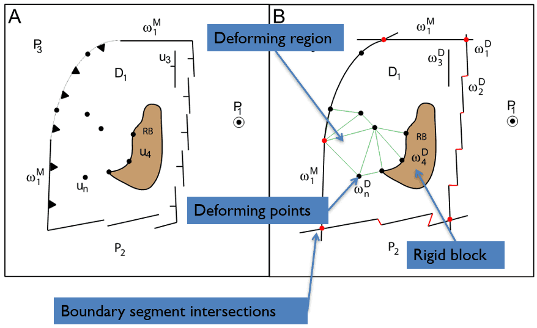

.. _pygplates_primer_deformation:

Deformation
-----------

This section covers deformation in pyGPlates.

.. contents::
   :local:
   :depth: 2

.. _pygplates_primer_topological_network:

Topological network
^^^^^^^^^^^^^^^^^^^

To model deformation, a topological network must first be created. This consists of a boundary polygon
(resolved by intersecting boundary line segments, similar to topological closed plate polygons), optional interior rigid blocks,
individual deforming points, and a triangulation (with vertices from boundary, rigid blocks and deforming points).

   On the left are the elements that make up a topological network.
   On the right is the resolving of these elements at a reconstruction time to form a resolved topological network.

More information on topological networks in GPlates/pyGPlates can be found in the following paper:

* Michael Gurnis, Ting Yang, John Cannon, Mark Turner, Simon Williams, Nicolas Flament, R. Dietmar Müller, 2018,
  `Global tectonic reconstructions with continuously deforming and evolving rigid plates <https://doi.org/10.1016/j.cageo.2018.04.007>`_,
  **Computers & Geosciences,** 116, 32-41, doi: 10.1016/j.cageo.2018.04.007

.. _pygplates_primer_rigid_blocks:

Rigid blocks
^^^^^^^^^^^^

A topological network can *optionally* have interior islands that are rigid.

.. note:: Any :meth:`interior geometry of a network <pygplates.GpmlTopologicalSection.create_network_interior>` that is a *polygon* is considered a rigid block.
   And the *interior* rings (if any) of a rigid block polygon are ignored (ie, only the exterior ring applies).

Each rigid block is represented by a :class:`pygplates.ReconstructedFeatureGeometry`, and is obtained from a :class:`pygplates.ResolvedTopologicalNetwork` with:
::

   rigid_blocks = resolved_topological_network.get_rigid_blocks()

For example, you can get the plate ID and boundary polygon of each interior rigid block (if any):
::

  for rigid_block in rigid_blocks:
      rigid_block_plate_id = rigid_block.get_feature().get_reconstruction_plate_id()
      rigid_block_boundary = rigid_block.get_reconstructed_geometry()

.. _pygplates_primer_network_triangulation:

Network triangulation
^^^^^^^^^^^^^^^^^^^^^

The network triangulation of a :class:`resolved topological network <pygplates.ResolvedTopologicalNetwork>` is the Delaunay triangulation of vertices
obtained from the network's boundary (polygon) and any interior rigid blocks (polygons) and any interior geometries (points or lines).

The Delaunay triangulation is a triangulation of the *convex hull* of its vertices. So it includes triangles *outside* the network boundary
(and also includes triangles *inside* any interior rigid blocks). However, the deforming region of a network is defined to be *inside* the
network's boundary polygon (but *outside* its interior rigid block polygons, if any). Hence the triangulation contains triangles that are *outside*
the deforming region. Therefore each triangle has a :attr:`flag <pygplates.NetworkTriangulation.Triangle.is_in_deforming_region>` indicating whether
it is inside the deforming region (if it's centroid is in the deforming region) or not. These triangles in the deforming region of a network triangulation
are referred to as the *deforming triangulation*.

.. note:: The Delaunay triangulation is not a *constrained* triangulation. This means the edges of some Delaunay triangles can cross over network boundary edges or
   interior block edges, rather than be constrained to follow them. However the flagging of Delaunay triangles (as deforming or non-deforming) deals with this
   quite effectively for current topological network datasets.

The :attr:`deforming <pygplates.NetworkTriangulation.Triangle.is_in_deforming_region>` triangles in a network triangulation do not overlap any
:ref:`interior rigid blocks <pygplates_primer_rigid_blocks>` (other than the above-mentioned note about *constrained* triangulations).
In other words, the *deforming* triangles (in the network triangulation) represent the *deforming* region of a
:class:`resolved topological network <pygplates.ResolvedTopologicalNetwork>` and the rigid blocks (if any) represent the *rigid* regions.

A network triangulation is represented by a :class:`pygplates.NetworkTriangulation`, and is obtained from a :class:`pygplates.ResolvedTopologicalNetwork` with:
::

   network_triangulation = resolved_topological_network.get_network_triangulation()

It consists of a sequence of vertices and a sequence of triangles. Each vertex is represented by a :class:`pygplates.NetworkTriangulation.Vertex` and contains a position,
a velocity, and a strain rate, and a list of incident vertices and incident triangles. Each triangle is represented by a :class:`pygplates.NetworkTriangulation.Triangle`
and contains a flag indicating whether it's deforming or not, and contains a strain rate, and references three vertices and three adjacent triangles.
::

   triangles = network_triangulation.get_triangles()
   vertices = network_triangulation.get_vertices()

   for triangle in triangles:
      triangle_is_in_deforming_region = triangle.is_in_deforming_region
      triangle_strain_rate = triangle.strain_rate

      for index in range(3):
         triangle_vertex = triangle.get_vertex(index)
         adjacent_triangle = triangle.get_adjacent_triangle(index)
         if adjacent_triangle:  # if not at a triangulation boundary
            ...

   for vertex in vertices:
      vertex_position = vertex.position
      vertex_strain_rate = vertex.strain_rate
      vertex_velocity = vertex.get_velocity()  # a function optionally accepting various velocity calculation parameters

      for incident_vertex in vertex.get_incident_vertices():
         ...
      for incident_triangle in vertex.get_incident_triangles():
         ...

.. _pygplates_primer_strain_rates_in_triangulation:

Strain rates in triangulation
^^^^^^^^^^^^^^^^^^^^^^^^^^^^^

Each :class:`triangle <pygplates.NetworkTriangulation.Triangle>` in a :class:`network triangulation <pygplates.NetworkTriangulation>` is assigned a :class:`strain rate <pygplates.StrainRate>`
that is *constant* across the triangle (and is zero if the triangle is *not* :attr:`deforming <pygplates.NetworkTriangulation.Triangle.is_in_deforming_region>`).
Furthermore, the strain rate of each triangle can optionally be :ref:`clamped to a maximum strain rate <pygplates_primer_strain_rate_clamping>`.
Then each :class:`vertex <pygplates.NetworkTriangulation.Vertex>` in the triangulation is assigned a strain rate that is an area-weighted average of the (potentially clamped) strain rates
from :attr:`deforming <pygplates.NetworkTriangulation.Triangle.is_in_deforming_region>` triangles incident to the vertex.

Finally, the strain rate that is queried at an *arbitrary* location (within the deforming triangulation) is either assigned the strain rate of the triangle containing that location,
or calculated by interpolating the strain rates of nearby vertices if :ref:`strain rates are smoothed <pygplates_primer_strain_rate_smoothing>`.

.. note:: Both strain rate :ref:`clamping <pygplates_primer_strain_rate_clamping>` and :ref:`smoothing <pygplates_primer_strain_rate_smoothing>` affect strain *rate* queries
   (such as :meth:`pygplates.ReconstructedGeometryTimeSpan.get_strain_rates`). They also affects *strain* queries (such as :meth:`pygplates.ReconstructedGeometryTimeSpan.get_strains`),
   since strain is :meth:`accumulated <pygplates.Strain.accumulate>` from strain rate.

.. _pygplates_primer_strain_rate_clamping:

Strain rate clamping
""""""""""""""""""""

Strain rates can optionally be clamped to a maximum strain rate to avoid excessive or spurious extension/compression in some triangles of a deforming triangulation.
This can happen in some topological networks depending on how they were built.

It is the :meth:`total strain rate <pygplates.StrainRate.get_total_strain_rate>` that is clamped, since it includes both the normal and shear components of deformation.
When a strain rate is clamped, all components of its tensor (specifically its :class:`spatial gradients of velocity tensor <pygplates.StrainRate.get_velocity_spatial_gradient>`)
are scaled equally to ensure its total strain rate equals the maximum total strain rate.

.. note:: Clamping the total strain rate also limits quantities derived from strain rate such as crustal thinning and tectonic subsidence.

Strain rate clamping is determined by :attr:`pygplates.ResolveTopologyParameters.enable_strain_rate_clamping` when topological networks are resolved at a reconstruction time
(using :class:`pygplates.TopologicalModel`, :class:`pygplates.TopologicalSnapshot` or :func:`pygplates.resolve_topologies`).
And the maximum strain rate is :attr:`pygplates.ResolveTopologyParameters.max_clamped_strain_rate`.
For example, to enable strain rate clamping (which is disabled by default) for a topological model, but keep the default maximum strain rate:
::

   topological_model = pygplates.TopologicalModel(
      'topologies.gpml',
      'rotations.rot',
      default_resolve_topology_parameters = pygplates.ResolveTopologyParameters(
         enable_strain_rate_clamping = True))

.. _pygplates_primer_strain_rate_smoothing:

Strain rate smoothing
"""""""""""""""""""""

Strain rates can optionally be smoothed to help reduce the faceted (piecewise constant) strain rate across a deforming triangulation (due to each triangle having a *constant* strain rate across its face).

.. note:: Smoothing the strain rate also affects quantities derived from strain rate such as crustal thinning and tectonic subsidence.

The strain rate at an arbitrary location within a deforming triangulation is affected by the smoothing value:

* ``pygplates.StrainRateSmoothing.none`` - No smoothing. The strain rate is equal to the (constant) strain rate of the :class:`triangle <pygplates.NetworkTriangulation.Triangle>` containing the query location.
* ``pygplates.StrainRateSmoothing.barycentric`` - Use linear interpolation of the strain rates of the 3 :class:`vertices <pygplates.NetworkTriangulation.Vertex>` of the
  :class:`triangle <pygplates.NetworkTriangulation.Triangle>` containing the query location.
* ``pygplates.StrainRateSmoothing.natural_neighbour`` - Use natural neighbour interpolation of the strain rates of triangulation :class:`vertices <pygplates.NetworkTriangulation.Vertex>` near the query location.

Strain rate smoothing is determined by :attr:`pygplates.ResolveTopologyParameters.strain_rate_smoothing` when topological networks are resolved at a reconstruction time
(using :class:`pygplates.TopologicalModel`, :class:`pygplates.TopologicalSnapshot` or :func:`pygplates.resolve_topologies`).
For example, to disable strain rate smoothing (which is natural neighbour smoothing by default) for a topological model:
::

   topological_model = pygplates.TopologicalModel(
      'topologies.gpml',
      'rotations.rot',
      default_resolve_topology_parameters = pygplates.ResolveTopologyParameters(
         strain_rate_smoothing = pygplates.StrainRateSmoothing.none))

.. _pygplates_primer_exponential_rift_stretching_profile:

Exponential rift stretching profile
^^^^^^^^^^^^^^^^^^^^^^^^^^^^^^^^^^^

A rift is typically modeled using two topological networks, one on each side of the rift axis. Each side of the rift axis typically has a single row of triangles (between the un-stretched side and the rift axis).
As a result, the strain rate at any location within the rift will essentially be *constant*, even when the :ref:`strain rates are smoothed <pygplates_primer_strain_rate_smoothing>`.
This is because triangulation vertices, along both the un-stretched boundary line and the rift axis, will effectively end up with the strain rate of the triangles (which is constant across each triangle).

To avoid the problem of *constant* stretching across the rift, an *exponential* rift stretching profile can be activated by adding rift left/right plate ID properties to a topological network feature.

Internally the exponential strain rate profile is implemented by automatically adding more points to the interior of a deforming triangulation and distributing the velocities
at these points such that the strain rate varies exponentially (along the stretching direction) from the un-stretched side of the rift towards the rift axis.

.. note:: This works reasonably well for regular rifts (like AFR-SAM), but not as well for oblique rifts (like AUS-ANT).

.. note:: The exponential rift stretching profile affects quantities derived from strain rate such as crustal thinning and tectonic subsidence.

Rift left/right plate IDs
"""""""""""""""""""""""""

An *exponential* rift stretching profile is activated by adding a ``gpml:riftLeftPlate``/``gpml:riftRightPlate`` pair of conjugate plate ID properties to a topological network :class:`pygplates.Feature`.
This can be done, for example, by using the *rift_parameters* argument of :meth:`pygplates.Feature.create_topological_network_feature`.
The presence of these plate IDs triggers the internal generation of an exponential strain rate rift profile when the topological networks are resolved at a reconstruction time
(using :class:`pygplates.TopologicalModel`, :class:`pygplates.TopologicalSnapshot` or :func:`pygplates.resolve_topologies`).

For example, to create a rift between Africa and South America:
::

  SAM_rift_network = pygplates.GpmlTopologicalNetwork([...])
  SAM_rift_feature = pygplates.Feature.create_topological_network_feature(
      SAM_rift_network,
      name='SAM rift',
      valid_time=(145, 115),
      rift_parameters=(201, 701))
  SAM_rift_feature.set_reconstruction_plate_id(201)

  AFR_rift_network = pygplates.GpmlTopologicalNetwork([...])
  AFR_rift_feature = pygplates.Feature.create_topological_network_feature(
      AFR_rift_network,
      name='AFR rift',
      valid_time=(145, 115),
      rift_parameters=(201, 701))
  AFR_rift_feature.set_reconstruction_plate_id(701)

.. note:: If the rift left/right plate ID properties are not present in a topological network feature then it is *not* considered a *rift*.

There are also three other parameters, in addition to the rift left/right plate IDs, that are optional and can either be set individually in each a topological network feature
(eg, using the *rift_parameters* argument of :meth:`pygplates.Feature.create_topological_network_feature`) or as default values for all topological network features
(using :class:`pygplates.ResolveTopologyParameters`).

.. note:: If these parameters are set in both places, then the feature properties have precedence.

When set on a topological network feature they become feature properties named:

* ``gpml:riftExponentialStretchingConstant``
* ``gpml:riftStrainRateResolutionLog10`` (note that this is :math:`\log_{10}` of the rift strain rate resolution)
* ``gpml:riftEdgeLengthThresholdDegrees``

...and for features missing these properties these parameters are instead obtained from :class:`pygplates.ResolveTopologyParameters` attributes:

* :attr:`pygplates.ResolveTopologyParameters.rift_exponential_stretching_constant`
* :attr:`pygplates.ResolveTopologyParameters.rift_strain_rate_resolution`
* :attr:`pygplates.ResolveTopologyParameters.rift_edge_length_threshold_degrees`

...when the topological networks are resolved at a reconstruction time
(using :class:`pygplates.TopologicalModel`, :class:`pygplates.TopologicalSnapshot` or :func:`pygplates.resolve_topologies`).

The default values (in :meth:`pygplates.ResolveTopologyParameters() <pygplates.ResolveTopologyParameters.__init__>`) should be fine
for resolving rift features that do not contain the associated rift feature properties. But you can change the defaults as needed.
For example, new default values can be specified for a topological model:
::

   topological_model = pygplates.TopologicalModel(
      'topologies.gpml',
      'rotations.rot',
      default_resolve_topology_parameters = pygplates.ResolveTopologyParameters(
         rift_exponential_stretching_constant = 1.5,  # default is 1.0
         rift_strain_rate_resolution = 1e-16,         # default is 5e-17
         rift_edge_length_threshold_degrees = 0.2))   # default is 0.1

Rift exponential stretching constant
""""""""""""""""""""""""""""""""""""

The strain rate in the rift stretching direction varies exponentially from the un-stretched side of the rift towards the rift axis.
The spatial variation in strain rate is:

  .. math::

     strain\_rate(x) = strain\_rate \times e^{C x} \frac{C}{e^C - 1}

...where :math:`strain\_rate` is the un-subdivided, original (constant) strain rate, :math:`C` is the *rift exponential stretching constant*
and :math:`x = 0` at the un-stretched side and :math:`x = 1` at the stretched point. Therefore :math:`strain\_rate(0) < strain\_rate < strain\_rate(1)`.
For example, when :math:`C = 1.0` then :math:`strain\_rate(0) = 0.58 \times strain\_rate` and :math:`strain\_rate(1) = 1.58 \times strain\_rate`.

Rift strain rate resolution
"""""""""""""""""""""""""""

The *rift strain rate resolution* controls how accurately the actual strain rate curve (across rift profile) matches the exponential curve (in units of :math:`second^{-1}`).
Rift edges in the network triangulation are sub-divided until the strain rate matches the exponential curve (within this tolerance).

Rift edge length threshold
""""""""""""""""""""""""""

Rift edges in network triangulation shorter than the *rift edge length threshold* (in degrees) will not be further sub-divided.
