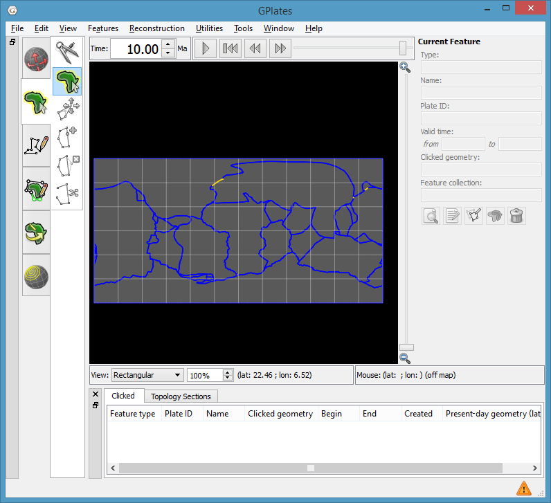
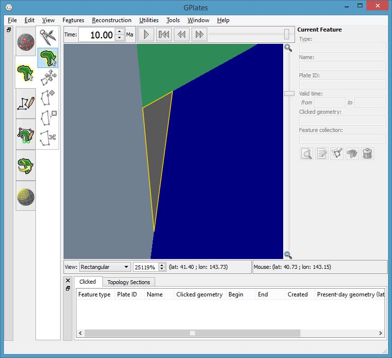
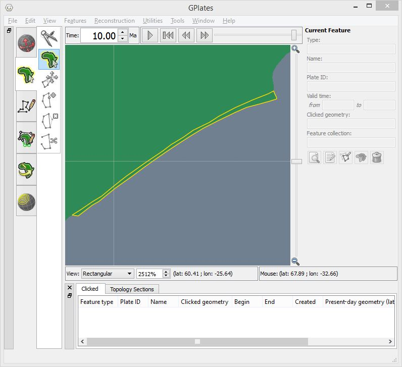

.. _pygplates_detect_topology_gaps_and_overlaps:

Find gaps and overlaps in global topological boundaries
^^^^^^^^^^^^^^^^^^^^^^^^^^^^^^^^^^^^^^^^^^^^^^^^^^^^^^^

| This example resolves topological plate polygons (and deforming networks) and detects any gaps and
  overlaps in their global coverage.
| Anomalous sub-segments, locating the gaps/overlaps, are written to a file that can be loaded into
  `GPlates <http://www.gplates.org>`_ to visualise alongside the dynamic plate polygons.

Gaps and overlaps are caused when:

- there is an area of the globe not covered by a topological boundary or network, or
- two (or more) topological boundary polygons overlap in some area of the globe.

This can also happen if two topological line sections are *identical* when ideally there should
only be one of them (and it should be shared by two neighbouring topological boundaries).

.. contents::
   :local:
   :depth: 2

Data files
""""""""""

``topologies.gpml``
    Topological plate polygon and/or deforming network features, intended to cover the globe.

``rotations.rot``
    A rotation file. It must contain rotations for the plate IDs of the topological features.

Files of these kinds are in the GPlates `sample data <https://www.gplates.org/download/>`_.

Sample code
"""""""""""

.. sample-code:: pygplates_detect_topology_gaps_and_overlaps.py

Details
"""""""

| First create a :class:`topological model<pygplates.TopologicalModel>` from topological features and rotation files.
| The topological features can be plate polygons and/or deforming networks.
| More than one file containing topological features can be specified here, however we're only specifying one file.
| Also note that more than one rotation file (or even a single :class:`pygplates.RotationModel`) can be specified here,
  however we're only specifying a single rotation file.

.. sample-code:: pygplates_detect_topology_gaps_and_overlaps.py
   :fragment: create-topological-model

.. note:: We create our :class:`pygplates.TopologicalModel` **outside** the time loop since that does not require ``time``.

| Get a snapshot of our resolved topologies.
| Here the topological features are resolved to the current ``time``
  using :func:`pygplates.TopologicalModel.topological_snapshot`.

.. sample-code:: pygplates_detect_topology_gaps_and_overlaps.py
   :fragment: topological-snapshot

| Extract the boundary sections between our resolved topological plate polygons (and deforming networks) from the current snapshot.
| By default both :class:`pygplates.ResolvedTopologicalBoundary` (used for dynamic plate polygons) and
  :class:`pygplates.ResolvedTopologicalNetwork` (used for deforming regions) are listed in the boundary sections.

.. sample-code:: pygplates_detect_topology_gaps_and_overlaps.py
   :fragment: resolved-topological-sections

These :class:`boundary sections<pygplates.ResolvedTopologicalSection>` are actually what
we're interested in because their sub-segments have a list of topologies on them.

| Not all parts of a topological section feature's geometry contribute to the boundaries of topologies.
| Little bits at the ends get clipped off.
| The parts that do contribute can be found using :meth:`pygplates.ResolvedTopologicalSection.get_shared_sub_segments`.

.. sample-code:: pygplates_detect_topology_gaps_and_overlaps.py
   :fragment: shared-sub-segments

| The list of topologies that share a :class:`sub-segment<pygplates.ResolvedTopologicalSharedSubSegment>`
  is obtained using :class:`pygplates.ResolvedTopologicalSharedSubSegment.get_sharing_resolved_topologies`.
| If the resolved topologies have global coverage with no gaps/overlaps then each sub-segment should be
  shared by exactly two resolved boundaries.

.. sample-code:: pygplates_detect_topology_gaps_and_overlaps.py
   :fragment: sharing-resolved-topologies

If a sub-segment is not shared by exactly two resolved boundaries then we record its feature.

.. sample-code:: pygplates_detect_topology_gaps_and_overlaps.py
   :fragment: record-anomalous-feature

Finally we write the anomalous features to a file.

.. sample-code:: pygplates_detect_topology_gaps_and_overlaps.py
   :fragment: write-anomalous-features

Visualising gaps and overlaps in GPlates
""""""""""""""""""""""""""""""""""""""""

The resulting output files such as ``anomalous_sub_segments_at_10Ma.gpml`` can be loaded into
`GPlates <http://www.gplates.org>`_ to see where the topological errors are located on the globe.

   GPlates screenshot showing anomalous sub-segments (yellow) and dynamic plate polygons (blue) at 10Ma.

The following two screenshots show a zoomed-in view of a gap and an overlap.

   GPlates screenshot showing zoomed-in view of a **gap** in dynamic polygon coverage (outlined in yellow) at 10Ma.

   GPlates screenshot showing zoomed-in view of an **overlap** in dynamic polygon coverage (outlined in yellow) at 10Ma.

See also
""""""""

- Primer: :ref:`pygplates_primer_topological_snapshot`
- Reference: :class:`pygplates.TopologicalModel`, :meth:`pygplates.TopologicalSnapshot.get_resolved_topological_sections`,
  :meth:`pygplates.ResolvedTopologicalSection.get_shared_sub_segments`,
  :meth:`pygplates.ResolvedTopologicalSharedSubSegment.get_sharing_resolved_topologies`
- Sample code: :ref:`pygplates_find_total_ridge_and_subduction_zone_lengths`,
  :ref:`pygplates_find_overriding_plate_of_closest_subducting_line`
